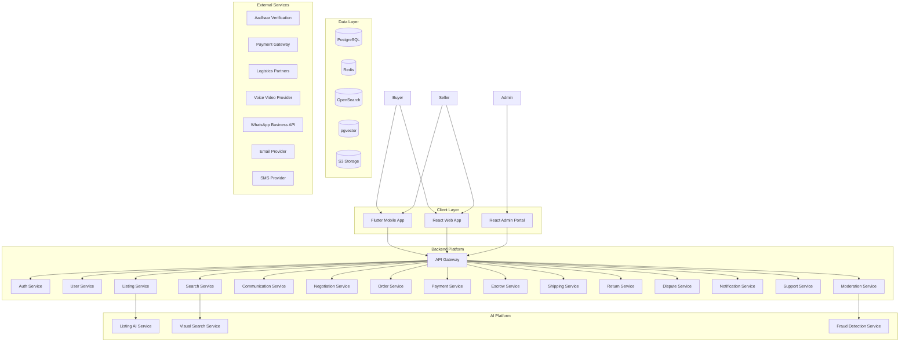

# ValueX High Level Design (HLD)

# Part 1 – Executive Summary, System Overview, High-Level Architecture & Technology Decisions

**Document Version:** 1.0
**Product:** ValueX
**Company:** ValueQuo Solutions Pvt. Ltd.
**Architecture Version:** MVP + Scale Ready
**Date:** June 2026

**Reference Documents:**

* PRD v1.3
* User Stories v2.0
* Sprint Plan v2.0
* User Flow Diagram v0.2

---

# 1. Executive Summary

## 1.1 Purpose

ValueX is a pan-India AI-enabled recommerce marketplace platform that enables buyers and sellers to safely transact used goods through a secure and trusted ecosystem.

The platform combines:

* Aadhaar-backed identity verification
* AI-assisted listing creation
* AI-powered visual search
* Escrow-protected payments
* Integrated logistics
* Dispute management
* Fraud prevention
* Premium monetization plans

The objective is to provide Amazon-level transaction confidence while maintaining the simplicity of a C2C marketplace.

---

## 1.2 Scope

### In Scope

#### User Management

* Aadhaar verification
* Mobile OTP verification
* One user one account enforcement
* User profile management

#### Marketplace

* Listing creation
* Listing plans
* AI-assisted listing generation
* Search and discovery
* Visual search

#### Communication

* Chat
* Voice calls
* Video calls

#### Commerce

* Negotiation
* Buy Now
* Cart
* Checkout
* Escrow

#### Logistics

* Pickup scheduling
* Shipment tracking
* Reverse logistics

#### Payments

* Escrow
* Refunds
* Seller payouts

#### Trust & Safety

* Fraud detection
* Content moderation
* Restricted item detection
* Image authenticity validation

#### Support

* AI support bot
* Human support
* Ticket management

#### Premium Features

* Buyer subscriptions
* Seller listing plans
* AI visual search

---

### Out of Scope

#### Phase 1

* International marketplace
* Warehousing
* Inventory ownership
* Auction system
* BNPL
* Insurance products
* Real-time AI dispute resolution
* AR commerce experiences

---

## 1.3 Stakeholders

### Business Stakeholders

| Role                | Responsibility                    |
| ------------------- | --------------------------------- |
| Product Owner       | Product vision and prioritization |
| Founder             | Business strategy                 |
| Operations Team     | Marketplace operations            |
| Customer Support    | User assistance                   |
| Trust & Safety Team | Moderation and fraud control      |

---

### Technical Stakeholders

| Role               | Responsibility                |
| ------------------ | ----------------------------- |
| Solution Architect | Architecture governance       |
| Backend Team       | Spring Boot services          |
| Mobile Team        | Flutter application           |
| Web Team           | React applications            |
| AI Team            | Python AI services            |
| DevOps Team        | Infrastructure and deployment |
| QA Team            | Testing and quality assurance |

---

### End Users

#### Buyers

Need:

* Trustworthy sellers
* Delivery assurance
* Fraud protection
* Easy discovery

---

#### Sellers

Need:

* Easy listing creation
* Payment assurance
* Fraud protection
* Visibility management

---

#### Admins

Need:

* Moderation controls
* Analytics
* Fraud investigation tools
* Operational visibility

---

## 1.4 Success Criteria

### Business

* ≥ 90% successful transactions
* Fraud rate < 1%
* Dispute rate < 5%
* Buyer retention > 60%
* Premium conversion > 5%

---

### Technical

* API latency < 300ms
* Search latency < 1 second
* Photo search latency < 2 seconds
* Availability > 99.9%

---

# 2. System Overview

## 2.1 High-Level Architecture



---

# 2.2 System Context

ValueX consists of four major platforms:

### 1. Mobile Platform

Primary marketplace interface.

Technology:

* Flutter

Used by:

* Buyers
* Sellers

---

### 2. Web Platform

Secondary marketplace interface.

Technology:

* React

Used by:

* Buyers
* Sellers

---

### 3. Admin Platform

Internal operations portal.

Technology:

* React

Used by:

* Moderators
* Support
* Operations
* Fraud Team

---

### 4. AI Platform

Independent AI service layer.

Technology:

* Python

Used for:

* Listing generation
* Visual search
* Fraud scoring

---

# 2.3 Core Business Domains

The platform is divided into the following business domains.

---

## Identity Domain

Responsible for:

* Aadhaar verification
* Mobile verification
* User lifecycle
* Account restrictions

---

## Marketplace Domain

Responsible for:

* Listings
* Categories
* Search
* Discovery
* Saved items

---

## Commerce Domain

Responsible for:

* Negotiation
* Orders
* Cart
* Checkout

---

## Financial Domain

Responsible for:

* Escrow
* Payments
* Refunds
* Payouts

---

## Logistics Domain

Responsible for:

* Pickup
* Delivery
* Reverse logistics

---

## Trust & Safety Domain

Responsible for:

* Moderation
* Fraud scoring
* Violations
* Investigations

---

## Support Domain

Responsible for:

* Tickets
* AI support
* Human support

---

## Subscription Domain

Responsible for:

* Buyer plans
* Seller plans
* Entitlements

---

# 3. Technology Stack

## 3.1 Frontend Technologies

| Layer                   | Technology |
| ----------------------- | ---------- |
| Mobile App              | Flutter    |
| Mobile Language         | Dart       |
| Mobile State Management | Riverpod   |
| Mobile Navigation       | GoRouter   |
| Web App                 | React      |
| Admin Portal            | React      |
| Language                | TypeScript |

---

## 3.2 Backend Technologies

| Layer             | Technology      |
| ----------------- | --------------- |
| Backend Framework | Spring Boot 3.x |
| Language          | Java 21         |
| API Style         | REST            |
| Authentication    | JWT             |
| Documentation     | OpenAPI         |

---

## 3.3 AI Technologies

| Layer           | Technology      |
| --------------- | --------------- |
| AI Services     | Python          |
| Framework       | FastAPI         |
| Visual Search   | CLIP Embeddings |
| Fraud Detection | ML Models       |
| Listing AI      | LLM Integration |

---

## 3.4 Data Technologies

| Layer            | Technology            |
| ---------------- | --------------------- |
| Primary Database | PostgreSQL            |
| Cache            | Redis                 |
| Search           | OpenSearch            |
| Vector Search    | pgvector              |
| Object Storage   | S3 Compatible Storage |

---

## 3.5 Infrastructure

| Layer            | Technology     |
| ---------------- | -------------- |
| Containerization | Docker         |
| Orchestration    | Kubernetes     |
| CI/CD            | GitHub Actions |
| IaC              | Terraform      |
| Monitoring       | Prometheus     |
| Dashboards       | Grafana        |

---

# 4. Architecture Style

## 4.1 Selected Architecture

### Modular Monolith + AI Services

For MVP:

```text
Spring Boot Modular Monolith
+
Independent Python AI Services
```

---

## Why Not Full Microservices?

At MVP stage:

* Team size is small
* Complexity already high
* Faster delivery needed
* Easier debugging

Full microservices would introduce:

* Service discovery
* Distributed tracing
* Distributed transactions
* Operational overhead

without immediate business value.

---

## Evolution Strategy

### Phase 1

```text
Flutter
React
Spring Boot Modular Monolith
Python AI Services
```

---

### Phase 2

Extract:

```text
Search Service
Notification Service
Payment Service
```

---

### Phase 3

Move toward:

```text
Event Driven Microservices
```

if scale requires.

---

# 5. Key Architecture Decisions

| Decision       | Chosen Option | Rationale                        |
| -------------- | ------------- | -------------------------------- |
| Mobile         | Flutter       | Single codebase, faster delivery |
| Web            | React         | Mature ecosystem                 |
| Backend        | Spring Boot   | Strong transactional support     |
| AI             | Python        | ML ecosystem                     |
| Database       | PostgreSQL    | ACID compliance                  |
| Search         | OpenSearch    | Marketplace search               |
| Vector Search  | pgvector      | Cost-effective MVP               |
| Storage        | S3            | Scalable media storage           |
| Messaging      | Event Driven  | Async processing                 |
| Authentication | JWT           | Stateless architecture           |
| Deployment     | Kubernetes    | Future scalability               |

---

# 6. Major System Characteristics

## Reliability

Target:

```text
99.9% uptime
```

---

## Scalability

Target:

```text
10M+
users
```

---

## Security

Target:

```text
Zero Trust Architecture
```

Principles:

* Aadhaar verification
* JWT security
* Encryption at rest
* Encryption in transit

---

## Observability

Built-in:

* Metrics
* Logs
* Traces
* Audit trails

---

## AI Readiness

Native support for:

* Visual search
* Fraud detection
* Listing assistance
* Recommendations

---

# Part 1 Deliverables Completed

✔ Executive Summary

✔ System Overview

✔ High-Level Architecture

✔ Technology Stack

✔ Architecture Style

✔ Key Architecture Decisions

Next Document:

**Part 2 – Backend Architecture, Service Decomposition, API Gateway, Event-Driven Design**
