# ValueX High Level Design (HLD)

# Part 2 – Backend Architecture, Service Decomposition, API Gateway & Event-Driven Design

**Document Version:** 1.0
**Product:** ValueX
**Backend Stack:** Java 21 + Spring Boot 3.x
**Architecture Style:** Modular Monolith for MVP, Microservice-Ready Boundaries

---

# 1. Backend Architecture Overview

The ValueX backend will initially be implemented as a **Spring Boot Modular Monolith** with strict domain boundaries.

This means:

```text
One deployable backend application
Multiple independent business modules
Clear package boundaries
Shared database initially
Event-driven internal communication
Microservice extraction possible later
```

This approach provides:

* Faster MVP delivery
* Easier debugging
* Simpler deployment
* Strong transactional consistency
* Lower operational overhead
* Clear future scalability path

---

# 2. Backend High-Level Diagram

```mermaid
graph TB
    Mobile[Flutter Mobile App]
    Web[React Web App]
    Admin[React Admin Portal]

    Mobile --> Gateway[API Gateway / Backend Edge]
    Web --> Gateway
    Admin --> Gateway

    Gateway --> Auth[Auth & Identity Module]
    Gateway --> User[User Profile Module]
    Gateway --> Listing[Listing Module]
    Gateway --> Search[Search Module]
    Gateway --> Plan[Plan & Entitlement Module]
    Gateway --> Communication[Communication Module]
    Gateway --> Negotiation[Negotiation Module]
    Gateway --> Cart[Cart Module]
    Gateway --> Order[Order Module]
    Gateway --> Payment[Payment Module]
    Gateway --> Escrow[Escrow Module]
    Gateway --> Shipping[Shipping Module]
    Gateway --> Return[Return Module]
    Gateway --> Dispute[Dispute Module]
    Gateway --> Rating[Rating Module]
    Gateway --> Support[Support Module]
    Gateway --> Notification[Notification Module]
    Gateway --> Moderation[Moderation Module]
    Gateway --> Audit[Audit Module]

    Listing --> AI[Python AI Services]
    Search --> AI
    Moderation --> AI

    Gateway --> PostgreSQL[(PostgreSQL)]
    Gateway --> Redis[(Redis)]
    Search --> OpenSearch[(OpenSearch)]
    Search --> VectorDB[(pgvector)]
```



---

# 3. Backend Architectural Style

## 3.1 Selected Architecture

### Modular Monolith + AI Services

```text
Spring Boot Modular Monolith
+
Independent Python AI Services
```

### Why This Architecture?

ValueX contains highly transactional business processes:

* Registration
* Listing creation
* Negotiation
* Order processing
* Escrow
* Shipping
* Returns
* Disputes

Using microservices too early would introduce:

* Distributed transactions
* Service discovery
* Message broker complexity
* Additional DevOps burden

without immediate business value.

---

## 3.2 Evolution Strategy

### Phase 1

```text
Flutter
React
Spring Boot Modular Monolith
Python AI Services
```

### Phase 2

Extract:

```text
Search Service
Notification Service
Payment Service
```

### Phase 3

Move toward:

```text
Event-Driven Microservices
```

---

# 4. Backend Module Decomposition

## 4.1 Auth & Identity Module

### Responsibilities

* Mobile OTP (primary registration and login)
* Google Sign-In (optional convenience login)
* Apple Sign-In (optional convenience login)
* Aadhaar identity verification (skippable until first transaction)
* JWT authentication and session management
* One-user-one-account enforcement
* User account lifecycle

### Owns

* users
* user_social_accounts
* identity_verifications
* user_sessions
* device_fingerprints
* account_status_history

### APIs

```http
POST /api/v1/auth/register/initiate
POST /api/v1/auth/register/verify-mobile
POST /api/v1/auth/register/skip-aadhaar
POST /api/v1/auth/aadhaar/initiate
POST /api/v1/auth/aadhaar/verify
POST /api/v1/auth/login
POST /api/v1/auth/social/google
POST /api/v1/auth/social/apple
POST /api/v1/auth/logout
POST /api/v1/auth/token/refresh
GET  /api/v1/auth/me
```

### Critical Rules

* Mobile number is always the account anchor — social login on first use must still verify a mobile number via OTP
* One Aadhaar = One Account (across all states including suspended and banned)
* Aadhaar stored as SHA-256 hash only — never plain text
* Google/Apple identity tokens validated server-side only — never trust client-side claims
* Apple `sub` claim (not email) used as stable Apple account identifier
* Suspended users cannot login
* Banned users cannot transact

---

## 4.2 User Profile Module

### Responsibilities

* Profile management
* Address management
* Saved items
* Language preferences
* Notification preferences
* Payout account management

### Owns

* user_profiles
* addresses
* saved_items
* payout_methods
* notification_preferences

### APIs

```http
GET    /api/v1/users/me
PATCH  /api/v1/users/me
POST   /api/v1/users/me/photo
GET    /api/v1/users/me/addresses
POST   /api/v1/users/me/addresses
GET    /api/v1/users/me/payout-methods
POST   /api/v1/users/me/payout-methods
```

---

## 4.3 Listing Module

### Responsibilities

* Listing creation
* Image uploads
* Category assignment
* Listing plans
* Moderation state management
* Listing lifecycle

### Owns

* listings
* listing_images
* categories
* listing_plans
* listing_status_history

### APIs

```http
POST   /api/v1/listings
POST   /api/v1/listings/{id}/images
PATCH  /api/v1/listings/{id}
DELETE /api/v1/listings/{id}
POST   /api/v1/listings/{id}/publish
```

### Critical Rules

* Listing cannot publish without plan
* Trust & Safety review required
* Active listings cannot be deleted when linked to active orders

---

## 4.4 Search Module

### Responsibilities

* Keyword search
* Filters
* Saved searches
* Listing indexing
* Visual search routing

### Owns

* search_queries
* saved_searches
* OpenSearch indexes

### APIs

```http
GET  /api/v1/search/listings
GET  /api/v1/search/categories
POST /api/v1/search/saved
GET  /api/v1/search/saved
POST /api/v1/search/photo
```

---

## 4.5 Plan & Entitlement Module

### Responsibilities

* Buyer subscriptions
* Seller listing plans
* Feature access control
* Entitlement validation
* Usage quota tracking

### Owns

* plans
* subscriptions
* entitlements
* feature_usage

### APIs

```http
GET  /api/v1/plans/buyer
GET  /api/v1/plans/seller
POST /api/v1/subscriptions
GET  /api/v1/entitlements
POST /api/v1/entitlements/check
```

---

## 4.6 Communication Module

### Responsibilities

* Chat
* Voice calls
* Video calls
* Communication history

### Owns

* chat_threads
* chat_messages
* call_logs
* video_sessions

### APIs

```http
POST /api/v1/chats
GET  /api/v1/chats
POST /api/v1/chats/{id}/messages

POST /api/v1/calls/voice
POST /api/v1/calls/video
```

### Realtime

```text
/ws/chat
/ws/notifications
```

---

## 4.7 Negotiation Module

### Responsibilities

* Offers
* Counter offers
* Acceptance
* Expiry
* Price locking

### Owns

* negotiations
* offers
* offer_status_history

### APIs

```http
POST /api/v1/listings/{id}/offers
POST /api/v1/offers/{id}/accept
POST /api/v1/offers/{id}/reject
POST /api/v1/offers/{id}/counter
```

---

## 4.8 Cart Module

### Responsibilities

* Cart creation
* Cart validation
* Multi-seller grouping

### Owns

* carts
* cart_items

### APIs

```http
GET    /api/v1/cart
POST   /api/v1/cart/items
DELETE /api/v1/cart/items/{id}
POST   /api/v1/cart/checkout
```

---

## 4.9 Order Module

### Responsibilities

* Order creation
* Order lifecycle
* Order history
* Cancellation

### Owns

* orders
* order_items
* order_status_history

### APIs

```http
POST /api/v1/orders
GET  /api/v1/orders
GET  /api/v1/orders/{id}
POST /api/v1/orders/{id}/cancel
POST /api/v1/orders/{id}/confirm-receipt
```

---

## 4.10 Payment Module

### Responsibilities

* Payment initiation
* Gateway integration
* Payment retries
* Refund initiation

### Owns

* payments
* payment_attempts
* refunds

### APIs

```http
POST /api/v1/payments/initiate
POST /api/v1/payments/{id}/retry
POST /api/v1/webhooks/payment
```

---

## 4.11 Escrow Module

### Responsibilities

* Escrow creation
* Escrow hold
* Escrow release
* Admin hold
* Seller payout

### Owns

* escrow_accounts
* escrow_ledger
* payouts

### APIs

```http
POST /api/v1/escrow/create
POST /api/v1/escrow/{id}/release
POST /api/v1/escrow/{id}/refund
```

---

## 4.12 Shipping Module

### Responsibilities

* Pickup scheduling
* Logistics integration
* Tracking
* Reverse logistics

### Owns

* shipments
* shipment_events
* logistics_requests

### APIs

```http
POST /api/v1/shipments
POST /api/v1/shipments/{id}/pickup
GET  /api/v1/shipments/{id}/tracking
```

---

## 4.13 Return Module

### Responsibilities

* Return requests
* Return approval
* Seller inspection
* Reverse shipping

### Owns

* returns
* return_events
* return_evidence

### APIs

```http
POST /api/v1/orders/{id}/returns
POST /api/v1/returns/{id}/approve
POST /api/v1/returns/{id}/reject
```

---

## 4.14 Dispute Module

### Responsibilities

* Dispute creation
* Evidence management
* Resolution workflow

### Owns

* disputes
* dispute_evidence
* dispute_decisions

### APIs

```http
POST /api/v1/disputes
POST /api/v1/disputes/{id}/evidence
POST /api/v1/admin/disputes/{id}/decision
```

---

## 4.15 Rating Module

### Responsibilities

* Buyer ratings
* Seller ratings
* Aggregated ratings

### APIs

```http
POST /api/v1/orders/{id}/ratings/seller
POST /api/v1/orders/{id}/ratings/buyer
```

---

## 4.16 Support Module

### Responsibilities

* Support tickets
* AI bot escalation
* Human support workflows

### APIs

```http
POST /api/v1/support/tickets
GET  /api/v1/support/tickets
POST /api/v1/support/tickets/{id}/messages
```

---

## 4.17 Notification Module

### Responsibilities

* Push notifications
* SMS
* Email
* WhatsApp

### APIs

```http
GET  /api/v1/notifications
PATCH /api/v1/notifications/{id}/read
```

---

## 4.18 Moderation Module

### Responsibilities

* User moderation
* Listing moderation
* Fraud investigations

### APIs

```http
GET  /api/v1/admin/users
POST /api/v1/admin/users/{id}/suspend

GET  /api/v1/admin/listings/review
POST /api/v1/admin/listings/{id}/approve
POST /api/v1/admin/listings/{id}/reject
```

---

## 4.19 Audit Module

### Responsibilities

* Immutable audit logs
* Compliance reporting
* Admin activity tracking

### Critical Logged Events

* Registration
* Aadhaar verification
* Listing publication
* Payment
* Refund
* Dispute decisions
* Account suspension

---

# 5. Spring Boot Package Structure

```text
com.valuex

├── common
│   ├── config
│   ├── security
│   ├── audit
│   ├── events
│   └── utils

├── auth
├── user
├── listing
├── search
├── plans
├── communication
├── negotiation
├── cart
├── order
├── payment
├── escrow
├── shipping
├── returns
├── dispute
├── rating
├── support
├── notification
├── moderation
└── admin
```

---

# 6. API Gateway Design

## Responsibilities

* JWT validation
* Rate limiting
* Request logging
* Correlation IDs
* Version routing
* Request tracing

### Headers

```http
Authorization: Bearer <token>
X-Correlation-Id: <uuid>
X-App-Version: 1.0.0
```

---

# 7. API Standards

## Base URL

```http
/api/v1
```

### Success Response

```json
{
  "success": true,
  "data": {},
  "metadata": {
    "requestId": "uuid"
  }
}
```

### Error Response

```json
{
  "success": false,
  "error": {
    "code": "ERROR_INVALID_OTP",
    "message": "Invalid OTP"
  }
}
```

---

# 8. Event-Driven Architecture

## MVP Strategy

```text
Spring Application Events
+
Transactional Outbox Pattern
```

## Scale Strategy

```text
Kafka
```

or

```text
RabbitMQ
```

---

## Core Domain Events

### User Events

```text
UserRegistered
OtpVerified
AadhaarVerified
UserActivated
UserSuspended
UserBanned
```

### Listing Events

```text
ListingCreated
ListingPublished
ListingRejected
ListingExpired
```

### Order Events

```text
OrderCreated
OrderCancelled
OrderCompleted
```

### Payment Events

```text
PaymentSucceeded
PaymentFailed
EscrowCreated
EscrowReleased
RefundProcessed
```

### Shipping Events

```text
PickupScheduled
ItemPickedUp
ShipmentDelivered
ShipmentLost
```

### Dispute Events

```text
DisputeCreated
EvidenceSubmitted
DisputeResolved
```

---

# 9. Transaction Boundaries

## Strong Consistency Required

* Registration
* Aadhaar verification
* Order creation
* Payment processing
* Escrow ledger updates
* Refunds

## Eventual Consistency Allowed

* Notifications
* Search indexing
* Analytics
* AI processing

---

# 10. State Machine Ownership

| Lifecycle      | Owner Module |
| -------------- | ------------ |
| User           | Auth         |
| Listing        | Listing      |
| Search         | Search       |
| Negotiation    | Negotiation  |
| Cart           | Cart         |
| Order          | Order        |
| Payment        | Payment      |
| Escrow         | Escrow       |
| Shipping       | Shipping     |
| Return         | Return       |
| Dispute        | Dispute      |
| Support Ticket | Support      |
| Subscription   | Plans        |

All state transitions must:

* Validate source state
* Validate target state
* Write audit record
* Publish domain event
* Store status history

---

# 11. Security Controls

## Mandatory Controls

* JWT authentication
* RBAC
* Rate limiting
* File validation
* Input sanitization
* Encryption at rest
* Encryption in transit
* Audit logging

### Account Status Enforcement

| Status       | Login | Browse  | Buy | Sell |
| ------------ | ----- | ------- | --- | ---- |
| ACTIVE       | Yes   | Yes     | Yes | Yes  |
| UNDER_REVIEW | Yes   | Yes     | No  | No   |
| RESTRICTED   | Yes   | Limited | No  | No   |
| SUSPENDED    | No    | No      | No  | No   |
| BANNED       | No    | No      | No  | No   |

---

# 12. Deployment Units

## MVP

```text
valuex-backend
valuex-ai
valuex-web
valuex-mobile
```

## Future

```text
valuex-auth-service
valuex-listing-service
valuex-order-service
valuex-payment-service
valuex-search-service
valuex-notification-service
```

---

# 13. Implementation Guidelines

### Controller Layer

* Request validation only
* No business logic

### Application Layer

* Use case orchestration
* Transactions
* Event publishing

### Domain Layer

* Business rules
* State machines
* Domain events

### Repository Layer

* Data access only

### Infrastructure Layer

* External integrations
* Storage
* Messaging
* AI adapters

---

# Part 2 Completed

Deliverables:

* Backend Architecture
* Module Decomposition
* Service Ownership
* API Gateway Design
* Event-Driven Design
* Domain Event Catalog
* Transaction Boundaries
* Security Controls
* State Machine Ownership
* Deployment Units

Next Document:

```text
Part 3 – Data Architecture, ERD, PostgreSQL Design, Redis, OpenSearch, pgvector & Object Storage
```
