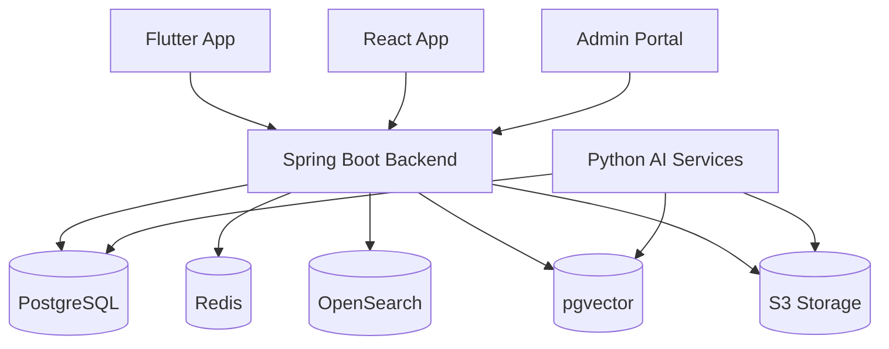
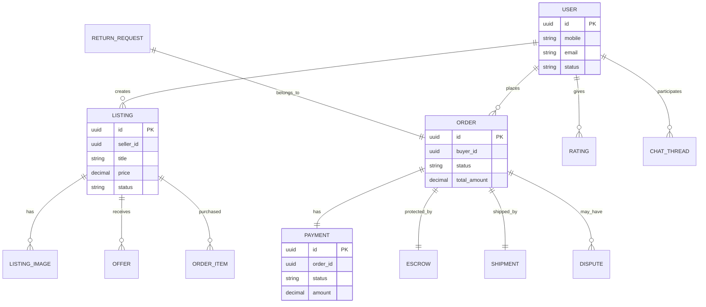

# ValueX High Level Design (HLD)

# Part 3 – Data Architecture, ERD, PostgreSQL Design, Redis, OpenSearch, pgvector & Object Storage

**Document Version:** 1.0
**Product:** ValueX
**Database:** PostgreSQL 16
**Cache:** Redis 7
**Search:** OpenSearch
**Vector Search:** pgvector
**Object Storage:** S3 Compatible Storage

---

# 1. Data Architecture Overview

ValueX requires multiple storage technologies because a single database is not suitable for all workloads.

## Storage Strategy

| Data Type                | Storage           |
| ------------------------ | ----------------- |
| Transactional Data       | PostgreSQL        |
| Sessions                 | Redis             |
| Search Index             | OpenSearch        |
| Visual Search Embeddings | pgvector          |
| Images & Videos          | S3 Object Storage |
| Audit Logs               | PostgreSQL        |
| Notifications            | PostgreSQL        |
| Analytics (MVP)          | PostgreSQL        |

---

## High Level Data Architecture



---

# 2. Database Design Principles

## Primary Principles

### ACID Transactions

Required for:

* registration
* orders
* payments
* escrow
* refunds
* disputes

Therefore:

```text
PostgreSQL = Source of Truth
```

---

### Eventual Consistency

Allowed for:

* notifications
* search indexing
* analytics
* AI enrichment

---

### Immutable Financial Records

Financial data must never be updated.

Examples:

```text
escrow_ledger
payment_events
refund_events
audit_logs
```

Only append.

---

# 3. High Level ERD



---

# 4. PostgreSQL Schema Design

## 4.1 Identity Domain

### users

```sql
CREATE TABLE users (
    id UUID PRIMARY KEY,
    mobile VARCHAR(15) UNIQUE NOT NULL,
    email VARCHAR(255),
    status VARCHAR(50) NOT NULL,
    created_at TIMESTAMP NOT NULL,
    updated_at TIMESTAMP NOT NULL
);
```

---

### identity_verifications

```sql
CREATE TABLE identity_verifications (
    id UUID PRIMARY KEY,
    user_id UUID NOT NULL,
    aadhaar_hash VARCHAR(512) UNIQUE,
    verification_status VARCHAR(50),
    verified_at TIMESTAMP,
    created_at TIMESTAMP
);
```

---

### user_sessions

```sql
CREATE TABLE user_sessions (
    id UUID PRIMARY KEY,
    user_id UUID NOT NULL,
    device_id VARCHAR(255),
    refresh_token_hash VARCHAR(512),
    expires_at TIMESTAMP
);
```

---

# 4.2 User Profile Domain

### user_profiles

```sql
CREATE TABLE user_profiles (
    user_id UUID PRIMARY KEY,
    display_name VARCHAR(100),
    profile_image_url TEXT,
    city VARCHAR(100),
    state VARCHAR(100),
    language_code VARCHAR(10)
);
```

---

### addresses

```sql
CREATE TABLE addresses (
    id UUID PRIMARY KEY,
    user_id UUID NOT NULL,
    address_line1 TEXT,
    city VARCHAR(100),
    state VARCHAR(100),
    pincode VARCHAR(10),
    is_default BOOLEAN
);
```

---

### payout_methods

```sql
CREATE TABLE payout_methods (
    id UUID PRIMARY KEY,
    user_id UUID NOT NULL,
    type VARCHAR(20),
    account_number_encrypted TEXT,
    ifsc VARCHAR(20),
    upi_id VARCHAR(255),
    is_primary BOOLEAN
);
```

---

# 4.3 Listing Domain

### listings

```sql
CREATE TABLE listings (
    id UUID PRIMARY KEY,
    seller_id UUID NOT NULL,
    title VARCHAR(255),
    description TEXT,
    condition VARCHAR(50),
    price NUMERIC(12,2),
    status VARCHAR(50),
    plan_type VARCHAR(50),
    expires_at TIMESTAMP,
    created_at TIMESTAMP
);
```

---

### listing_images

```sql
CREATE TABLE listing_images (
    id UUID PRIMARY KEY,
    listing_id UUID NOT NULL,
    image_url TEXT,
    image_hash VARCHAR(255),
    sort_order INTEGER
);
```

---

### categories

```sql
CREATE TABLE categories (
    id UUID PRIMARY KEY,
    parent_id UUID,
    name VARCHAR(255)
);
```

---

### listing_categories

```sql
CREATE TABLE listing_categories (
    listing_id UUID,
    category_id UUID,
    PRIMARY KEY(listing_id, category_id)
);
```

---

### listing_status_history

```sql
CREATE TABLE listing_status_history (
    id UUID PRIMARY KEY,
    listing_id UUID,
    from_status VARCHAR(50),
    to_status VARCHAR(50),
    changed_at TIMESTAMP
);
```

---

# 4.4 Negotiation Domain

### negotiations

```sql
CREATE TABLE negotiations (
    id UUID PRIMARY KEY,
    listing_id UUID,
    buyer_id UUID,
    seller_id UUID,
    status VARCHAR(50),
    expires_at TIMESTAMP
);
```

---

### offers

```sql
CREATE TABLE offers (
    id UUID PRIMARY KEY,
    negotiation_id UUID,
    offered_by UUID,
    offer_amount NUMERIC(12,2),
    status VARCHAR(50),
    created_at TIMESTAMP
);
```

---

# 4.5 Cart Domain

### carts

```sql
CREATE TABLE carts (
    id UUID PRIMARY KEY,
    buyer_id UUID UNIQUE
);
```

---

### cart_items

```sql
CREATE TABLE cart_items (
    id UUID PRIMARY KEY,
    cart_id UUID,
    listing_id UUID,
    negotiated_price NUMERIC(12,2),
    added_at TIMESTAMP
);
```

---

# 4.6 Order Domain

### orders

```sql
CREATE TABLE orders (
    id UUID PRIMARY KEY,
    buyer_id UUID,
    status VARCHAR(50),
    total_amount NUMERIC(12,2),
    created_at TIMESTAMP
);
```

---

### order_items

```sql
CREATE TABLE order_items (
    id UUID PRIMARY KEY,
    order_id UUID,
    listing_id UUID,
    seller_id UUID,
    price NUMERIC(12,2)
);
```

---

### order_status_history

```sql
CREATE TABLE order_status_history (
    id UUID PRIMARY KEY,
    order_id UUID,
    from_status VARCHAR(50),
    to_status VARCHAR(50),
    changed_at TIMESTAMP
);
```

---

# 4.7 Payment Domain

### payments

```sql
CREATE TABLE payments (
    id UUID PRIMARY KEY,
    order_id UUID,
    gateway_order_id VARCHAR(255),
    amount NUMERIC(12,2),
    status VARCHAR(50),
    created_at TIMESTAMP
);
```

---

### payment_attempts

```sql
CREATE TABLE payment_attempts (
    id UUID PRIMARY KEY,
    payment_id UUID,
    gateway_transaction_id VARCHAR(255),
    status VARCHAR(50),
    attempted_at TIMESTAMP
);
```

---

# 4.8 Escrow Domain

### escrow_accounts

```sql
CREATE TABLE escrow_accounts (
    id UUID PRIMARY KEY,
    order_id UUID,
    amount NUMERIC(12,2),
    status VARCHAR(50)
);
```

---

### escrow_ledger

```sql
CREATE TABLE escrow_ledger (
    id UUID PRIMARY KEY,
    escrow_id UUID,
    entry_type VARCHAR(50),
    amount NUMERIC(12,2),
    created_at TIMESTAMP
);
```

### Important Rule

```text
Never update ledger rows
Only insert new entries
```

---

# 4.9 Shipping Domain

### shipments

```sql
CREATE TABLE shipments (
    id UUID PRIMARY KEY,
    order_id UUID,
    logistics_partner VARCHAR(255),
    tracking_number VARCHAR(255),
    status VARCHAR(50)
);
```

---

### shipment_events

```sql
CREATE TABLE shipment_events (
    id UUID PRIMARY KEY,
    shipment_id UUID,
    status VARCHAR(50),
    event_time TIMESTAMP
);
```

---

# 4.10 Returns Domain

### return_requests

```sql
CREATE TABLE return_requests (
    id UUID PRIMARY KEY,
    order_id UUID,
    reason VARCHAR(255),
    status VARCHAR(50)
);
```

---

# 4.11 Dispute Domain

### disputes

```sql
CREATE TABLE disputes (
    id UUID PRIMARY KEY,
    order_id UUID,
    raised_by UUID,
    status VARCHAR(50),
    created_at TIMESTAMP
);
```

---

### dispute_evidence

```sql
CREATE TABLE dispute_evidence (
    id UUID PRIMARY KEY,
    dispute_id UUID,
    evidence_type VARCHAR(50),
    file_url TEXT
);
```

---

# 4.12 Communication Domain

### chat_threads

```sql
CREATE TABLE chat_threads (
    id UUID PRIMARY KEY,
    buyer_id UUID,
    seller_id UUID,
    listing_id UUID
);
```

---

### chat_messages

```sql
CREATE TABLE chat_messages (
    id UUID PRIMARY KEY,
    thread_id UUID,
    sender_id UUID,
    message TEXT,
    sent_at TIMESTAMP
);
```

---

# 4.13 Rating Domain

### ratings

```sql
CREATE TABLE ratings (
    id UUID PRIMARY KEY,
    order_id UUID,
    reviewer_id UUID,
    reviewee_id UUID,
    rating INTEGER,
    review TEXT
);
```

---

# 4.14 Support Domain

### support_tickets

```sql
CREATE TABLE support_tickets (
    id UUID PRIMARY KEY,
    user_id UUID,
    status VARCHAR(50),
    priority VARCHAR(50)
);
```

---

# 4.15 Notification Domain

### notifications

```sql
CREATE TABLE notifications (
    id UUID PRIMARY KEY,
    user_id UUID,
    channel VARCHAR(50),
    status VARCHAR(50),
    payload JSONB
);
```

---

# 4.16 Audit Domain

### audit_logs

```sql
CREATE TABLE audit_logs (
    id UUID PRIMARY KEY,
    actor_id UUID,
    action VARCHAR(255),
    entity_type VARCHAR(255),
    entity_id UUID,
    metadata JSONB,
    created_at TIMESTAMP
);
```

### Retention

```text
7 Years Minimum
Immutable
```

---

# 5. Redis Design

## Purpose

Redis is NOT a source of truth.

Used for:

* sessions
* OTP
* caching
* rate limiting
* temporary locks

---

## Redis Keys

### Sessions

```text
session:{userId}
```

TTL:

```text
7 days
```

---

### OTP

```text
otp:{mobile}
```

TTL:

```text
5 minutes
```

---

### Rate Limiting

```text
rate:otp:{mobile}
rate:login:{user}
rate:search:{user}
```

TTL:

```text
1 hour
```

---

### Cart Locks

```text
cart-lock:{listingId}
```

TTL:

```text
15 minutes
```

---

# 6. OpenSearch Design

## Purpose

Marketplace discovery.

Supports:

* keyword search
* category search
* filtering
* sorting

---

## Listing Index

```json
{
  "listingId": "uuid",
  "title": "iPhone 14",
  "description": "...",
  "price": 50000,
  "condition": "GOOD",
  "location": "Bangalore",
  "categories": [],
  "sellerRating": 4.8,
  "planType": "BOOSTED"
}
```

---

## Ranking Strategy

```text
1. Exact match
2. Category relevance
3. Seller rating
4. Plan type boost
5. Recency
```

---

# 7. pgvector Design

## Purpose

Visual search.

Stores image embeddings.

---

### image_embeddings

```sql
CREATE TABLE image_embeddings (
    id UUID PRIMARY KEY,
    listing_id UUID,
    image_id UUID,
    embedding VECTOR(768)
);
```

---

## Search Flow

```text
Buyer uploads image
 ↓
Python AI generates embedding
 ↓
Store embedding
 ↓
Nearest Neighbor Search
 ↓
Return top matches
```

---

# 8. Object Storage Design

## Storage Provider

```text
AWS S3
or
MinIO
or
Cloud Storage
```

---

## Buckets

### Listing Images

```text
valuex-listings
```

---

### Proof Images

```text
valuex-proof-images
```

---

### Dispute Evidence

```text
valuex-disputes
```

---

### Video Recordings

```text
valuex-video-recordings
```

---

# 9. Media Retention Policy

| Media               | Retention                         |
| ------------------- | --------------------------------- |
| Listing Images      | Until listing deleted             |
| Seller Proof Images | 2 years                           |
| Buyer Proof Images  | 2 years                           |
| Dispute Evidence    | 7 years                           |
| Video Recordings    | 30 days after transaction closure |
| Chat Messages       | 6 months                          |
| Call Logs           | 6 months                          |

---

# 10. Indexing Strategy

## PostgreSQL Indexes

### Users

```sql
CREATE INDEX idx_users_mobile
ON users(mobile);
```

---

### Listings

```sql
CREATE INDEX idx_listing_status
ON listings(status);

CREATE INDEX idx_listing_seller
ON listings(seller_id);
```

---

### Orders

```sql
CREATE INDEX idx_order_buyer
ON orders(buyer_id);

CREATE INDEX idx_order_status
ON orders(status);
```

---

# 11. Partitioning Strategy

Future Scale:

### Audit Logs

```sql
audit_logs_2026_01
audit_logs_2026_02
audit_logs_2026_03
```

Monthly partitions.

---

### Notifications

Partition by month.

---

### Chat Messages

Partition by thread creation date.

---

# 12. Backup Strategy

## PostgreSQL

### Full Backup

```text
Daily
```

### Incremental

```text
Every 15 Minutes
```

---

## Object Storage

```text
Versioned Storage
Cross Region Replication
```

---

# 13. Data Security

## Encryption At Rest

* PostgreSQL TDE
* S3 Encryption
* Redis Encryption

---

## Sensitive Data

Encrypted:

```text
Aadhaar Hash
Bank Account
UPI Details
Refresh Tokens
```

---

## PII Masking

Logs:

```text
98XXXX1234
ab***@gmail.com
```

---

# 14. Data Retention

| Data          | Retention |
| ------------- | --------- |
| Audit Logs    | 7 Years   |
| Transactions  | 7 Years   |
| Disputes      | 7 Years   |
| Orders        | 7 Years   |
| Messages      | 6 Months  |
| Video Calls   | 30 Days   |
| Notifications | 90 Days   |

---

# 15. Data Recovery Objectives

### RPO

```text
15 Minutes
```

Maximum data loss.

---

### RTO

```text
2 Hours
```

Maximum recovery time.

---

# Part 3 Completed

Deliverables:

* Data Architecture
* ERD
* PostgreSQL Schema Design
* Redis Strategy
* OpenSearch Design
* pgvector Design
* Object Storage Design
* Retention Policies
* Backup & Recovery
* Data Security

Next Document:

```text
Part 4 – AI Architecture, Visual Search, Listing AI, Fraud Detection & AI Operations
```
