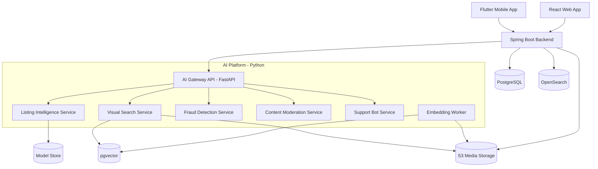
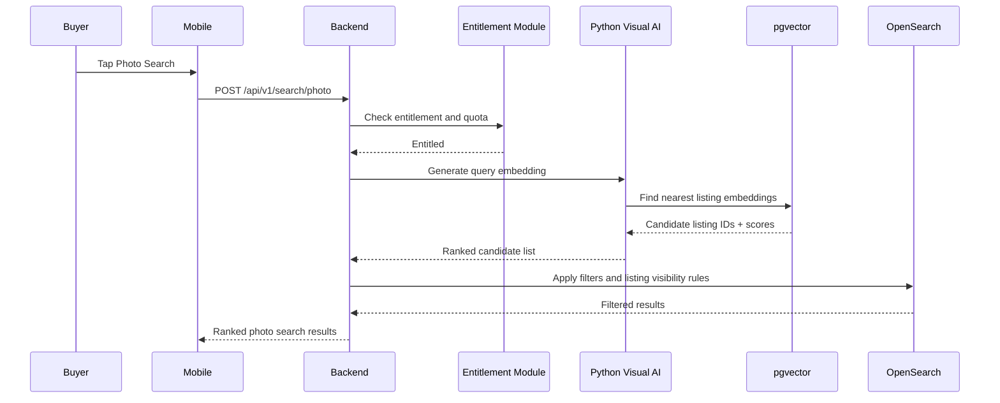
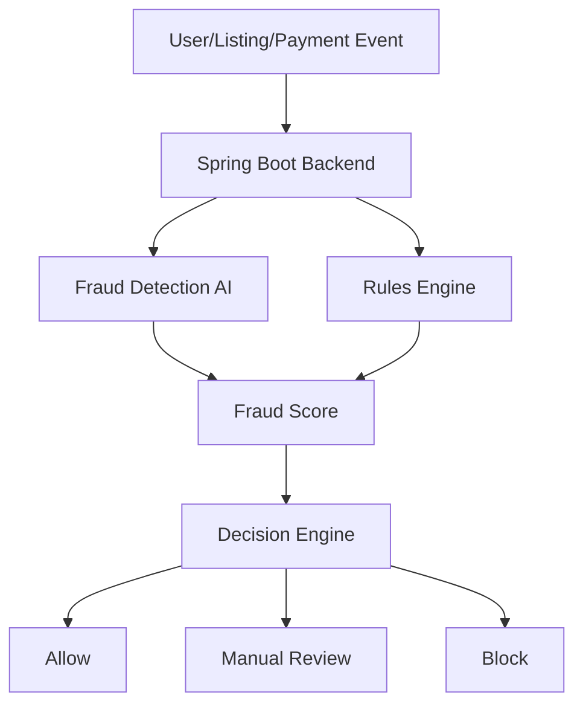
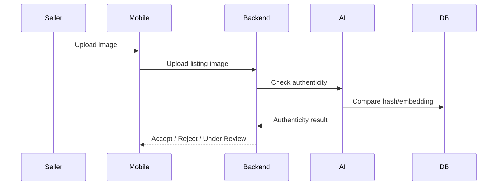
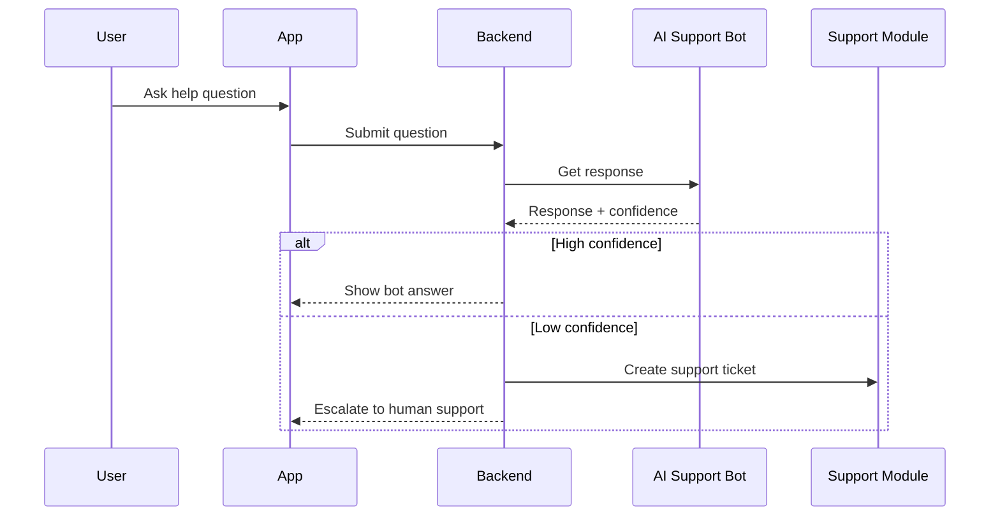
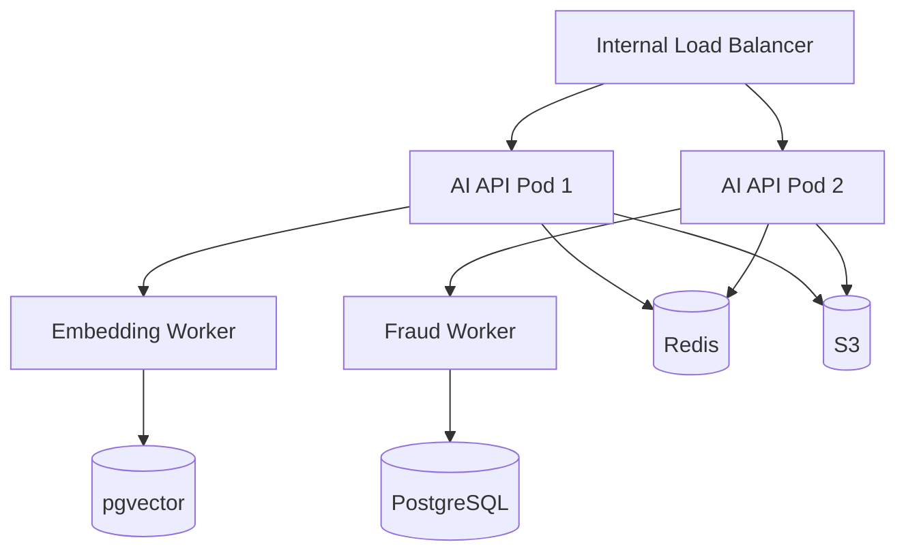

# ValueX High Level Design (HLD)

# Part 4 - AI Architecture, Visual Search, Listing AI, Fraud Detection & AI Operations

**Document Version:** 1.0  
**Product:** ValueX  
**AI Stack:** Python 3.11+, FastAPI  
**Backend Integration:** Java Spring Boot 3.x  
**Vector Search:** pgvector for MVP, Vector DB optional for scale  
**Reference Scope:** PRD v1.3, User Stories v2.0, Sprint Plan v2.0, User Flow v0.2

---

# 1. AI Architecture Overview

ValueX uses AI to improve listing creation, buyer discovery, fraud detection, moderation, support, and marketplace trust.

AI services are implemented as independent Python services and integrated with the Spring Boot backend through internal REST APIs and asynchronous events.

## Primary AI Capabilities

| AI Capability | Purpose |
|---|---|
| Listing AI | Suggest title, category, condition, description, price range |
| Visual Search AI | Match buyer-uploaded images to visually similar listings |
| Fraud Detection AI | Score suspicious listings, users, images, and behavior |
| Image Authenticity AI | Detect duplicate, reused, edited, or watermarked images |
| Moderation AI | Detect restricted items and inappropriate content |
| Support AI Bot | Provide user guidance and escalate complex issues |

---

# 2. AI Platform High-Level Architecture



---

# 3. AI Service Design Principles

## 3.1 AI Must Be Advisory Unless Business Rule Requires Blocking

AI suggestions should not override user control unless platform safety is at risk.

Examples:

| Use Case | AI Output | User Override? |
|---|---|---|
| Listing title suggestion | Suggestion | Yes |
| Category suggestion | Suggestion | Yes, within taxonomy |
| Price suggestion | Suggestion | Yes |
| Restricted item detection | Safety decision | No, unless admin override |
| Watermark detection | Safety decision | Admin override only |
| Fraud score | Risk signal | Admin/system decision |

---

## 3.2 Human-in-the-Loop for Risky Decisions

Manual review is required for:

- high fraud score listings
- borderline restricted items
- duplicate image ambiguity
- watermark disputes
- user account risk review
- return/dispute decisions

---

## 3.3 AI Service Isolation

AI must be isolated from core transaction logic.

Spring Boot remains the source of truth for:

- listings
- orders
- payments
- escrow
- shipping
- disputes
- subscriptions
- user account state

Python AI services return predictions and scores only.

---

# 4. AI Components

## 4.1 AI Gateway API

### Purpose

Single internal entry point for all AI capabilities.

### Responsibilities

- authenticate internal backend requests
- route requests to AI sub-services
- standardize AI responses
- enforce timeout and fallback rules
- record inference metadata

### Tech Stack

```text
Python
FastAPI
Pydantic
Uvicorn/Gunicorn
```

### Example Endpoints

```http
POST /ai/v1/listings/suggest
POST /ai/v1/images/embed
POST /ai/v1/search/photo
POST /ai/v1/fraud/listing-score
POST /ai/v1/moderation/restricted-item-check
POST /ai/v1/support/respond
```

---

## 4.2 Listing Intelligence Service

### Related User Stories

- US-005: AI-Assisted Listing Creation
- US-006: Multi-Category Tagging
- US-007: Restricted Items Prevention
- US-084: Pre-Publication Trust & Safety Review

### Responsibilities

- identify item from uploaded images
- suggest listing title
- suggest category
- suggest condition
- suggest description
- suggest price range
- identify multiple items in image
- detect unclear images

### Input

```json
{
  "listingId": "uuid",
  "sellerId": "uuid",
  "imageUrls": ["s3://valuex-listings/image1.jpg"],
  "sellerLocation": "Bengaluru",
  "optionalText": "iPhone used 1 year"
}
```

### Output

```json
{
  "categorySuggestions": [
    {
      "categoryId": "uuid",
      "categoryPath": "Electronics > Mobile Phones",
      "confidence": 0.91
    }
  ],
  "titleSuggestion": "Apple iPhone 13 128GB - Good Condition",
  "conditionSuggestion": "GOOD",
  "descriptionSuggestion": "Used Apple iPhone 13 with visible minor wear...",
  "priceRange": {
    "min": 32000,
    "max": 38000,
    "currency": "INR"
  },
  "warnings": [
    "Minor scratches detected on back panel"
  ]
}
```

### Model Sources

MVP may use:

- external multimodal LLM / vision API
- product/category taxonomy rules
- historical listing data
- comparable active listings

Scale version may use:

- custom fine-tuned classification model
- price prediction model
- regional demand model

---

# 5. Visual Search Architecture

## 5.1 Related User Stories

- US-038: Buyer Upgrades to Premium
- US-039: Photo-Based Search
- US-040: Visual Search Results Ranking
- US-041: Search Refinement with Filters
- US-096: Premium Subscription Lifecycle

---

## 5.2 Visual Search Flow



---

## 5.3 Image Embedding Generation

### Listing Image Embeddings

Generated when:

- seller uploads listing images
- listing is approved
- listing image is changed

### Buyer Query Embedding

Generated when:

- buyer takes photo
- buyer uploads gallery image

### Embedding Model

MVP:

```text
CLIP-like image embedding model
```

Vector size:

```text
512 or 768 dimensions
```

Storage:

```text
PostgreSQL pgvector
```

---

## 5.4 Visual Search Ranking

Ranking formula:

```text
Final Score =
Visual Similarity Score
+ Listing Plan Boost
+ Seller Rating Boost
+ Recency Boost
+ Location Proximity Boost
- Fraud Risk Penalty
```

### Match Bands

| Similarity | Label | Handling |
|---|---|---|
| >= 85% | High Match | Show first |
| 70-84% | Good Match | Show normally |
| 60-69% | Partial Match | Show with label |
| < 60% | Low Match | Hide by default |

---

## 5.5 Photo Search Entitlement Rules

| Buyer Plan | Photo Search Limit | Contact Privilege |
|---|---:|---|
| Basic | 3/day | Chat |
| Smart | 10/day | Chat + Voice |
| Vision | Unlimited | Chat + Voice + Video |

Entitlement validation is always server-side.

---

# 6. Fraud Detection AI

## 6.1 Related User Stories

- US-048: Fraud Listing Detection
- US-049: Image Proof Authenticity Validation
- US-050: Daily Listing Limit
- US-051: Progressive Penalties
- US-052: Fraud Score and Velocity Checks
- US-081: Block Transactions for Users Under Investigation
- US-082: Image Watermark Detection

---

## 6.2 Fraud Signal Categories

| Signal Type | Examples |
|---|---|
| Identity | Duplicate Aadhaar attempts, device reuse |
| Listing | Too many listings, unrealistic price, duplicate image |
| Communication | Spam messages, repeated calls, harassment reports |
| Payment | Failed payment spikes, suspicious refund patterns |
| Shipping | Frequent cancellations, wrong item reports |
| Returns | Repeated return abuse |
| Device | Multiple users on same device fingerprint |

---

## 6.3 Fraud Score Model

Fraud score range:

```text
0 - 100
```

| Score | Risk Level | Action |
|---:|---|---|
| 0-39 | Low | Allow |
| 40-69 | Medium | Monitor |
| 70-84 | High | Manual review |
| 85-100 | Critical | Block action / restrict account |

---

## 6.4 Fraud Scoring Flow



---

## 6.5 Fraud Actions

| Action | Trigger |
|---|---|
| Allow | Low score |
| Soft warning | Repeated minor signals |
| Manual review | High fraud score |
| Restrict account | Critical score or repeat violation |
| Suspend account | Confirmed violation |
| Ban account | Severe/repeated violation |

---

# 7. Image Authenticity & Watermark Detection

## 7.1 Responsibilities

- detect duplicate images
- detect edited images
- detect watermarks from other platforms
- detect screenshots
- identify reused seller proof images

---

## 7.2 Techniques

| Technique | Purpose |
|---|---|
| Perceptual Hashing | Detect same image after crop/filter |
| EXIF Analysis | Detect suspicious metadata |
| OCR | Detect platform watermark text |
| Logo Detection | Detect known marketplace logos |
| Similarity Embeddings | Detect visually similar reused images |

---

## 7.3 Image Authenticity Flow



---

# 8. Restricted Item & Content Moderation AI

## 8.1 Restricted Item Categories

- weapons
- explosives
- ammunition
- drugs
- tobacco
- alcohol
- adult content
- counterfeit goods
- live animals
- documents
- hazardous material

---

## 8.2 Moderation Sources

AI checks:

- listing title
- listing description
- images
- category selection
- seller history

---

## 8.3 Moderation Decision

| AI Result | Action |
|---|---|
| Safe | Continue |
| Unclear | Manual review |
| Restricted | Block listing |
| Severe violation | Restrict seller |

---

# 9. AI Support Bot Architecture

## 9.1 Related Stories

- US-043: On-Screen AI Bot Assistance
- US-045: Chat with Human Support
- US-074: Track Support Ticket Status
- US-095: Support Ticket Lifecycle

---

## 9.2 Bot Responsibilities

- answer general platform questions
- explain how to list item
- explain shipping/payment status
- guide buyer/seller through common flows
- escalate to human support when required

---

## 9.3 Bot Restrictions

Bot must not:

- decide disputes
- approve refunds
- override account penalties
- disclose another user's private information
- provide legal/financial guarantees

---

## 9.4 Support Bot Flow



---

# 10. AI Service APIs

## 10.1 Listing Suggestion API

```http
POST /ai/v1/listings/suggest
```

### Request

```json
{
  "listingId": "uuid",
  "imageUrls": ["s3://bucket/image.jpg"],
  "sellerLocation": "Bengaluru",
  "textHint": "used phone"
}
```

### Response

```json
{
  "title": "Apple iPhone 13 128GB",
  "categoryId": "uuid",
  "condition": "GOOD",
  "priceMin": 32000,
  "priceMax": 38000,
  "confidence": 0.89
}
```

---

## 10.2 Photo Search API

```http
POST /ai/v1/search/photo
```

### Request

```json
{
  "userId": "uuid",
  "imageUrl": "s3://query/image.jpg",
  "filters": {
    "priceMin": 1000,
    "priceMax": 50000,
    "location": "Mumbai"
  }
}
```

### Response

```json
{
  "results": [
    {
      "listingId": "uuid",
      "similarityScore": 0.87,
      "matchType": "HIGH_MATCH"
    }
  ]
}
```

---

## 10.3 Fraud Score API

```http
POST /ai/v1/fraud/score
```

### Request

```json
{
  "entityType": "LISTING",
  "entityId": "uuid",
  "signals": {
    "sellerAgeDays": 2,
    "listingCountToday": 8,
    "priceDeviationPercent": 65
  }
}
```

### Response

```json
{
  "fraudScore": 78,
  "riskLevel": "HIGH",
  "recommendedAction": "MANUAL_REVIEW",
  "reasons": [
    "New seller with high listing velocity",
    "Price significantly below comparable items"
  ]
}
```

---

# 11. AI Data Stores

## 11.1 PostgreSQL

Stores:

- AI request metadata
- AI decisions
- fraud scores
- moderation outcomes
- model version references

---

## 11.2 pgvector

Stores:

- listing image embeddings
- query image embeddings if needed for audit/quality analysis

---

## 11.3 Object Storage

Stores:

- listing images
- query images
- proof images
- dispute evidence
- moderation snapshots

---

## 11.4 Model Store

Stores:

- model binaries
- prompt templates
- model metadata
- version history

MVP options:

```text
S3 folder structure
```

Scale options:

```text
MLflow Model Registry
```

---

# 12. AI Observability

## 12.1 Metrics

| Metric | Target |
|---|---|
| Listing AI latency | < 5 seconds |
| Photo search latency | < 2 seconds p95 |
| Fraud score latency | < 500ms p95 |
| Moderation latency | < 3 seconds |
| AI support response | < 5 seconds |

---

## 12.2 Quality Metrics

| AI Feature | Quality Metric |
|---|---|
| Listing AI | Seller acceptance rate of suggestions |
| Price AI | Price correction rate by seller |
| Visual Search | Click-through rate on top 5 results |
| Fraud AI | False positive / false negative rate |
| Moderation AI | Admin override rate |
| Support Bot | Human escalation rate |

---

## 12.3 Logs

Must log:

- request ID
- model version
- input metadata
- output score
- confidence
- decision
- latency
- fallback used or not

Do not log:

- raw Aadhaar
- raw bank details
- private messages beyond moderation-safe excerpts

---

# 13. AI Failure Handling

## 13.1 Listing AI Failure

Fallback:

```text
Allow manual listing entry
```

User message:

```text
Auto-suggestions unavailable. Please enter details manually.
```

---

## 13.2 Photo Search Failure

Fallback:

```text
Show keyword/category search suggestion
```

User message:

```text
Photo search is temporarily unavailable. Try keyword search.
```

---

## 13.3 Fraud AI Failure

Fallback:

```text
Use rule-based fraud engine
```

High-risk actions should not bypass all checks.

---

## 13.4 Support Bot Failure

Fallback:

```text
Create support ticket / show help articles
```

---

# 14. Model Versioning

Every AI response must include:

```json
{
  "modelName": "visual-search-clip",
  "modelVersion": "1.0.0",
  "inferenceId": "uuid"
}
```

This enables:

- auditability
- debugging
- rollback
- A/B testing

---

# 15. AI Security & Privacy

## 15.1 Access Control

AI APIs must be internal-only.

Allowed callers:

- Spring Boot backend
- trusted batch workers
- admin moderation tools through backend only

---

## 15.2 Data Privacy

AI services must:

- avoid storing unnecessary PII
- use signed URLs for media access
- redact sensitive fields before prompt/model calls
- respect data deletion requests
- delete temporary query images according to retention policy

---

## 15.3 Prompt Safety

For LLM-based features:

- no direct user-to-model privileged prompt injection
- system prompts controlled centrally
- output validated before showing to users
- no legal/payment/dispute final decisions by AI alone

---

# 16. AI Deployment Architecture



---

# 17. AI Deployment Units

## MVP

```text
valuex-ai-service
```

Contains:

- listing AI
- visual search
- fraud scoring
- moderation
- support bot adapter

---

## Scale Phase

```text
valuex-ai-gateway
valuex-visual-search-service
valuex-fraud-service
valuex-support-bot-service
valuex-embedding-worker
```

---

# 18. AI Operations

## 18.1 Model Evaluation

Run scheduled evaluation for:

- photo search accuracy
- fraud scoring accuracy
- restricted item detection accuracy
- price suggestion deviation

---

## 18.2 Feedback Loops

Collect feedback from:

- seller edits to AI suggestions
- buyer clicks on photo search results
- admin moderation decisions
- dispute outcomes
- support bot escalation outcomes

---

## 18.3 Retraining Triggers

Retrain or adjust models when:

- fraud false negatives increase
- admin override rate > threshold
- photo search CTR drops
- new categories are added
- marketplace inventory changes significantly

---

# 19. AI Risks & Mitigations

| Risk | Impact | Mitigation |
|---|---|---|
| Wrong price suggestion | Seller distrust | Show as suggestion only |
| Wrong category | Poor search quality | Seller can edit |
| False fraud positive | Seller friction | Manual review path |
| Fraud false negative | Buyer loss | Rule engine + evidence capture |
| Photo search poor match | Low premium value | Confidence threshold + fallback |
| AI cost spike | Margin impact | Quotas and caching |
| Model drift | Accuracy decline | Monitoring and retraining |
| Prompt injection | Unsafe outputs | Prompt hardening and validation |

---

# 20. AI Roadmap Alignment with Sprint Plan

| Sprint | AI Scope |
|---|---|
| Sprint 2 | AI-assisted listing creation, restricted item checks |
| Sprint 9 | Fraud detection, image authenticity, watermark detection |
| Sprint 11 | AI bot assistance |
| Sprint 13 | Premium photo search, visual ranking |

---

# Part 4 Completed

Deliverables:

- AI Platform Architecture
- Listing AI Design
- Visual Search Architecture
- Fraud Detection Design
- Image Authenticity Design
- Restricted Item Moderation
- Support Bot Architecture
- AI API Contracts
- AI Observability
- AI Security and Privacy
- AI Deployment Model
- AI Operations

Next Document:

```text
Part 5 - Mobile Architecture (Flutter) and Web Architecture (React)
```
