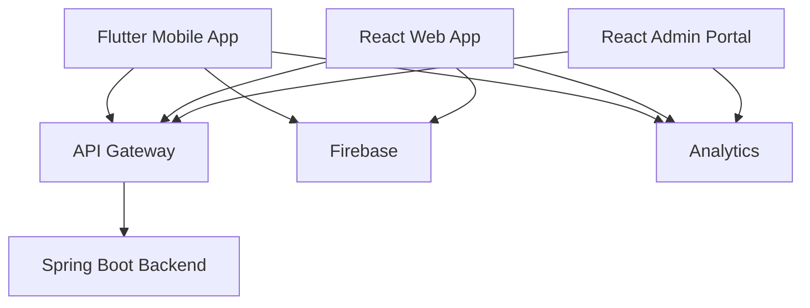

# ValueX High Level Design (HLD)

# Part 5 – Mobile Architecture (Flutter) & Web Architecture (React)

**Document Version:** 1.0
**Product:** ValueX
**Mobile Stack:** Flutter + Dart
**Web Stack:** React + TypeScript
**State Management:** Riverpod (Mobile), Redux Toolkit (Web)
**Architecture Style:** Clean Architecture + Feature-Based Modular Structure

---

# 1. Frontend Architecture Overview

ValueX has three frontend applications:

| Application  | Technology | Users                       |
| ------------ | ---------- | --------------------------- |
| Mobile App   | Flutter    | Buyers, Sellers             |
| Web App      | React      | Buyers, Sellers             |
| Admin Portal | React      | Admins, Moderators, Support |

---

# 2. Frontend High-Level Architecture



---

# 3. Mobile Application Architecture

## 3.1 Architecture Style

Flutter will follow:

```text
Clean Architecture
+
Feature-Based Modular Architecture
+
Riverpod State Management
```

Benefits:

* High maintainability
* Easy testing
* AI-code friendly
* Independent feature ownership

---

## 3.2 Flutter Layered Architecture

```text
Presentation Layer
        ↓
Application Layer
        ↓
Domain Layer
        ↓
Data Layer
        ↓
Backend APIs
```

---

## Presentation Layer

Contains:

```text
Screens
Widgets
View Models
State Providers
Navigation
```

Examples:

```text
LoginScreen
CreateListingScreen
CartScreen
OrderHistoryScreen
```

---

## Application Layer

Contains:

```text
Use Cases
Application Services
State Orchestration
```

Examples:

```text
CreateListingUseCase
InitiatePaymentUseCase
SearchListingUseCase
```

---

## Domain Layer

Contains:

```text
Entities
Enums
Business Rules
Lifecycle Models
```

Examples:

```text
User
Listing
Order
Escrow
Shipment
```

---

## Data Layer

Contains:

```text
Repositories
API Clients
DTOs
Remote Data Sources
```

Examples:

```text
AuthRepository
ListingRepository
OrderRepository
```

---

# 4. Flutter Folder Structure

```text
lib/

├── core
│   ├── config
│   ├── constants
│   ├── theme
│   ├── networking
│   ├── security
│   ├── utils
│   └── widgets

├── features

│   ├── auth
│   ├── profile
│   ├── listing
│   ├── search
│   ├── communication
│   ├── negotiation
│   ├── cart
│   ├── order
│   ├── payment
│   ├── shipping
│   ├── return
│   ├── dispute
│   ├── subscription
│   ├── support
│   ├── notification

├── navigation

├── localization

├── analytics

└── main.dart
```

---

# 5. State Management Strategy

## Mobile

Technology:

```text
Riverpod
```

---

### Why Riverpod?

* Compile-time safety
* Better testability
* Less boilerplate than Bloc
* Excellent AI-generated code quality

---

## Example Providers

### Auth Provider

```dart
authProvider
```

---

### User Provider

```dart
userProfileProvider
```

---

### Search Provider

```dart
searchProvider
```

---

### Cart Provider

```dart
cartProvider
```

---

### Order Provider

```dart
orderProvider
```

---

# 6. Navigation Architecture

## Bottom Navigation

```text
Home
Search
Sell
Orders
Profile
```

---

## Navigation Stack

### Home

```text
Home
 → Listing Details
 → Seller Profile
 → Chat
```

---

### Search

```text
Search
 → Filters
 → Listing Details
```

---

### Sell

```text
Create Listing
 → Upload Images
 → AI Suggestions
 → Plan Selection
 → Publish
```

---

### Orders

```text
Order List
 → Order Details
 → Tracking
 → Return
 → Dispute
```

---

### Profile

```text
Profile
 → Saved Items
 → Subscription
 → Support
 → Settings
```

---

# 7. Mobile Screen Inventory

## Authentication

```text
Splash
Onboarding
Mobile Verification
OTP Verification
Aadhaar Verification
Login
```

---

## Seller Screens

```text
Create Listing
Capture Photos
AI Suggestions
Plan Selection
Listing Management
Offer Management
Seller Analytics
```

---

## Buyer Screens

```text
Home
Search
Photo Search
Listing Details
Saved Items
Cart
Checkout
```

---

## Communication

```text
Chat
Voice Call
Video Call
```

---

## Order Management

```text
Orders
Order Details
Tracking
Returns
Disputes
```

---

## Premium Features

```text
Premium Plans
Subscription Management
Photo Search
```

---

## Support

```text
AI Assistant
Support Tickets
Human Chat
Call Support
```

---

# 8. Mobile API Strategy

All APIs accessed through:

```text
ApiClient
```

using:

```text
Dio HTTP Client
```

---

## API Layers

```text
Screen
 ↓
Provider
 ↓
Repository
 ↓
Api Client
 ↓
Backend API
```

---

# 9. Offline Strategy

## Cached Locally

* User profile
* Saved items
* Recent searches
* Notifications
* Settings

---

## Offline Actions Queue

```text
Save Listing Draft
Chat Draft
Support Ticket Draft
```

---

# 10. Push Notifications

## Technology

```text
Firebase Cloud Messaging
```

---

## Notification Types

### High Priority

```text
Order Updates
Payment Updates
Disputes
Account Security
```

---

### Medium Priority

```text
Messages
Offers
Tracking Updates
```

---

### Low Priority

```text
Marketing
Recommendations
```

---

# 11. Mobile Security

## Storage

Use:

```text
Flutter Secure Storage
```

Store:

* JWT
* Refresh Token
* Device ID

---

## Security Controls

* SSL Pinning
* Root Detection
* Jailbreak Detection
* Screenshot Protection (Sensitive Screens)

---

# 12. Web Application Architecture

## Technology Stack

```text
React
TypeScript
Redux Toolkit
React Query
Material UI
```

---

## Architecture Style

```text
Feature-Based Architecture
```

---

# 13. React Folder Structure

```text
src/

├── app
├── api
├── components
├── layouts
├── pages

├── features
│   ├── auth
│   ├── profile
│   ├── listings
│   ├── search
│   ├── cart
│   ├── orders
│   ├── support

├── store
├── routes
├── hooks
├── utils
└── types
```

---

# 14. State Management (Web)

## Redux Toolkit

Global state:

```text
Auth
User
Cart
Notifications
```

---

## React Query

Server state:

```text
Listings
Orders
Search Results
Subscriptions
```

---

# 15. Web Routing

```text
/
 /login
 /search
 /listing/:id
 /profile
 /orders
 /cart
 /support
```

---

# 16. Admin Portal Architecture

## Modules

### User Management

```text
Search Users
Suspend User
Ban User
```

---

### Listing Moderation

```text
Review Listings
Approve Listing
Reject Listing
```

---

### Disputes

```text
Review Evidence
Resolve Dispute
```

---

### Fraud Monitoring

```text
Fraud Dashboard
Risk Scores
```

---

### Analytics

```text
GMV
Conversion
Photo Search Usage
Revenue
```

---

# 17. Frontend Performance Strategy

## Mobile

### Targets

| Metric         | Target  |
| -------------- | ------- |
| App Startup    | < 3 sec |
| Screen Load    | < 1 sec |
| Search Results | < 2 sec |
| Photo Search   | < 2 sec |

---

## Optimizations

* Lazy Loading
* Pagination
* Image Compression
* Cached Network Images

---

# 18. Frontend Analytics

## Events

### Authentication

```text
UserRegistered
UserLoggedIn
```

---

### Listings

```text
ListingCreated
ListingPublished
```

---

### Search

```text
SearchPerformed
PhotoSearchPerformed
```

---

### Commerce

```text
OfferCreated
OrderPlaced
PaymentCompleted
```

---

### Subscription

```text
PlanPurchased
PlanRenewed
```

---

# 19. Accessibility

## Mobile

* Screen Reader Support
* Dynamic Font Scaling
* Color Contrast Compliance
* Touch Targets > 44px

---

## Web

* WCAG 2.1 AA
* Keyboard Navigation
* ARIA Labels
* Accessible Forms

---

# 20. Localization

## Languages

Phase 1:

```text
English
Hindi
Tamil
Telugu
Bengali
Marathi
Kannada
Gujarati
Malayalam
Punjabi
```

---

## Translation Strategy

```text
i18n JSON Files
```

Example:

```json
{
  "login": "Login",
  "search": "Search"
}
```

---

# 21. Error Handling

## Standard Error UI

### Network Failure

```text
Unable to connect
Retry
```

---

### Server Failure

```text
Something went wrong
Try Again
```

---

### Authorization Failure

```text
Session expired
Please login again
```

---

# 22. Feature Flags

All premium and AI features must support:

```text
Feature Toggle
```

Examples:

```text
Photo Search
Voice Calls
Video Calls
Premium Plans
AI Assistant
```

---

# 23. Frontend Deployment

## Mobile

### Android

```text
Google Play Store
```

---

### iOS

```text
Apple App Store
```

---

## Web

```text
React Build
 → CDN
 → Web Hosting
```

---

## Admin

```text
React Build
 → Secure Internal Domain
```

---

# 24. Frontend Quality Gates

### Mobile

* Unit Tests
* Widget Tests
* Integration Tests

---

### Web

* Unit Tests
* Component Tests
* E2E Tests

---

# 25. Part 5 Completed

Deliverables:

* Flutter Architecture
* React Architecture
* Admin Portal Architecture
* State Management Strategy
* Navigation Architecture
* Screen Inventory
* Security Design
* Offline Strategy
* Push Notifications
* Accessibility
* Localization
* Frontend Analytics
* Deployment Strategy

---

## Next Document

```text
Part 6 – Security Architecture, Deployment Architecture, DevOps, CI/CD, Monitoring & Disaster Recovery
```
