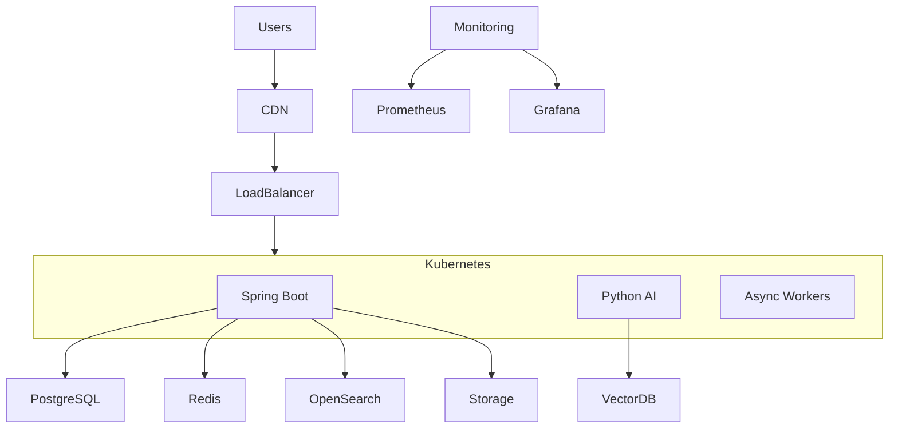

# ValueX High Level Design (HLD)

# Part 6 – Security Architecture, Deployment Architecture, DevOps, CI/CD, Monitoring & Disaster Recovery

**Document Version:** 1.0
**Product:** ValueX
**Cloud Strategy:** Cloud Native
**Infrastructure:** Kubernetes + Docker + Terraform
**CI/CD:** GitHub Actions
**Monitoring:** Prometheus + Grafana + ELK

---

# 1. Security Architecture Overview

ValueX handles:

* Aadhaar verification
* Buyer/Seller identities
* Escrow payments
* Bank account details
* UPI information
* Disputes
* Communication records
* AI-generated decisions

Therefore security is a core platform capability.

---

# 2. Security Principles

## Zero Trust Architecture

```text
Never Trust
Always Verify
Least Privilege
```

Every request must be:

* authenticated
* authorized
* audited

---

## Defense In Depth

Security layers:

```text
User
 ↓
Device Security
 ↓
Application Security
 ↓
API Security
 ↓
Network Security
 ↓
Infrastructure Security
 ↓
Data Security
```

---

# 3. Authentication Architecture

## Authentication Method

### Users

```text
Primary:
  Mobile OTP → JWT

Optional Convenience:
  Google Sign-In → (mobile verify on first use) → JWT
  Apple Sign-In  → (mobile verify on first use) → JWT
```

All three methods produce the same JWT upon completion. Mobile number is always the account anchor — social login on first use must still collect and verify a mobile number via OTP.

---

### Admin Users

```text
Password
+
MFA
+
JWT
```

---

## JWT Strategy

### Access Token

```text
Validity: 1 Hour
```

---

### Refresh Token

```text
Validity: 7 Days
```

Stored:

```text
Redis
```

---

## JWT Claims

```json
{
  "userId": "uuid",
  "role": "BUYER",
  "status": "ACTIVE",
  "subscription": "VISION",
  "aadhaarVerified": false,
  "authProvider": "MOBILE_OTP"
}
```

`authProvider` values: `MOBILE_OTP`, `GOOGLE`, `APPLE`

---

# 4. Authorization Architecture

## RBAC

### Roles

```text
BUYER
SELLER
SUPPORT_AGENT
MODERATOR
ADMIN
SUPER_ADMIN
LOGISTICS_PARTNER
```

---

## Example Permissions

### Buyer

```text
Search Listings
Create Orders
Create Returns
Create Disputes
```

---

### Seller

```text
Create Listings
Accept Offers
Receive Payments
```

---

### Moderator

```text
Review Listings
Review Users
Moderate Content
```

---

### Admin

```text
All Permissions
```

---

# 5. Account Status Enforcement

All APIs must validate account state.

| Status       | Login | Browse  | Buy | Sell |
| ------------ | ----- | ------- | --- | ---- |
| ACTIVE       | Yes   | Yes     | Yes | Yes  |
| UNDER_REVIEW | Yes   | Yes     | No  | No   |
| RESTRICTED   | Yes   | Limited | No  | No   |
| SUSPENDED    | No    | No      | No  | No   |
| BANNED       | No    | No      | No  | No   |

---

# 6. Aadhaar Security

## Storage Rule

Never store:

```text
Raw Aadhaar Number
```

Store:

```text
Hashed Aadhaar Reference
```

Example:

```text
SHA-256 Hash
```

---

## Encryption

Sensitive fields:

```text
aadhaar_hash
bank_account
upi_details
```

Encrypted using:

```text
AES-256
```

---

# 7. API Security

## TLS

All traffic:

```text
TLS 1.3
```

Mandatory.

---

## Rate Limiting

### Login

```text
5 Requests / Minute
```

---

### OTP

```text
5 Requests / Hour
```

---

### Search

```text
100 Requests / Minute
```

---

### Photo Search

```text
Plan Controlled
```

---

## API Gateway Security

Responsibilities:

* JWT validation
* Rate limiting
* Request tracing
* WAF integration
* IP blocking

---

# 8. Mobile Security

## Storage

Use:

```text
Flutter Secure Storage
```

Store:

* JWT
* Refresh token
* Device identifier

---

## Security Controls

### SSL Pinning

Prevent:

```text
MITM Attacks
```

---

### Root Detection

Detect:

```text
Rooted Android Devices
```

---

### Jailbreak Detection

Detect:

```text
Jailbroken iPhones
```

---

### Screen Protection

Sensitive screens:

```text
Payments
Escrow
Bank Details
```

Prevent screenshots.

---

# 9. Web Security

## Protection

### CSP

```text
Content Security Policy
```

---

### CSRF Protection

Admin portal:

```text
Mandatory
```

---

### Secure Cookies

```text
HttpOnly
Secure
SameSite
```

---

# 10. File Upload Security

## Allowed Formats

Images:

```text
jpg
jpeg
png
heic
```

---

## Validation

Validate:

* mime type
* extension
* content

---

## Virus Scanning

All uploads pass through:

```text
ClamAV
```

or cloud equivalent.

---

# 11. Fraud Protection Layer

## Fraud Signals

### Listing Fraud

Monitor:

```text
Duplicate Images
Restricted Items
Fake Pricing
```

---

### Buyer Fraud

Monitor:

```text
Spam Messaging
Mass Negotiations
Return Abuse
```

---

### Seller Fraud

Monitor:

```text
Frequent Cancellations
Wrong Item Reports
Disputes
```

---

## Fraud Score

Range:

```text
0 - 100
```

---

### Actions

| Score | Action    |
| ----- | --------- |
| <50   | No Action |
| 50-70 | Monitor   |
| 70-85 | Restrict  |
| >85   | Suspend   |

---

# 12. Infrastructure Architecture

## Cloud Layout



---

# 13. Environment Strategy

## Development

```text
dev
```

Purpose:

```text
Developer Testing
```

---

## Staging

```text
staging
```

Purpose:

```text
Production Replica
```

---

## Production

```text
prod
```

Purpose:

```text
Live Users
```

---

# 14. Infrastructure as Code

## Technology

```text
Terraform
```

---

## Managed Resources

```text
VPC
Kubernetes
PostgreSQL
Redis
S3
Load Balancer
DNS
Monitoring
```

---

# 15. Docker Strategy

## Containers

### Backend

```dockerfile
Spring Boot
```

---

### AI

```dockerfile
Python FastAPI
```

---

### Web

```dockerfile
React
```

---

### Workers

```dockerfile
Background Jobs
```

---

# 16. Kubernetes Strategy

## Deployments

### Backend

```text
valuex-backend
```

Replicas:

```text
3
```

---

### AI

```text
valuex-ai
```

Replicas:

```text
2
```

---

### Workers

```text
valuex-workers
```

Replicas:

```text
2
```

---

# 17. CI/CD Architecture

## GitHub Repositories

```text
valuex-mobile
valuex-web
valuex-backend
valuex-ai
valuex-infra
```

---

## Branch Strategy

### Main

```text
main
```

Production ready.

---

### Development

```text
develop
```

Integration branch.

---

### Feature Branch

```text
feature/*
```

Example:

```text
feature/user-registration
```

---

# 18. CI Pipeline

## Trigger

```text
Pull Request
```

---

## Steps

```text
Checkout
 ↓
Compile
 ↓
Unit Tests
 ↓
Static Analysis
 ↓
Security Scan
 ↓
Build Artifact
```

---

# 19. CD Pipeline

## Staging Deployment

```text
Merge → develop
```

Deploy automatically.

---

## Production Deployment

```text
Merge → main
```

Requires approval.

---

# 20. Quality Gates

## Backend

Minimum:

```text
80% Coverage
```

---

## Mobile

Minimum:

```text
70% Coverage
```

---

## Web

Minimum:

```text
70% Coverage
```

---

## AI

Minimum:

```text
Model Validation Required
```

---

# 21. Monitoring Architecture

## Monitoring Stack

### Metrics

```text
Prometheus
```

---

### Dashboards

```text
Grafana
```

---

### Logs

```text
ELK Stack
```

Components:

```text
Elasticsearch
Logstash
Kibana
```

---

# 22. Metrics Collection

## Backend

Track:

```text
Request Count
Latency
Error Rate
Throughput
```

---

## Database

Track:

```text
Connections
Query Latency
Locks
Replication
```

---

## AI

Track:

```text
Inference Latency
Accuracy
Failure Rate
```

---

## Business Metrics

Track:

```text
Orders
GMV
Fraud Rate
Returns
Subscriptions
```

---

# 23. Distributed Tracing

## Technology

```text
OpenTelemetry
```

---

## Trace Flow

```text
Mobile
 ↓
API Gateway
 ↓
Backend
 ↓
Database
```

---

# 24. Logging Strategy

## Structured Logging

JSON logs only.

Example:

```json
{
  "timestamp":"...",
  "requestId":"...",
  "userId":"...",
  "action":"OrderCreated"
}
```

---

## Log Levels

```text
ERROR
WARN
INFO
DEBUG
```

---

# 25. Alerting Strategy

## Critical Alerts

### Backend Down

Alert:

```text
PagerDuty
```

---

### Database Failure

Alert:

```text
Immediate
```

---

### Payment Failure Spike

Alert:

```text
Immediate
```

---

### Escrow Failure

Alert:

```text
Immediate
```

---

# 26. Disaster Recovery

## RPO

Recovery Point Objective

```text
15 Minutes
```

---

## RTO

Recovery Time Objective

```text
2 Hours
```

---

# 27. Backup Strategy

## PostgreSQL

### Full Backup

```text
Daily
```

---

### Incremental Backup

```text
15 Minutes
```

---

## Object Storage

### Replication

```text
Cross Region
```

---

# 28. High Availability

## Backend

```text
3 Replicas
```

---

## PostgreSQL

```text
Primary
+
Read Replica
```

---

## Redis

```text
Redis Cluster
```

---

# 29. Deployment Strategies

## Rolling Update

Default.

```text
No Downtime
```

---

## Blue/Green

Major releases.

---

## Canary

High risk releases.

```text
10%
25%
50%
100%
```

---

# 30. Incident Response

## Severity 1

Examples:

```text
Payment Failure
Data Loss
Production Down
```

Response:

```text
Immediate
```

---

## Severity 2

Examples:

```text
Search Failure
Notifications Failure
```

Response:

```text
Within 1 Hour
```

---

## Severity 3

Examples:

```text
Reporting Errors
Analytics Delays
```

Response:

```text
Within 24 Hours
```

---

# 31. Compliance Controls

## Aadhaar Compliance

* No raw Aadhaar storage
* Consent tracking
* Audit logs

---

## Payment Compliance

* PCI DSS
* Gateway tokenization

---

## Privacy Compliance

Supports:

```text
Data Export
Data Deletion
```

---

# 32. Security Audit Strategy

## Automated

Monthly:

```text
Dependency Scan
Container Scan
SAST
```

---

## Manual

Quarterly:

```text
Penetration Testing
```

---

# 33. Business Continuity

## Critical Services

Must survive:

```text
Single Node Failure
Single AZ Failure
```

---

## Graceful Degradation

If AI unavailable:

```text
Manual Listing Entry
Keyword Search Only
```

---

If Notification Service fails:

```text
Retry Queue
```

---

# 34. Part 6 Completed

Deliverables:

* Security Architecture
* Authentication & Authorization
* Aadhaar Security Controls
* Fraud Protection
* Infrastructure Architecture
* Docker & Kubernetes Design
* CI/CD Strategy
* Monitoring & Logging
* Distributed Tracing
* Disaster Recovery
* Backup Strategy
* Compliance Controls
* Incident Management

---

## Next Document

```text
Part 7 – API Catalog, External Integrations, Release Architecture, Rollout Strategy & Risk Analysis
```
