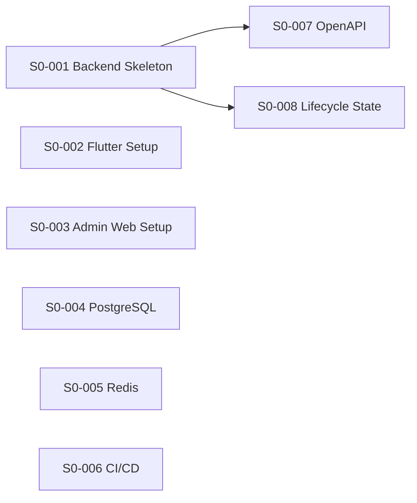

# Low Level Design - Sprint 0: Foundation & Architecture

**Document Version:** 1.0  
**Product:** ValueX  
**Sprint:** Sprint 0 - Foundation & Architecture  
**Sprint Duration:** 2 Weeks  
**Date:** June 2026

**Reference Documents:**
- PRD v1.3
- HLD Parts 1-3
- Sprint Plan v2.0
- User Stories v2.0

---

## Table of Contents

1. [Sprint Overview](#1-sprint-overview)
2. [S0-001: Backend Project Skeleton](#2-s0-001-backend-project-skeleton)
3. [S0-002: Flutter Project Setup](#3-s0-002-flutter-project-setup)
4. [S0-003: Admin Web Setup](#4-s0-003-admin-web-setup)
5. [S0-004: PostgreSQL Setup](#5-s0-004-postgresql-setup)
6. [S0-005: Redis Setup](#6-s0-005-redis-setup)
7. [S0-006: CI/CD Pipeline](#7-s0-006-cicd-pipeline)
8. [S0-007: OpenAPI Framework](#8-s0-007-openapi-framework)
9. [S0-008: Lifecycle State Framework](#9-s0-008-lifecycle-state-framework)
10. [Environment Configuration](#10-environment-configuration)
11. [Testing Strategy](#11-testing-strategy)

---

# 1. Sprint Overview

## 1.1 Goal

Establish engineering foundation, repositories, CI/CD, environments, and architecture skeletons.

## 1.2 Stories Covered

| ID     | Story                     | Repo    | SP | Dependency |
| ------ | ------------------------- | ------- | -- | ---------- |
| S0-001 | Backend Project Skeleton  | backend | 5  | None       |
| S0-002 | Flutter Project Setup     | mobile  | 5  | None       |
| S0-003 | Admin Web Setup           | web     | 3  | None       |
| S0-004 | PostgreSQL Setup          | infra   | 3  | None       |
| S0-005 | Redis Setup               | infra   | 2  | None       |
| S0-006 | CI/CD Pipeline            | infra   | 8  | None       |
| S0-007 | OpenAPI Framework         | backend | 5  | S0-001     |
| S0-008 | Lifecycle State Framework | backend | 5  | S0-001     |

## 1.3 Dependencies



## 1.4 Exit Criteria

- [ ] All repositories created and initialized
- [ ] Backend Spring Boot application runs successfully
- [ ] Flutter mobile app runs on emulator/device
- [ ] React admin web app runs locally
- [ ] PostgreSQL database accessible
- [ ] Redis accessible
- [ ] CI/CD pipelines execute successfully
- [ ] OpenAPI documentation auto-generated
- [ ] State machine framework functional

---

# 2. S0-001: Backend Project Skeleton

## 2.1 Objective

Create a production-ready Spring Boot 3.x project with modular architecture, security, observability, and extensibility.

## 2.2 Technology Stack

| Component | Technology | Version |
| --------- | ---------- | ------- |
| Language | Java | 21 |
| Framework | Spring Boot | 3.2.x |
| Build Tool | Maven | 3.9+ |
| API Style | REST | - |
| Documentation | OpenAPI 3.0 | - |
| Security | Spring Security + JWT | - |
| Database | PostgreSQL | 16 |
| Cache | Redis | 7 |
| Messaging | Spring Events (MVP) | - |

## 2.3 Project Structure

```text
valuex-backend/
├── pom.xml
├── .gitignore
├── README.md
├── docker-compose.yml
├── src/
│   ├── main/
│   │   ├── java/
│   │   │   └── com/
│   │   │       └── valuex/
│   │   │           ├── ValuexApplication.java
│   │   │           ├── common/
│   │   │           │   ├── config/
│   │   │           │   │   ├── SecurityConfig.java
│   │   │           │   │   ├── DatabaseConfig.java
│   │   │           │   │   ├── RedisConfig.java
│   │   │           │   │   ├── OpenApiConfig.java
│   │   │           │   │   ├── JacksonConfig.java
│   │   │           │   │   └── AsyncConfig.java
│   │   │           │   ├── security/
│   │   │           │   │   ├── JwtTokenProvider.java
│   │   │           │   │   ├── JwtAuthenticationFilter.java
│   │   │           │   │   ├── SecurityContext.java
│   │   │           │   │   └── PasswordService.java
│   │   │           │   ├── audit/
│   │   │           │   │   ├── AuditInterceptor.java
│   │   │           │   │   ├── AuditLogger.java
│   │   │           │   │   └── AuditEvent.java
│   │   │           │   ├── events/
│   │   │           │   │   ├── DomainEvent.java
│   │   │           │   │   ├── DomainEventPublisher.java
│   │   │           │   │   └── EventListener.java
│   │   │           │   ├── exception/
│   │   │           │   │   ├── GlobalExceptionHandler.java
│   │   │           │   │   ├── BusinessException.java
│   │   │           │   │   ├── NotFoundException.java
│   │   │           │   │   ├── ValidationException.java
│   │   │           │   │   └── ErrorResponse.java
│   │   │           │   ├── dto/
│   │   │           │   │   ├── ApiResponse.java
│   │   │           │   │   ├── PagedResponse.java
│   │   │           │   │   └── Metadata.java
│   │   │           │   └── utils/
│   │   │           │       ├── DateUtils.java
│   │   │           │       ├── StringUtils.java
│   │   │           │       └── ValidationUtils.java
│   │   │           ├── auth/
│   │   │           ├── user/
│   │   │           ├── listing/
│   │   │           ├── search/
│   │   │           ├── plans/
│   │   │           ├── communication/
│   │   │           ├── negotiation/
│   │   │           ├── cart/
│   │   │           ├── order/
│   │   │           ├── payment/
│   │   │           ├── escrow/
│   │   │           ├── shipping/
│   │   │           ├── returns/
│   │   │           ├── dispute/
│   │   │           ├── rating/
│   │   │           ├── support/
│   │   │           ├── notification/
│   │   │           ├── moderation/
│   │   │           └── admin/
│   │   └── resources/
│   │       ├── application.yml
│   │       ├── application-dev.yml
│   │       ├── application-staging.yml
│   │       ├── application-prod.yml
│   │       ├── db/
│   │       │   └── migration/
│   │       │       └── V1__init_schema.sql
│   │       └── logback-spring.xml
│   └── test/
│       └── java/
│           └── com/
│               └── valuex/
│                   ├── ValuexApplicationTests.java
│                   └── common/
└── .github/
    └── workflows/
        └── backend-ci.yml
```

## 2.4 Maven Dependencies (pom.xml)

```xml
<?xml version="1.0" encoding="UTF-8"?>
<project xmlns="http://maven.apache.org/POM/4.0.0"
         xmlns:xsi="http://www.w3.org/2001/XMLSchema-instance"
         xsi:schemaLocation="http://maven.apache.org/POM/4.0.0 
         https://maven.apache.org/xsd/maven-4.0.0.xsd">
    <modelVersion>4.0.0</modelVersion>
    
    <parent>
        <groupId>org.springframework.boot</groupId>
        <artifactId>spring-boot-starter-parent</artifactId>
        <version>3.2.5</version>
        <relativePath/>
    </parent>
    
    <groupId>com.valuex</groupId>
    <artifactId>valuex-backend</artifactId>
    <version>0.1.0-SNAPSHOT</version>
    <name>ValueX Backend</name>
    <description>ValueX C2C Marketplace Backend API</description>
    
    <properties>
        <java.version>21</java.version>
        <springdoc.version>2.5.0</springdoc.version>
        <jjwt.version>0.12.5</jjwt.version>
        <flyway.version>10.13.0</flyway.version>
    </properties>
    
    <dependencies>
        <!-- Spring Boot Starters -->
        <dependency>
            <groupId>org.springframework.boot</groupId>
            <artifactId>spring-boot-starter-web</artifactId>
        </dependency>
        
        <dependency>
            <groupId>org.springframework.boot</groupId>
            <artifactId>spring-boot-starter-data-jpa</artifactId>
        </dependency>
        
        <dependency>
            <groupId>org.springframework.boot</groupId>
            <artifactId>spring-boot-starter-data-redis</artifactId>
        </dependency>
        
        <dependency>
            <groupId>org.springframework.boot</groupId>
            <artifactId>spring-boot-starter-security</artifactId>
        </dependency>
        
        <dependency>
            <groupId>org.springframework.boot</groupId>
            <artifactId>spring-boot-starter-validation</artifactId>
        </dependency>
        
        <dependency>
            <groupId>org.springframework.boot</groupId>
            <artifactId>spring-boot-starter-actuator</artifactId>
        </dependency>
        
        <!-- Database -->
        <dependency>
            <groupId>org.postgresql</groupId>
            <artifactId>postgresql</artifactId>
            <scope>runtime</scope>
        </dependency>
        
        <!-- Database Migration -->
        <dependency>
            <groupId>org.flywaydb</groupId>
            <artifactId>flyway-core</artifactId>
        </dependency>
        
        <dependency>
            <groupId>org.flywaydb</groupId>
            <artifactId>flyway-database-postgresql</artifactId>
        </dependency>
        
        <!-- JWT -->
        <dependency>
            <groupId>io.jsonwebtoken</groupId>
            <artifactId>jjwt-api</artifactId>
            <version>${jjwt.version}</version>
        </dependency>
        
        <dependency>
            <groupId>io.jsonwebtoken</groupId>
            <artifactId>jjwt-impl</artifactId>
            <version>${jjwt.version}</version>
            <scope>runtime</scope>
        </dependency>
        
        <dependency>
            <groupId>io.jsonwebtoken</groupId>
            <artifactId>jjwt-jackson</artifactId>
            <version>${jjwt.version}</version>
            <scope>runtime</scope>
        </dependency>
        
        <!-- OpenAPI Documentation -->
        <dependency>
            <groupId>org.springdoc</groupId>
            <artifactId>springdoc-openapi-starter-webmvc-ui</artifactId>
            <version>${springdoc.version}</version>
        </dependency>
        
        <!-- Utilities -->
        <dependency>
            <groupId>org.projectlombok</groupId>
            <artifactId>lombok</artifactId>
            <optional>true</optional>
        </dependency>
        
        <dependency>
            <groupId>org.apache.commons</groupId>
            <artifactId>commons-lang3</artifactId>
        </dependency>
        
        <!-- Testing -->
        <dependency>
            <groupId>org.springframework.boot</groupId>
            <artifactId>spring-boot-starter-test</artifactId>
            <scope>test</scope>
        </dependency>
        
        <dependency>
            <groupId>org.springframework.security</groupId>
            <artifactId>spring-security-test</artifactId>
            <scope>test</scope>
        </dependency>
        
        <dependency>
            <groupId>com.h2database</groupId>
            <artifactId>h2</artifactId>
            <scope>test</scope>
        </dependency>
    </dependencies>
    
    <build>
        <plugins>
            <plugin>
                <groupId>org.springframework.boot</groupId>
                <artifactId>spring-boot-maven-plugin</artifactId>
            </plugin>
        </plugins>
    </build>
</project>
```

## 2.5 Main Application Class

```java
package com.valuex;

import org.springframework.boot.SpringApplication;
import org.springframework.boot.autoconfigure.SpringBootApplication;
import org.springframework.scheduling.annotation.EnableAsync;

@SpringBootApplication
@EnableAsync
public class ValuexApplication {

    public static void main(String[] args) {
        SpringApplication.run(ValuexApplication.class, args);
    }
}
```

## 2.6 Application Configuration (application.yml)

```yaml
spring:
  application:
    name: valuex-backend
    
  profiles:
    active: ${SPRING_PROFILE:dev}
    
  datasource:
    url: ${DATABASE_URL:jdbc:postgresql://localhost:5432/valuex_dev}
    username: ${DATABASE_USERNAME:valuex_user}
    password: ${DATABASE_PASSWORD:changeme}
    driver-class-name: org.postgresql.Driver
    hikari:
      maximum-pool-size: 20
      minimum-idle: 5
      connection-timeout: 30000
      idle-timeout: 600000
      max-lifetime: 1800000
      
  jpa:
    database-platform: org.hibernate.dialect.PostgreSQLDialect
    hibernate:
      ddl-auto: validate
    show-sql: false
    properties:
      hibernate:
        format_sql: true
        jdbc:
          batch_size: 20
        order_inserts: true
        order_updates: true
        
  flyway:
    enabled: true
    baseline-on-migrate: true
    locations: classpath:db/migration
    
  data:
    redis:
      host: ${REDIS_HOST:localhost}
      port: ${REDIS_PORT:6379}
      password: ${REDIS_PASSWORD:}
      timeout: 60000
      
  jackson:
    default-property-inclusion: non_null
    serialization:
      write-dates-as-timestamps: false
    deserialization:
      fail-on-unknown-properties: false
      
  servlet:
    multipart:
      max-file-size: 10MB
      max-request-size: 50MB

server:
  port: ${PORT:8080}
  shutdown: graceful
  compression:
    enabled: true
  error:
    include-message: always
    include-binding-errors: always

management:
  endpoints:
    web:
      exposure:
        include: health,info,metrics,prometheus
  endpoint:
    health:
      show-details: when-authorized
  metrics:
    export:
      prometheus:
        enabled: true

logging:
  level:
    root: INFO
    com.valuex: DEBUG
    org.springframework.web: INFO
    org.hibernate.SQL: DEBUG
  pattern:
    console: "%d{yyyy-MM-dd HH:mm:ss} - %msg%n"
    file: "%d{yyyy-MM-dd HH:mm:ss} [%thread] %-5level %logger{36} - %msg%n"

valuex:
  jwt:
    secret: ${JWT_SECRET:changeme-secret-key-minimum-256-bits}
    access-token-expiry: 3600000  # 1 hour
    refresh-token-expiry: 604800000  # 7 days
  cors:
    allowed-origins: ${CORS_ALLOWED_ORIGINS:http://localhost:3000,http://localhost:8080}
  api:
    base-path: /api/v1
```

## 2.7 Security Configuration

```java
package com.valuex.common.config;

import com.valuex.common.security.JwtAuthenticationFilter;
import lombok.RequiredArgsConstructor;
import org.springframework.context.annotation.Bean;
import org.springframework.context.annotation.Configuration;
import org.springframework.security.authentication.AuthenticationManager;
import org.springframework.security.config.annotation.authentication.configuration.AuthenticationConfiguration;
import org.springframework.security.config.annotation.method.configuration.EnableMethodSecurity;
import org.springframework.security.config.annotation.web.builders.HttpSecurity;
import org.springframework.security.config.annotation.web.configuration.EnableWebSecurity;
import org.springframework.security.config.annotation.web.configurers.AbstractHttpConfigurer;
import org.springframework.security.config.http.SessionCreationPolicy;
import org.springframework.security.crypto.bcrypt.BCryptPasswordEncoder;
import org.springframework.security.crypto.password.PasswordEncoder;
import org.springframework.security.web.SecurityFilterChain;
import org.springframework.security.web.authentication.UsernamePasswordAuthenticationFilter;
import org.springframework.web.cors.CorsConfiguration;
import org.springframework.web.cors.CorsConfigurationSource;
import org.springframework.web.cors.UrlBasedCorsConfigurationSource;

import java.util.Arrays;
import java.util.List;

@Configuration
@EnableWebSecurity
@EnableMethodSecurity
@RequiredArgsConstructor
public class SecurityConfig {

    private final JwtAuthenticationFilter jwtAuthenticationFilter;

    @Bean
    public SecurityFilterChain securityFilterChain(HttpSecurity http) throws Exception {
        http
            .csrf(AbstractHttpConfigurer::disable)
            .cors(cors -> cors.configurationSource(corsConfigurationSource()))
            .sessionManagement(session -> 
                session.sessionCreationPolicy(SessionCreationPolicy.STATELESS))
            .authorizeHttpRequests(auth -> auth
                // Public endpoints
                .requestMatchers(
                    "/api/v1/auth/**",
                    "/api/v1/health",
                    "/actuator/**",
                    "/swagger-ui/**",
                    "/v3/api-docs/**"
                ).permitAll()
                // Admin endpoints
                .requestMatchers("/api/v1/admin/**").hasRole("ADMIN")
                // All other requests require authentication
                .anyRequest().authenticated()
            )
            .addFilterBefore(jwtAuthenticationFilter, 
                UsernamePasswordAuthenticationFilter.class);

        return http.build();
    }

    @Bean
    public PasswordEncoder passwordEncoder() {
        return new BCryptPasswordEncoder();
    }

    @Bean
    public AuthenticationManager authenticationManager(
            AuthenticationConfiguration config) throws Exception {
        return config.getAuthenticationManager();
    }

    @Bean
    public CorsConfigurationSource corsConfigurationSource() {
        CorsConfiguration configuration = new CorsConfiguration();
        configuration.setAllowedOrigins(List.of(
            "http://localhost:3000",
            "http://localhost:8080"
        ));
        configuration.setAllowedMethods(Arrays.asList(
            "GET", "POST", "PUT", "PATCH", "DELETE", "OPTIONS"
        ));
        configuration.setAllowedHeaders(List.of("*"));
        configuration.setAllowCredentials(true);
        configuration.setMaxAge(3600L);

        UrlBasedCorsConfigurationSource source = new UrlBasedCorsConfigurationSource();
        source.registerCorsConfiguration("/**", configuration);
        return source;
    }
}
```

## 2.8 JWT Token Provider

```java
package com.valuex.common.security;

import io.jsonwebtoken.*;
import io.jsonwebtoken.security.Keys;
import lombok.extern.slf4j.Slf4j;
import org.springframework.beans.factory.annotation.Value;
import org.springframework.stereotype.Component;

import javax.crypto.SecretKey;
import java.nio.charset.StandardCharsets;
import java.util.Date;
import java.util.UUID;

@Component
@Slf4j
public class JwtTokenProvider {

    private final SecretKey secretKey;
    private final long accessTokenExpiry;
    private final long refreshTokenExpiry;

    public JwtTokenProvider(
            @Value("${valuex.jwt.secret}") String secret,
            @Value("${valuex.jwt.access-token-expiry}") long accessTokenExpiry,
            @Value("${valuex.jwt.refresh-token-expiry}") long refreshTokenExpiry) {
        this.secretKey = Keys.hmacShaKeyFor(secret.getBytes(StandardCharsets.UTF_8));
        this.accessTokenExpiry = accessTokenExpiry;
        this.refreshTokenExpiry = refreshTokenExpiry;
    }

    public String generateAccessToken(UUID userId, String role) {
        Date now = new Date();
        Date expiryDate = new Date(now.getTime() + accessTokenExpiry);

        return Jwts.builder()
                .subject(userId.toString())
                .claim("type", "access")
                .claim("role", role)
                .issuedAt(now)
                .expiration(expiryDate)
                .signWith(secretKey)
                .compact();
    }

    public String generateRefreshToken(UUID userId) {
        Date now = new Date();
        Date expiryDate = new Date(now.getTime() + refreshTokenExpiry);

        return Jwts.builder()
                .subject(userId.toString())
                .claim("type", "refresh")
                .issuedAt(now)
                .expiration(expiryDate)
                .signWith(secretKey)
                .compact();
    }

    public UUID getUserIdFromToken(String token) {
        Claims claims = Jwts.parser()
                .verifyWith(secretKey)
                .build()
                .parseSignedClaims(token)
                .getPayload();

        return UUID.fromString(claims.getSubject());
    }

    public boolean validateToken(String token) {
        try {
            Jwts.parser()
                .verifyWith(secretKey)
                .build()
                .parseSignedClaims(token);
            return true;
        } catch (JwtException | IllegalArgumentException e) {
            log.error("Invalid JWT token: {}", e.getMessage());
            return false;
        }
    }
}
```

## 2.9 Global Exception Handler

```java
package com.valuex.common.exception;

import com.valuex.common.dto.ApiResponse;
import lombok.extern.slf4j.Slf4j;
import org.springframework.http.HttpStatus;
import org.springframework.http.ResponseEntity;
import org.springframework.validation.FieldError;
import org.springframework.web.bind.MethodArgumentNotValidException;
import org.springframework.web.bind.annotation.ExceptionHandler;
import org.springframework.web.bind.annotation.RestControllerAdvice;

import java.util.HashMap;
import java.util.Map;
import java.util.UUID;

@RestControllerAdvice
@Slf4j
public class GlobalExceptionHandler {

    @ExceptionHandler(NotFoundException.class)
    public ResponseEntity<ApiResponse<Void>> handleNotFoundException(
            NotFoundException ex) {
        log.error("Not found: {}", ex.getMessage());
        
        ErrorResponse error = ErrorResponse.builder()
                .code("NOT_FOUND")
                .message(ex.getMessage())
                .build();
                
        return ResponseEntity
                .status(HttpStatus.NOT_FOUND)
                .body(ApiResponse.error(error));
    }

    @ExceptionHandler(ValidationException.class)
    public ResponseEntity<ApiResponse<Void>> handleValidationException(
            ValidationException ex) {
        log.error("Validation error: {}", ex.getMessage());
        
        ErrorResponse error = ErrorResponse.builder()
                .code(ex.getErrorCode())
                .message(ex.getMessage())
                .build();
                
        return ResponseEntity
                .status(HttpStatus.BAD_REQUEST)
                .body(ApiResponse.error(error));
    }

    @ExceptionHandler(MethodArgumentNotValidException.class)
    public ResponseEntity<ApiResponse<Void>> handleValidationErrors(
            MethodArgumentNotValidException ex) {
        Map<String, String> errors = new HashMap<>();
        ex.getBindingResult().getAllErrors().forEach((error) -> {
            String fieldName = ((FieldError) error).getField();
            String errorMessage = error.getDefaultMessage();
            errors.put(fieldName, errorMessage);
        });

        ErrorResponse error = ErrorResponse.builder()
                .code("VALIDATION_ERROR")
                .message("Validation failed")
                .details(errors)
                .build();
                
        return ResponseEntity
                .status(HttpStatus.BAD_REQUEST)
                .body(ApiResponse.error(error));
    }

    @ExceptionHandler(BusinessException.class)
    public ResponseEntity<ApiResponse<Void>> handleBusinessException(
            BusinessException ex) {
        log.error("Business exception: {}", ex.getMessage());
        
        ErrorResponse error = ErrorResponse.builder()
                .code(ex.getErrorCode())
                .message(ex.getMessage())
                .build();
                
        return ResponseEntity
                .status(HttpStatus.BAD_REQUEST)
                .body(ApiResponse.error(error));
    }

    @ExceptionHandler(Exception.class)
    public ResponseEntity<ApiResponse<Void>> handleGenericException(
            Exception ex) {
        log.error("Unexpected error", ex);
        
        ErrorResponse error = ErrorResponse.builder()
                .code("INTERNAL_ERROR")
                .message("An unexpected error occurred")
                .build();
                
        return ResponseEntity
                .status(HttpStatus.INTERNAL_SERVER_ERROR)
                .body(ApiResponse.error(error));
    }
}
```

## 2.10 Standard API Response DTO

```java
package com.valuex.common.dto;

import com.fasterxml.jackson.annotation.JsonInclude;
import lombok.AllArgsConstructor;
import lombok.Builder;
import lombok.Data;
import lombok.NoArgsConstructor;

import java.time.Instant;
import java.util.UUID;

@Data
@Builder
@NoArgsConstructor
@AllArgsConstructor
@JsonInclude(JsonInclude.Include.NON_NULL)
public class ApiResponse<T> {
    
    private boolean success;
    private T data;
    private ErrorResponse error;
    private Metadata metadata;

    public static <T> ApiResponse<T> success(T data) {
        return ApiResponse.<T>builder()
                .success(true)
                .data(data)
                .metadata(Metadata.builder()
                        .requestId(UUID.randomUUID().toString())
                        .timestamp(Instant.now())
                        .build())
                .build();
    }

    public static <T> ApiResponse<T> error(ErrorResponse error) {
        return ApiResponse.<T>builder()
                .success(false)
                .error(error)
                .metadata(Metadata.builder()
                        .requestId(UUID.randomUUID().toString())
                        .timestamp(Instant.now())
                        .build())
                .build();
    }
}
```

## 2.11 Docker Compose for Local Development

```yaml
# docker-compose.yml
version: '3.8'

services:
  postgres:
    image: postgres:16-alpine
    container_name: valuex-postgres
    environment:
      POSTGRES_DB: valuex_dev
      POSTGRES_USER: valuex_user
      POSTGRES_PASSWORD: changeme
    ports:
      - "5432:5432"
    volumes:
      - postgres_data:/var/lib/postgresql/data
    healthcheck:
      test: ["CMD-SHELL", "pg_isready -U valuex_user"]
      interval: 10s
      timeout: 5s
      retries: 5

  redis:
    image: redis:7-alpine
    container_name: valuex-redis
    ports:
      - "6379:6379"
    volumes:
      - redis_data:/data
    healthcheck:
      test: ["CMD", "redis-cli", "ping"]
      interval: 10s
      timeout: 3s
      retries: 5

volumes:
  postgres_data:
  redis_data:
```

## 2.12 Initial Database Migration

```sql
-- src/main/resources/db/migration/V1__init_schema.sql

-- Enable UUID extension
CREATE EXTENSION IF NOT EXISTS "uuid-ossp";

-- Create enum types
CREATE TYPE user_status AS ENUM (
    'NEW',
    'OTP_PENDING',
    'IDENTITY_VERIFICATION_PENDING',
    'ACTIVE',
    'UNDER_REVIEW',
    'RESTRICTED',
    'SUSPENDED',
    'BANNED',
    'CLOSED'
);

-- Users table
CREATE TABLE users (
    id UUID PRIMARY KEY DEFAULT uuid_generate_v4(),
    mobile VARCHAR(15) UNIQUE NOT NULL,
    email VARCHAR(255),
    status user_status NOT NULL DEFAULT 'NEW',
    created_at TIMESTAMP NOT NULL DEFAULT CURRENT_TIMESTAMP,
    updated_at TIMESTAMP NOT NULL DEFAULT CURRENT_TIMESTAMP
);

CREATE INDEX idx_users_mobile ON users(mobile);
CREATE INDEX idx_users_status ON users(status);

-- Audit logs table
CREATE TABLE audit_logs (
    id UUID PRIMARY KEY DEFAULT uuid_generate_v4(),
    actor_id UUID,
    action VARCHAR(255) NOT NULL,
    entity_type VARCHAR(255),
    entity_id UUID,
    metadata JSONB,
    created_at TIMESTAMP NOT NULL DEFAULT CURRENT_TIMESTAMP
);

CREATE INDEX idx_audit_logs_actor ON audit_logs(actor_id);
CREATE INDEX idx_audit_logs_entity ON audit_logs(entity_type, entity_id);
CREATE INDEX idx_audit_logs_created_at ON audit_logs(created_at);
```

## 2.13 Testing

### Unit Test Example

```java
package com.valuex.common.security;

import org.junit.jupiter.api.BeforeEach;
import org.junit.jupiter.api.Test;

import java.util.UUID;

import static org.assertj.core.api.Assertions.assertThat;

class JwtTokenProviderTest {

    private JwtTokenProvider jwtTokenProvider;

    @BeforeEach
    void setUp() {
        jwtTokenProvider = new JwtTokenProvider(
            "test-secret-key-minimum-256-bits-required",
            3600000L,
            604800000L
        );
    }

    @Test
    void shouldGenerateValidAccessToken() {
        // Given
        UUID userId = UUID.randomUUID();
        String role = "USER";

        // When
        String token = jwtTokenProvider.generateAccessToken(userId, role);

        // Then
        assertThat(token).isNotNull();
        assertThat(jwtTokenProvider.validateToken(token)).isTrue();
        assertThat(jwtTokenProvider.getUserIdFromToken(token)).isEqualTo(userId);
    }

    @Test
    void shouldGenerateValidRefreshToken() {
        // Given
        UUID userId = UUID.randomUUID();

        // When
        String token = jwtTokenProvider.generateRefreshToken(userId);

        // Then
        assertThat(token).isNotNull();
        assertThat(jwtTokenProvider.validateToken(token)).isTrue();
    }

    @Test
    void shouldRejectInvalidToken() {
        // Given
        String invalidToken = "invalid.token.here";

        // When
        boolean isValid = jwtTokenProvider.validateToken(invalidToken);

        // Then
        assertThat(isValid).isFalse();
    }
}
```

---

# 3. S0-002: Flutter Project Setup

## 3.1 Objective

Create a production-ready Flutter mobile application with clean architecture, state management, and API integration.

## 3.2 Technology Stack

| Component | Technology | Version |
| --------- | ---------- | ------- |
| Framework | Flutter | 3.22+ |
| Language | Dart | 3.4+ |
| State Management | Riverpod | 2.5+ |
| Navigation | GoRouter | 14.0+ |
| HTTP Client | Dio | 5.4+ |
| Local Storage | SharedPreferences | 2.2+ |
| Secure Storage | FlutterSecureStorage | 9.0+ |

## 3.3 Project Structure

```text
valuex-mobile/
├── pubspec.yaml
├── .gitignore
├── README.md
├── analysis_options.yaml
├── lib/
│   ├── main.dart
│   ├── app.dart
│   ├── core/
│   │   ├── constants/
│   │   │   ├── api_constants.dart
│   │   │   ├── app_constants.dart
│   │   │   └── storage_keys.dart
│   │   ├── theme/
│   │   │   ├── app_theme.dart
│   │   │   ├── colors.dart
│   │   │   └── text_styles.dart
│   │   ├── network/
│   │   │   ├── dio_client.dart
│   │   │   ├── api_interceptor.dart
│   │   │   ├── api_response.dart
│   │   │   └── api_error.dart
│   │   ├── storage/
│   │   │   ├── secure_storage_service.dart
│   │   │   └── preferences_service.dart
│   │   ├── utils/
│   │   │   ├── validators.dart
│   │   │   ├── formatters.dart
│   │   │   └── date_utils.dart
│   │   └── routing/
│   │       ├── app_router.dart
│   │       └── route_names.dart
│   ├── features/
│   │   ├── auth/
│   │   ├── home/
│   │   ├── listing/
│   │   ├── search/
│   │   ├── chat/
│   │   ├── orders/
│   │   └── profile/
│   ├── shared/
│   │   ├── widgets/
│   │   │   ├── app_button.dart
│   │   │   ├── app_text_field.dart
│   │   │   ├── loading_indicator.dart
│   │   │   └── error_widget.dart
│   │   └── providers/
│   └── l10n/
│       ├── app_en.arb
│       └── app_hi.arb
└── test/
    └── widget_test.dart
```

## 3.4 Dependencies (pubspec.yaml)

```yaml
name: valuex_mobile
description: ValueX C2C Marketplace Mobile App
publish_to: 'none'

version: 0.1.0+1

environment:
  sdk: '>=3.4.0 <4.0.0'
  flutter: '>=3.22.0'

dependencies:
  flutter:
    sdk: flutter
  
  # State Management
  flutter_riverpod: ^2.5.1
  riverpod_annotation: ^2.3.5
  
  # Navigation
  go_router: ^14.0.0
  
  # Networking
  dio: ^5.4.3
  
  # Storage
  shared_preferences: ^2.2.3
  flutter_secure_storage: ^9.0.0
  
  # UI
  flutter_svg: ^2.0.10
  cached_network_image: ^3.3.1
  shimmer: ^3.0.0
  
  # Utilities
  intl: ^0.19.0
  uuid: ^4.3.3
  logger: ^2.2.0
  
  # Image Handling
  image_picker: ^1.0.8
  
  # Permissions
  permission_handler: ^11.3.1

dev_dependencies:
  flutter_test:
    sdk: flutter
  
  flutter_lints: ^3.0.0
  riverpod_generator: ^2.4.0
  build_runner: ^2.4.9
  riverpod_lint: ^2.3.10

flutter:
  uses-material-design: true
  
  assets:
    - assets/images/
    - assets/icons/
    
  fonts:
    - family: Inter
      fonts:
        - asset: assets/fonts/Inter-Regular.ttf
        - asset: assets/fonts/Inter-Medium.ttf
          weight: 500
        - asset: assets/fonts/Inter-SemiBold.ttf
          weight: 600
        - asset: assets/fonts/Inter-Bold.ttf
          weight: 700
```

## 3.5 Main Application Entry

```dart
// lib/main.dart
import 'package:flutter/material.dart';
import 'package:flutter_riverpod/flutter_riverpod.dart';
import 'app.dart';

void main() {
  WidgetsFlutterBinding.ensureInitialized();
  
  runApp(
    const ProviderScope(
      child: ValueXApp(),
    ),
  );
}
```

```dart
// lib/app.dart
import 'package:flutter/material.dart';
import 'package:flutter_riverpod/flutter_riverpod.dart';
import 'core/routing/app_router.dart';
import 'core/theme/app_theme.dart';

class ValueXApp extends ConsumerWidget {
  const ValueXApp({super.key});

  @override
  Widget build(BuildContext context, WidgetRef ref) {
    final router = ref.watch(appRouterProvider);
    
    return MaterialApp.router(
      title: 'ValueX',
      debugShowCheckedModeBanner: false,
      theme: AppTheme.lightTheme,
      routerConfig: router,
    );
  }
}
```

## 3.6 App Theme

```dart
// lib/core/theme/app_theme.dart
import 'package:flutter/material.dart';
import 'colors.dart';
import 'text_styles.dart';

class AppTheme {
  static ThemeData get lightTheme {
    return ThemeData(
      useMaterial3: true,
      colorScheme: ColorScheme.fromSeed(
        seedColor: AppColors.primary,
        primary: AppColors.primary,
        secondary: AppColors.secondary,
        error: AppColors.error,
        background: AppColors.background,
        surface: AppColors.surface,
      ),
      scaffoldBackgroundColor: AppColors.background,
      appBarTheme: const AppBarTheme(
        centerTitle: true,
        elevation: 0,
        backgroundColor: AppColors.surface,
      ),
      textTheme: AppTextStyles.textTheme,
      inputDecorationTheme: InputDecorationTheme(
        filled: true,
        fillColor: AppColors.surface,
        border: OutlineInputBorder(
          borderRadius: BorderRadius.circular(12),
          borderSide: BorderSide.none,
        ),
        enabledBorder: OutlineInputBorder(
          borderRadius: BorderRadius.circular(12),
          borderSide: BorderSide(color: AppColors.borderColor),
        ),
        focusedBorder: OutlineInputBorder(
          borderRadius: BorderRadius.circular(12),
          borderSide: BorderSide(color: AppColors.primary, width: 2),
        ),
        errorBorder: OutlineInputBorder(
          borderRadius: BorderRadius.circular(12),
          borderSide: BorderSide(color: AppColors.error),
        ),
        contentPadding: const EdgeInsets.symmetric(
          horizontal: 16,
          vertical: 16,
        ),
      ),
      elevatedButtonTheme: ElevatedButtonThemeData(
        style: ElevatedButton.styleFrom(
          backgroundColor: AppColors.primary,
          foregroundColor: Colors.white,
          elevation: 0,
          padding: const EdgeInsets.symmetric(
            horizontal: 24,
            vertical: 16,
          ),
          shape: RoundedRectangleBorder(
            borderRadius: BorderRadius.circular(12),
          ),
          textStyle: AppTextStyles.button,
        ),
      ),
    );
  }
}
```

## 3.7 Dio HTTP Client

```dart
// lib/core/network/dio_client.dart
import 'package:dio/dio.dart';
import 'package:flutter_riverpod/flutter_riverpod.dart';
import '../constants/api_constants.dart';
import 'api_interceptor.dart';

final dioProvider = Provider<Dio>((ref) {
  final dio = Dio(
    BaseOptions(
      baseUrl: ApiConstants.baseUrl,
      connectTimeout: const Duration(seconds: 30),
      receiveTimeout: const Duration(seconds: 30),
      headers: {
        'Content-Type': 'application/json',
        'Accept': 'application/json',
      },
    ),
  );

  dio.interceptors.add(ApiInterceptor(ref));
  
  return dio;
});
```

```dart
// lib/core/network/api_interceptor.dart
import 'package:dio/dio.dart';
import 'package:flutter_riverpod/flutter_riverpod.dart';
import 'package:logger/logger.dart';
import '../storage/secure_storage_service.dart';

class ApiInterceptor extends Interceptor {
  final Ref ref;
  final Logger logger = Logger();

  ApiInterceptor(this.ref);

  @override
  void onRequest(
    RequestOptions options,
    RequestInterceptorHandler handler,
  ) async {
    // Add auth token
    final secureStorage = ref.read(secureStorageServiceProvider);
    final token = await secureStorage.getAccessToken();
    
    if (token != null) {
      options.headers['Authorization'] = 'Bearer $token';
    }

    logger.d('REQUEST[${options.method}] => PATH: ${options.path}');
    super.onRequest(options, handler);
  }

  @override
  void onResponse(Response response, ResponseInterceptorHandler handler) {
    logger.d(
      'RESPONSE[${response.statusCode}] => PATH: ${response.requestOptions.path}',
    );
    super.onResponse(response, handler);
  }

  @override
  void onError(DioException err, ErrorInterceptorHandler handler) {
    logger.e(
      'ERROR[${err.response?.statusCode}] => PATH: ${err.requestOptions.path}',
    );
    super.onError(err, handler);
  }
}
```

## 3.8 Secure Storage Service

```dart
// lib/core/storage/secure_storage_service.dart
import 'package:flutter_secure_storage/flutter_secure_storage.dart';
import 'package:flutter_riverpod/flutter_riverpod.dart';
import '../constants/storage_keys.dart';

final secureStorageServiceProvider = Provider<SecureStorageService>((ref) {
  return SecureStorageService();
});

class SecureStorageService {
  final FlutterSecureStorage _storage = const FlutterSecureStorage();

  // Access Token
  Future<void> saveAccessToken(String token) async {
    await _storage.write(key: StorageKeys.accessToken, value: token);
  }

  Future<String?> getAccessToken() async {
    return await _storage.read(key: StorageKeys.accessToken);
  }

  Future<void> deleteAccessToken() async {
    await _storage.delete(key: StorageKeys.accessToken);
  }

  // Refresh Token
  Future<void> saveRefreshToken(String token) async {
    await _storage.write(key: StorageKeys.refreshToken, value: token);
  }

  Future<String?> getRefreshToken() async {
    return await _storage.read(key: StorageKeys.refreshToken);
  }

  Future<void> deleteRefreshToken() async {
    await _storage.delete(key: StorageKeys.refreshToken);
  }

  // User ID
  Future<void> saveUserId(String userId) async {
    await _storage.write(key: StorageKeys.userId, value: userId);
  }

  Future<String?> getUserId() async {
    return await _storage.read(key: StorageKeys.userId);
  }

  // Clear all
  Future<void> clearAll() async {
    await _storage.deleteAll();
  }
}
```

## 3.9 App Router

```dart
// lib/core/routing/app_router.dart
import 'package:flutter/material.dart';
import 'package:flutter_riverpod/flutter_riverpod.dart';
import 'package:go_router/go_router.dart';
import '../../features/auth/presentation/screens/splash_screen.dart';
import '../../features/home/presentation/screens/home_screen.dart';
import 'route_names.dart';

final appRouterProvider = Provider<GoRouter>((ref) {
  return GoRouter(
    initialLocation: RouteNames.splash,
    debugLogDiagnostics: true,
    routes: [
      GoRoute(
        path: RouteNames.splash,
        name: RouteNames.splash,
        builder: (context, state) => const SplashScreen(),
      ),
      GoRoute(
        path: RouteNames.home,
        name: RouteNames.home,
        builder: (context, state) => const HomeScreen(),
      ),
    ],
    errorBuilder: (context, state) => Scaffold(
      body: Center(
        child: Text('Page not found: ${state.uri.path}'),
      ),
    ),
  );
});
```

---

# 4. S0-003: Admin Web Setup

## 4.1 Objective

Create a React-based admin portal for moderation, user management, and analytics.

## 4.2 Technology Stack

| Component | Technology | Version |
| --------- | ---------- | ------- |
| Framework | React | 18+ |
| Language | TypeScript | 5+ |
| Build Tool | Vite | 5+ |
| State Management | Redux Toolkit | 2.0+ |
| Routing | React Router | 6+ |
| HTTP Client | Axios | 1.6+ |
| UI Framework | Material-UI (MUI) | 5+ |

## 4.3 Project Structure

```text
valuex-web/
├── package.json
├── tsconfig.json
├── vite.config.ts
├── .gitignore
├── index.html
├── src/
│   ├── main.tsx
│   ├── App.tsx
│   ├── api/
│   │   ├── client.ts
│   │   ├── interceptors.ts
│   │   └── endpoints/
│   ├── store/
│   │   ├── index.ts
│   │   └── slices/
│   │       └── authSlice.ts
│   ├── features/
│   │   ├── auth/
│   │   ├── dashboard/
│   │   ├── users/
│   │   ├── listings/
│   │   └── disputes/
│   ├── components/
│   │   ├── layout/
│   │   │   ├── AdminLayout.tsx
│   │   │   ├── Sidebar.tsx
│   │   │   └── Header.tsx
│   │   └── shared/
│   ├── hooks/
│   ├── utils/
│   ├── types/
│   └── styles/
└── public/
```

## 4.4 Package Dependencies

```json
{
  "name": "valuex-admin",
  "version": "0.1.0",
  "type": "module",
  "scripts": {
    "dev": "vite",
    "build": "tsc && vite build",
    "preview": "vite preview",
    "lint": "eslint src --ext ts,tsx",
    "test": "vitest"
  },
  "dependencies": {
    "react": "^18.3.1",
    "react-dom": "^18.3.1",
    "react-router-dom": "^6.23.0",
    "@reduxjs/toolkit": "^2.2.3",
    "react-redux": "^9.1.2",
    "@mui/material": "^5.15.15",
    "@mui/icons-material": "^5.15.15",
    "@emotion/react": "^11.11.4",
    "@emotion/styled": "^11.11.5",
    "axios": "^1.6.8",
    "react-hook-form": "^7.51.3",
    "date-fns": "^3.6.0"
  },
  "devDependencies": {
    "@types/react": "^18.3.1",
    "@types/react-dom": "^18.3.0",
    "@typescript-eslint/eslint-plugin": "^7.8.0",
    "@typescript-eslint/parser": "^7.8.0",
    "@vitejs/plugin-react": "^4.2.1",
    "eslint": "^8.57.0",
    "eslint-plugin-react-hooks": "^4.6.2",
    "typescript": "^5.4.5",
    "vite": "^5.2.10",
    "vitest": "^1.5.3"
  }
}
```

## 4.5 Main Entry Point

```typescript
// src/main.tsx
import React from 'react';
import ReactDOM from 'react-dom/client';
import { Provider } from 'react-redux';
import { BrowserRouter } from 'react-router-dom';
import { ThemeProvider, CssBaseline } from '@mui/material';
import App from './App';
import { store } from './store';
import theme from './styles/theme';

ReactDOM.createRoot(document.getElementById('root')!).render(
  <React.StrictMode>
    <Provider store={store}>
      <BrowserRouter>
        <ThemeProvider theme={theme}>
          <CssBaseline />
          <App />
        </ThemeProvider>
      </BrowserRouter>
    </Provider>
  </React.StrictMode>
);
```

## 4.6 Axios HTTP Client

```typescript
// src/api/client.ts
import axios, { AxiosInstance } from 'axios';
import { setupInterceptors } from './interceptors';

const API_BASE_URL = import.meta.env.VITE_API_BASE_URL || 'http://localhost:8080/api/v1';

const apiClient: AxiosInstance = axios.create({
  baseURL: API_BASE_URL,
  timeout: 30000,
  headers: {
    'Content-Type': 'application/json',
  },
});

setupInterceptors(apiClient);

export default apiClient;
```

```typescript
// src/api/interceptors.ts
import { AxiosInstance, InternalAxesRequestConfig, AxiosResponse } from 'axios';

export const setupInterceptors = (axiosInstance: AxiosInstance) => {
  // Request interceptor
  axiosInstance.interceptors.request.use(
    (config: InternalAxesRequestConfig) => {
      const token = localStorage.getItem('accessToken');
      
      if (token && config.headers) {
        config.headers.Authorization = `Bearer ${token}`;
      }

      console.log(`[${config.method?.toUpperCase()}] ${config.url}`);
      return config;
    },
    (error) => {
      console.error('Request error:', error);
      return Promise.reject(error);
    }
  );

  // Response interceptor
  axiosInstance.interceptors.response.use(
    (response: AxiosResponse) => {
      console.log(`[${response.status}] ${response.config.url}`);
      return response;
    },
    async (error) => {
      console.error('Response error:', error);

      if (error.response?.status === 401) {
        // Handle token refresh or redirect to login
        localStorage.removeItem('accessToken');
        window.location.href = '/login';
      }

      return Promise.reject(error);
    }
  );
};
```

---

# 5. S0-004: PostgreSQL Setup

## 5.1 Objective

Set up PostgreSQL 16 database with proper configuration, extensions, and security.

## 5.2 Database Configuration

### PostgreSQL Installation (Docker)

```yaml
# docker-compose.yml (excerpt)
services:
  postgres:
    image: postgres:16-alpine
    container_name: valuex-postgres
    environment:
      POSTGRES_DB: valuex_dev
      POSTGRES_USER: valuex_user
      POSTGRES_PASSWORD: changeme
      POSTGRES_INITDB_ARGS: "--encoding=UTF8 --locale=en_US.UTF-8"
    ports:
      - "5432:5432"
    volumes:
      - postgres_data:/var/lib/postgresql/data
      - ./init-scripts:/docker-entrypoint-initdb.d
    command:
      - "postgres"
      - "-c"
      - "max_connections=200"
      - "-c"
      - "shared_buffers=256MB"
      - "-c"
      - "effective_cache_size=1GB"
      - "-c"
      - "maintenance_work_mem=64MB"
      - "-c"
      - "checkpoint_completion_target=0.9"
      - "-c"
      - "wal_buffers=16MB"
      - "-c"
      - "default_statistics_target=100"
      - "-c"
      - "random_page_cost=1.1"
      - "-c"
      - "effective_io_concurrency=200"
      - "-c"
      - "work_mem=2621kB"
      - "-c"
      - "min_wal_size=1GB"
      - "-c"
      - "max_wal_size=4GB"
    healthcheck:
      test: ["CMD-SHELL", "pg_isready -U valuex_user"]
      interval: 10s
      timeout: 5s
      retries: 5
    networks:
      - valuex-network

volumes:
  postgres_data:

networks:
  valuex-network:
    driver: bridge
```

## 5.3 Initial Database Setup Script

```sql
-- init-scripts/01_init_database.sql

-- Create database (if not exists)
SELECT 'CREATE DATABASE valuex_dev'
WHERE NOT EXISTS (SELECT FROM pg_database WHERE datname = 'valuex_dev')\gexec

\c valuex_dev

-- Enable required extensions
CREATE EXTENSION IF NOT EXISTS "uuid-ossp";
CREATE EXTENSION IF NOT EXISTS "pgcrypto";
CREATE EXTENSION IF NOT EXISTS "pg_trgm";  -- For text search
CREATE EXTENSION IF NOT EXISTS "vector";    -- For pgvector (visual search)

-- Create schema
CREATE SCHEMA IF NOT EXISTS valuex;

-- Set search path
SET search_path TO valuex, public;

-- Create roles
DO $$
BEGIN
    IF NOT EXISTS (SELECT FROM pg_roles WHERE rolname = 'valuex_app') THEN
        CREATE ROLE valuex_app WITH LOGIN PASSWORD 'changeme';
    END IF;
    
    IF NOT EXISTS (SELECT FROM pg_roles WHERE rolname = 'valuex_readonly') THEN
        CREATE ROLE valuex_readonly WITH LOGIN PASSWORD 'readonly';
    END IF;
END
$$;

-- Grant permissions
GRANT USAGE ON SCHEMA valuex TO valuex_app;
GRANT USAGE ON SCHEMA valuex TO valuex_readonly;

GRANT ALL PRIVILEGES ON ALL TABLES IN SCHEMA valuex TO valuex_app;
GRANT SELECT ON ALL TABLES IN SCHEMA valuex TO valuex_readonly;

-- Set default privileges
ALTER DEFAULT PRIVILEGES IN SCHEMA valuex
GRANT ALL ON TABLES TO valuex_app;

ALTER DEFAULT PRIVILEGES IN SCHEMA valuex
GRANT SELECT ON TABLES TO valuex_readonly;
```

## 5.4 Connection Pooling Configuration

```properties
# application-dev.yml (excerpt)
spring:
  datasource:
    hikari:
      maximum-pool-size: 20
      minimum-idle: 5
      connection-timeout: 30000  # 30 seconds
      idle-timeout: 600000       # 10 minutes
      max-lifetime: 1800000      # 30 minutes
      pool-name: ValueX-HikariCP
      connection-test-query: SELECT 1
      auto-commit: true
```

## 5.5 Database Backup Script

```bash
#!/bin/bash
# scripts/backup_database.sh

set -e

BACKUP_DIR="/backups/postgresql"
DB_NAME="valuex_dev"
DB_USER="valuex_user"
DB_HOST="localhost"
DB_PORT="5432"
TIMESTAMP=$(date +"%Y%m%d_%H%M%S")
BACKUP_FILE="${BACKUP_DIR}/${DB_NAME}_${TIMESTAMP}.sql.gz"

echo "Starting backup of database: ${DB_NAME}"

mkdir -p "${BACKUP_DIR}"

PGPASSWORD="${DB_PASSWORD}" pg_dump \
    -h "${DB_HOST}" \
    -p "${DB_PORT}" \
    -U "${DB_USER}" \
    -F c \
    -b \
    -v \
    -f "${BACKUP_FILE}" \
    "${DB_NAME}"

echo "Backup completed: ${BACKUP_FILE}"

# Delete backups older than 30 days
find "${BACKUP_DIR}" -name "*.sql.gz" -type f -mtime +30 -delete

echo "Old backups cleaned up"
```

---

# 6. S0-005: Redis Setup

## 6.1 Objective

Set up Redis 7 for caching, sessions, and rate limiting.

## 6.2 Redis Configuration

### Redis Installation (Docker)

```yaml
# docker-compose.yml (excerpt)
services:
  redis:
    image: redis:7-alpine
    container_name: valuex-redis
    command: >
      redis-server
      --requirepass changeme
      --maxmemory 512mb
      --maxmemory-policy allkeys-lru
      --save 60 1000
      --appendonly yes
      --appendfsync everysec
    ports:
      - "6379:6379"
    volumes:
      - redis_data:/data
      - ./redis.conf:/usr/local/etc/redis/redis.conf
    healthcheck:
      test: ["CMD", "redis-cli", "--raw", "incr", "ping"]
      interval: 10s
      timeout: 3s
      retries: 5
    networks:
      - valuex-network

volumes:
  redis_data:
```

## 6.3 Redis Configuration File

```ini
# redis.conf

# Network
bind 0.0.0.0
protected-mode yes
port 6379

# General
daemonize no
pidfile /var/run/redis_6379.pid
loglevel notice
logfile ""

# Persistence
save 900 1
save 300 10
save 60 10000
stop-writes-on-bgsave-error yes
rdbcompression yes
rdbchecksum yes
dbfilename dump.rdb
dir /data

# AOF
appendonly yes
appendfilename "appendonly.aof"
appendfsync everysec
no-appendfsync-on-rewrite no
auto-aof-rewrite-percentage 100
auto-aof-rewrite-min-size 64mb

# Memory Management
maxmemory 512mb
maxmemory-policy allkeys-lru
maxmemory-samples 5

# Security
requirepass changeme

# Limits
maxclients 10000
```

## 6.4 Redis Spring Configuration

```java
package com.valuex.common.config;

import org.springframework.beans.factory.annotation.Value;
import org.springframework.cache.annotation.EnableCaching;
import org.springframework.context.annotation.Bean;
import org.springframework.context.annotation.Configuration;
import org.springframework.data.redis.connection.RedisConnectionFactory;
import org.springframework.data.redis.connection.RedisStandaloneConfiguration;
import org.springframework.data.redis.connection.lettuce.LettuceConnectionFactory;
import org.springframework.data.redis.core.RedisTemplate;
import org.springframework.data.redis.serializer.GenericJackson2JsonRedisSerializer;
import org.springframework.data.redis.serializer.StringRedisSerializer;

@Configuration
@EnableCaching
public class RedisConfig {

    @Value("${spring.data.redis.host}")
    private String redisHost;

    @Value("${spring.data.redis.port}")
    private int redisPort;

    @Value("${spring.data.redis.password}")
    private String redisPassword;

    @Bean
    public RedisConnectionFactory redisConnectionFactory() {
        RedisStandaloneConfiguration config = new RedisStandaloneConfiguration();
        config.setHostName(redisHost);
        config.setPort(redisPort);
        if (redisPassword != null && !redisPassword.isEmpty()) {
            config.setPassword(redisPassword);
        }
        
        return new LettuceConnectionFactory(config);
    }

    @Bean
    public RedisTemplate<String, Object> redisTemplate(
            RedisConnectionFactory connectionFactory) {
        RedisTemplate<String, Object> template = new RedisTemplate<>();
        template.setConnectionFactory(connectionFactory);
        
        // Use String serializer for keys
        template.setKeySerializer(new StringRedisSerializer());
        template.setHashKeySerializer(new StringRedisSerializer());
        
        // Use JSON serializer for values
        template.setValueSerializer(new GenericJackson2JsonRedisSerializer());
        template.setHashValueSerializer(new GenericJackson2JsonRedisSerializer());
        
        template.afterPropertiesSet();
        return template;
    }
}
```

## 6.5 Redis Service Example

```java
package com.valuex.common.cache;

import lombok.RequiredArgsConstructor;
import org.springframework.data.redis.core.RedisTemplate;
import org.springframework.stereotype.Service;

import java.time.Duration;
import java.util.concurrent.TimeUnit;

@Service
@RequiredArgsConstructor
public class RedisCacheService {

    private final RedisTemplate<String, Object> redisTemplate;

    // Session Management
    public void setSession(String userId, Object sessionData, Duration ttl) {
        String key = "session:" + userId;
        redisTemplate.opsForValue().set(key, sessionData, ttl);
    }

    public Object getSession(String userId) {
        String key = "session:" + userId;
        return redisTemplate.opsForValue().get(key);
    }

    // OTP Management
    public void setOTP(String mobile, String otp) {
        String key = "otp:" + mobile;
        redisTemplate.opsForValue().set(key, otp, Duration.ofMinutes(5));
    }

    public String getOTP(String mobile) {
        String key = "otp:" + mobile;
        return (String) redisTemplate.opsForValue().get(key);
    }

    public void deleteOTP(String mobile) {
        String key = "otp:" + mobile;
        redisTemplate.delete(key);
    }

    // Rate Limiting
    public boolean checkRateLimit(String key, int maxAttempts, Duration window) {
        Long count = redisTemplate.opsForValue().increment(key);
        
        if (count == 1) {
            redisTemplate.expire(key, window);
        }
        
        return count != null && count <= maxAttempts;
    }

    // Generic Cache Operations
    public void set(String key, Object value, Duration ttl) {
        redisTemplate.opsForValue().set(key, value, ttl);
    }

    public Object get(String key) {
        return redisTemplate.opsForValue().get(key);
    }

    public void delete(String key) {
        redisTemplate.delete(key);
    }

    public boolean exists(String key) {
        Boolean exists = redisTemplate.hasKey(key);
        return exists != null && exists;
    }
}
```

---

# 7. S0-006: CI/CD Pipeline

## 7.1 Objective

Set up automated CI/CD pipelines for all repositories using GitHub Actions.

## 7.2 Backend CI/CD Pipeline

```yaml
# .github/workflows/backend-ci.yml
name: Backend CI/CD

on:
  push:
    branches: [main, develop]
    paths:
      - 'valuex-backend/**'
  pull_request:
    branches: [main, develop]
    paths:
      - 'valuex-backend/**'

jobs:
  test:
    runs-on: ubuntu-latest
    
    services:
      postgres:
        image: postgres:16-alpine
        env:
          POSTGRES_DB: valuex_test
          POSTGRES_USER: test_user
          POSTGRES_PASSWORD: test_password
        ports:
          - 5432:5432
        options: >-
          --health-cmd pg_isready
          --health-interval 10s
          --health-timeout 5s
          --health-retries 5
      
      redis:
        image: redis:7-alpine
        ports:
          - 6379:6379
        options: >-
          --health-cmd "redis-cli ping"
          --health-interval 10s
          --health-timeout 5s
          --health-retries 5
    
    steps:
      - uses: actions/checkout@v4
      
      - name: Set up JDK 21
        uses: actions/setup-java@v4
        with:
          java-version: '21'
          distribution: 'temurin'
          cache: maven
      
      - name: Run tests
        working-directory: valuex-backend
        env:
          DATABASE_URL: jdbc:postgresql://localhost:5432/valuex_test
          DATABASE_USERNAME: test_user
          DATABASE_PASSWORD: test_password
          REDIS_HOST: localhost
          REDIS_PORT: 6379
        run: mvn clean test
      
      - name: Build
        working-directory: valuex-backend
        run: mvn clean package -DskipTests
      
      - name: Upload artifact
        uses: actions/upload-artifact@v4
        with:
          name: valuex-backend-jar
          path: valuex-backend/target/*.jar

  build-docker:
    needs: test
    runs-on: ubuntu-latest
    if: github.ref == 'refs/heads/main'
    
    steps:
      - uses: actions/checkout@v4
      
      - name: Download artifact
        uses: actions/download-artifact@v4
        with:
          name: valuex-backend-jar
          path: valuex-backend/target
      
      - name: Set up Docker Buildx
        uses: docker/setup-buildx-action@v3
      
      - name: Build Docker image
        working-directory: valuex-backend
        run: |
          docker build -t valuex-backend:${{ github.sha }} .
          docker tag valuex-backend:${{ github.sha }} valuex-backend:latest
```

## 7.3 Flutter CI/CD Pipeline

```yaml
# .github/workflows/mobile-ci.yml
name: Mobile CI/CD

on:
  push:
    branches: [main, develop]
    paths:
      - 'valuex-mobile/**'
  pull_request:
    branches: [main, develop]
    paths:
      - 'valuex-mobile/**'

jobs:
  test:
    runs-on: ubuntu-latest
    
    steps:
      - uses: actions/checkout@v4
      
      - name: Set up Flutter
        uses: subosito/flutter-action@v2
        with:
          flutter-version: '3.22.0'
          channel: 'stable'
      
      - name: Get dependencies
        working-directory: valuex-mobile
        run: flutter pub get
      
      - name: Run analyzer
        working-directory: valuex-mobile
        run: flutter analyze
      
      - name: Run tests
        working-directory: valuex-mobile
        run: flutter test
      
      - name: Build APK
        working-directory: valuex-mobile
        run: flutter build apk --release

  build-ios:
    runs-on: macos-latest
    if: github.ref == 'refs/heads/main'
    
    steps:
      - uses: actions/checkout@v4
      
      - name: Set up Flutter
        uses: subosito/flutter-action@v2
        with:
          flutter-version: '3.22.0'
          channel: 'stable'
      
      - name: Get dependencies
        working-directory: valuex-mobile
        run: flutter pub get
      
      - name: Build iOS
        working-directory: valuex-mobile
        run: flutter build ios --release --no-codesign
```

## 7.4 Web CI/CD Pipeline

```yaml
# .github/workflows/web-ci.yml
name: Web CI/CD

on:
  push:
    branches: [main, develop]
    paths:
      - 'valuex-web/**'
  pull_request:
    branches: [main, develop]
    paths:
      - 'valuex-web/**'

jobs:
  test:
    runs-on: ubuntu-latest
    
    steps:
      - uses: actions/checkout@v4
      
      - name: Set up Node.js
        uses: actions/setup-node@v4
        with:
          node-version: '20'
          cache: 'npm'
          cache-dependency-path: valuex-web/package-lock.json
      
      - name: Install dependencies
        working-directory: valuex-web
        run: npm ci
      
      - name: Run linter
        working-directory: valuex-web
        run: npm run lint
      
      - name: Run tests
        working-directory: valuex-web
        run: npm run test
      
      - name: Build
        working-directory: valuex-web
        env:
          VITE_API_BASE_URL: ${{ secrets.API_BASE_URL }}
        run: npm run build
      
      - name: Upload artifact
        uses: actions/upload-artifact@v4
        with:
          name: valuex-web-dist
          path: valuex-web/dist

  deploy:
    needs: test
    runs-on: ubuntu-latest
    if: github.ref == 'refs/heads/main'
    
    steps:
      - name: Download artifact
        uses: actions/download-artifact@v4
        with:
          name: valuex-web-dist
          path: dist
      
      - name: Deploy to staging
        run: echo "Deploy to staging server"
        # Add actual deployment steps here
```

## 7.5 Dockerfile for Backend

```dockerfile
# valuex-backend/Dockerfile
FROM eclipse-temurin:21-jre-alpine

WORKDIR /app

# Add application user
RUN addgroup -S spring && adduser -S spring -G spring
USER spring:spring

# Copy JAR file
ARG JAR_FILE=target/*.jar
COPY ${JAR_FILE} app.jar

# Expose port
EXPOSE 8080

# Health check
HEALTHCHECK --interval=30s --timeout=3s --start-period=30s --retries=3 \
    CMD wget --no-verbose --tries=1 --spider http://localhost:8080/actuator/health || exit 1

# Run application
ENTRYPOINT ["java", "-jar", "/app/app.jar"]
```

---

# 8. S0-007: OpenAPI Framework

## 8.1 Objective

Implement OpenAPI 3.0 documentation generation with Springdoc.

## 8.2 OpenAPI Configuration

```java
package com.valuex.common.config;

import io.swagger.v3.oas.models.OpenAPI;
import io.swagger.v3.oas.models.info.Contact;
import io.swagger.v3.oas.models.info.Info;
import io.swagger.v3.oas.models.info.License;
import io.swagger.v3.oas.models.security.SecurityRequirement;
import io.swagger.v3.oas.models.security.SecurityScheme;
import io.swagger.v3.oas.models.servers.Server;
import org.springframework.beans.factory.annotation.Value;
import org.springframework.context.annotation.Bean;
import org.springframework.context.annotation.Configuration;

import java.util.List;

@Configuration
public class OpenApiConfig {

    @Value("${server.port:8080}")
    private String serverPort;

    @Bean
    public OpenAPI valueXOpenAPI() {
        return new OpenAPI()
                .info(new Info()
                        .title("ValueX API")
                        .description("ValueX C2C Marketplace API Documentation")
                        .version("v1.0.0")
                        .contact(new Contact()
                                .name("ValueX Support")
                                .email("support@valuex.com")
                                .url("https://valuex.com"))
                        .license(new License()
                                .name("Proprietary")
                                .url("https://valuex.com/license")))
                .servers(List.of(
                        new Server()
                                .url("http://localhost:" + serverPort)
                                .description("Local Development"),
                        new Server()
                                .url("https://api-staging.valuex.com")
                                .description("Staging Environment"),
                        new Server()
                                .url("https://api.valuex.com")
                                .description("Production Environment")))
                .addSecurityItem(new SecurityRequirement().addList("bearerAuth"))
                .schemaRequirement("bearerAuth", new SecurityScheme()
                        .type(SecurityScheme.Type.HTTP)
                        .scheme("bearer")
                        .bearerFormat("JWT")
                        .description("JWT Authorization header using the Bearer scheme"));
    }
}
```

## 8.3 Example Controller with OpenAPI Annotations

```java
package com.valuex.common.health;

import com.valuex.common.dto.ApiResponse;
import io.swagger.v3.oas.annotations.Operation;
import io.swagger.v3.oas.annotations.media.Content;
import io.swagger.v3.oas.annotations.media.Schema;
import io.swagger.v3.oas.annotations.responses.ApiResponses;
import io.swagger.v3.oas.annotations.tags.Tag;
import lombok.extern.slf4j.Slf4j;
import org.springframework.http.ResponseEntity;
import org.springframework.web.bind.annotation.GetMapping;
import org.springframework.web.bind.annotation.RequestMapping;
import org.springframework.web.bind.annotation.RestController;

import java.time.Instant;
import java.util.Map;

@RestController
@RequestMapping("/api/v1")
@Slf4j
@Tag(name = "Health", description = "Health check endpoints")
public class HealthController {

    @Operation(
        summary = "Health check",
        description = "Returns the health status of the application"
    )
    @ApiResponses(value = {
        @io.swagger.v3.oas.annotations.responses.ApiResponse(
            responseCode = "200",
            description = "Application is healthy",
            content = @Content(
                mediaType = "application/json",
                schema = @Schema(implementation = ApiResponse.class)
            )
        )
    })
    @GetMapping("/health")
    public ResponseEntity<ApiResponse<Map<String, Object>>> health() {
        Map<String, Object> health = Map.of(
            "status", "UP",
            "timestamp", Instant.now(),
            "version", "0.1.0"
        );
        
        return ResponseEntity.ok(ApiResponse.success(health));
    }
}
```

## 8.4 Access OpenAPI Documentation

Once the application is running:

- **Swagger UI**: http://localhost:8080/swagger-ui.html
- **OpenAPI JSON**: http://localhost:8080/v3/api-docs
- **OpenAPI YAML**: http://localhost:8080/v3/api-docs.yaml

---

# 9. S0-008: Lifecycle State Framework

## 9.1 Objective

Implement a reusable state machine framework for managing entity lifecycle states.

## 9.2 State Machine Design

### Base State Interface

```java
package com.valuex.common.statemachine;

public interface State {
    String getName();
}
```

### State Transition

```java
package com.valuex.common.statemachine;

import lombok.AllArgsConstructor;
import lombok.Data;
import lombok.NoArgsConstructor;

@Data
@AllArgsConstructor
@NoArgsConstructor
public class StateTransition<S extends State> {
    private S from;
    private S to;
    private String action;
}
```

### State Machine

```java
package com.valuex.common.statemachine;

import com.valuex.common.exception.ValidationException;
import lombok.extern.slf4j.Slf4j;

import java.util.ArrayList;
import java.util.List;
import java.util.Objects;

@Slf4j
public class StateMachine<S extends State> {

    private final List<StateTransition<S>> allowedTransitions;

    public StateMachine() {
        this.allowedTransitions = new ArrayList<>();
    }

    public void addTransition(S from, S to, String action) {
        allowedTransitions.add(new StateTransition<>(from, to, action));
    }

    public void transition(S currentState, S targetState, String action) {
        log.debug("Attempting transition from {} to {} via action {}",
                currentState.getName(), targetState.getName(), action);

        boolean isAllowed = allowedTransitions.stream()
                .anyMatch(t ->
                        Objects.equals(t.getFrom(), currentState) &&
                        Objects.equals(t.getTo(), targetState) &&
                        Objects.equals(t.getAction(), action)
                );

        if (!isAllowed) {
            String message = String.format(
                    "Invalid state transition from %s to %s via action %s",
                    currentState.getName(),
                    targetState.getName(),
                    action
            );
            log.error(message);
            throw new ValidationException("INVALID_STATE_TRANSITION", message);
        }

        log.info("State transition successful: {} -> {}",
                currentState.getName(), targetState.getName());
    }

    public List<S> getAvailableStates(S currentState) {
        return allowedTransitions.stream()
                .filter(t -> Objects.equals(t.getFrom(), currentState))
                .map(StateTransition::getTo)
                .distinct()
                .toList();
    }
}
```

## 9.3 Example: User Account State Machine

```java
package com.valuex.auth.domain;

import com.valuex.common.statemachine.State;

public enum UserAccountState implements State {
    NEW("New"),
    OTP_PENDING("OTP Pending"),
    IDENTITY_VERIFICATION_PENDING("Identity Verification Pending"),
    ACTIVE("Active"),
    UNDER_REVIEW("Under Review"),
    RESTRICTED("Restricted"),
    SUSPENDED("Suspended"),
    BANNED("Banned"),
    CLOSED("Closed");

    private final String name;

    UserAccountState(String name) {
        this.name = name;
    }

    @Override
    public String getName() {
        return name;
    }
}
```

```java
package com.valuex.auth.domain;

import com.valuex.common.statemachine.StateMachine;
import org.springframework.stereotype.Component;

import static com.valuex.auth.domain.UserAccountState.*;

@Component
public class UserAccountStateMachine extends StateMachine<UserAccountState> {

    public UserAccountStateMachine() {
        super();
        configureTransitions();
    }

    private void configureTransitions() {
        // Registration flow
        addTransition(NEW, OTP_PENDING, "REQUEST_OTP");
        addTransition(OTP_PENDING, IDENTITY_VERIFICATION_PENDING, "VERIFY_OTP");
        addTransition(IDENTITY_VERIFICATION_PENDING, ACTIVE, "VERIFY_IDENTITY");

        // Moderation flow
        addTransition(ACTIVE, UNDER_REVIEW, "FLAG_FOR_REVIEW");
        addTransition(UNDER_REVIEW, ACTIVE, "CLEAR_REVIEW");
        addTransition(UNDER_REVIEW, RESTRICTED, "RESTRICT_ACCOUNT");
        addTransition(UNDER_REVIEW, SUSPENDED, "SUSPEND_ACCOUNT");
        addTransition(UNDER_REVIEW, BANNED, "BAN_ACCOUNT");

        // Restricted to other states
        addTransition(RESTRICTED, ACTIVE, "LIFT_RESTRICTION");
        addTransition(RESTRICTED, SUSPENDED, "SUSPEND_ACCOUNT");
        addTransition(RESTRICTED, BANNED, "BAN_ACCOUNT");

        // Suspended to other states
        addTransition(SUSPENDED, ACTIVE, "LIFT_SUSPENSION");
        addTransition(SUSPENDED, BANNED, "BAN_ACCOUNT");

        // Closure
        addTransition(ACTIVE, CLOSED, "CLOSE_ACCOUNT");
        addTransition(SUSPENDED, CLOSED, "CLOSE_ACCOUNT");
    }
}
```

## 9.4 Using the State Machine

```java
package com.valuex.auth.service;

import com.valuex.auth.domain.UserAccountState;
import com.valuex.auth.domain.UserAccountStateMachine;
import lombok.RequiredArgsConstructor;
import lombok.extern.slf4j.Slf4j;
import org.springframework.stereotype.Service;
import org.springframework.transaction.annotation.Transactional;

import java.util.UUID;

@Service
@RequiredArgsConstructor
@Slf4j
public class UserStateService {

    private final UserAccountStateMachine stateMachine;
    // private final UserRepository userRepository;

    @Transactional
    public void transitionUserState(
            UUID userId,
            UserAccountState currentState,
            UserAccountState targetState,
            String action) {

        // Validate transition
        stateMachine.transition(currentState, targetState, action);

        // Update database
        // User user = userRepository.findById(userId)
        //         .orElseThrow(() -> new NotFoundException("User not found"));
        // user.setStatus(targetState);
        // userRepository.save(user);

        // Publish event
        // eventPublisher.publish(new UserStateChanged(userId, currentState, targetState));

        log.info("User {} transitioned from {} to {}",
                userId, currentState, targetState);
    }
}
```

---

# 10. Environment Configuration

## 10.1 Environment Variables

### Development (.env.dev)

```bash
# Database
DATABASE_URL=jdbc:postgresql://localhost:5432/valuex_dev
DATABASE_USERNAME=valuex_user
DATABASE_PASSWORD=changeme

# Redis
REDIS_HOST=localhost
REDIS_PORT=6379
REDIS_PASSWORD=

# JWT
JWT_SECRET=dev-secret-key-minimum-256-bits-required-change-in-production

# API
CORS_ALLOWED_ORIGINS=http://localhost:3000,http://localhost:8080

# External Services
AADHAAR_API_URL=https://sandbox.aadhaar.api.com
AADHAAR_API_KEY=dev_key_xxxxx

PAYMENT_GATEWAY_URL=https://sandbox.payment.com
PAYMENT_GATEWAY_KEY=dev_key_xxxxx

# AWS/S3
AWS_REGION=us-east-1
AWS_ACCESS_KEY_ID=dev_access_key
AWS_SECRET_ACCESS_KEY=dev_secret_key
S3_BUCKET_NAME=valuex-dev-media
```

### Staging (.env.staging)

```bash
# Database
DATABASE_URL=jdbc:postgresql://staging-db.valuex.com:5432/valuex_staging
DATABASE_USERNAME=valuex_staging_user
DATABASE_PASSWORD=${STAGING_DB_PASSWORD}

# Redis
REDIS_HOST=staging-redis.valuex.com
REDIS_PORT=6379
REDIS_PASSWORD=${STAGING_REDIS_PASSWORD}

# JWT
JWT_SECRET=${STAGING_JWT_SECRET}

# API
CORS_ALLOWED_ORIGINS=https://staging.valuex.com,https://admin-staging.valuex.com

# External Services
AADHAAR_API_URL=https://api.aadhaar.com
AADHAAR_API_KEY=${STAGING_AADHAAR_API_KEY}

PAYMENT_GATEWAY_URL=https://api.payment.com
PAYMENT_GATEWAY_KEY=${STAGING_PAYMENT_KEY}

# AWS/S3
AWS_REGION=ap-south-1
S3_BUCKET_NAME=valuex-staging-media
```

### Production (.env.prod)

```bash
# Database
DATABASE_URL=jdbc:postgresql://prod-db.valuex.com:5432/valuex_prod
DATABASE_USERNAME=valuex_prod_user
DATABASE_PASSWORD=${PROD_DB_PASSWORD}

# Redis
REDIS_HOST=prod-redis.valuex.com
REDIS_PORT=6379
REDIS_PASSWORD=${PROD_REDIS_PASSWORD}

# JWT
JWT_SECRET=${PROD_JWT_SECRET}

# API
CORS_ALLOWED_ORIGINS=https://valuex.com,https://admin.valuex.com

# External Services
AADHAAR_API_URL=https://api.aadhaar.com
AADHAAR_API_KEY=${PROD_AADHAAR_API_KEY}

PAYMENT_GATEWAY_URL=https://api.payment.com
PAYMENT_GATEWAY_KEY=${PROD_PAYMENT_KEY}

# AWS/S3
AWS_REGION=ap-south-1
S3_BUCKET_NAME=valuex-prod-media
```

---

# 11. Testing Strategy

## 11.1 Backend Testing

### Unit Tests

```java
@Test
void shouldCreateUserSuccessfully() {
    // Arrange
    // Act
    // Assert
}
```

### Integration Tests

```java
@SpringBootTest
@AutoConfigureMockMvc
class UserControllerIntegrationTest {
    
    @Autowired
    private MockMvc mockMvc;
    
    @Test
    void shouldRegisterNewUser() throws Exception {
        mockMvc.perform(post("/api/v1/auth/register")
                .contentType(MediaType.APPLICATION_JSON)
                .content("{\"mobile\":\"9876543210\"}"))
                .andExpect(status().isOk());
    }
}
```

## 11.2 Frontend Testing

### Unit Tests (Flutter)

```dart
test('should format phone number correctly', () {
  expect(formatPhoneNumber('9876543210'), '+91 98765 43210');
});
```

### Widget Tests (Flutter)

```dart
testWidgets('Login button should be disabled when fields are empty', 
    (WidgetTester tester) async {
  await tester.pumpWidget(LoginScreen());
  
  final button = find.byType(ElevatedButton);
  expect(tester.widget<ElevatedButton>(button).enabled, false);
});
```

## 11.3 Component Tests (React)

```typescript
test('renders login form', () => {
  render(<LoginForm />);
  expect(screen.getByLabelText(/email/i)).toBeInTheDocument();
  expect(screen.getByLabelText(/password/i)).toBeInTheDocument();
});
```

---

# Sprint 0 Deliverables Summary

## Completed Artifacts

✅ **S0-001: Backend Project Skeleton**
- Spring Boot 3.x application with modular structure
- Security configuration with JWT
- Global exception handling
- API response standards
- Docker Compose for local development

✅ **S0-002: Flutter Project Setup**
- Flutter 3.22+ project structure
- Riverpod state management
- GoRouter navigation
- Dio HTTP client with interceptors
- Secure storage service

✅ **S0-003: Admin Web Setup**
- React 18+ with TypeScript
- Redux Toolkit state management
- Material-UI components
- Axios HTTP client

✅ **S0-004: PostgreSQL Setup**
- PostgreSQL 16 with Docker
- Initial database schema
- Connection pooling configuration
- Backup scripts

✅ **S0-005: Redis Setup**
- Redis 7 with Docker
- Configuration for caching and sessions
- Redis service implementation

✅ **S0-006: CI/CD Pipeline**
- GitHub Actions workflows for all repos
- Automated testing
- Docker image building
- Artifact management

✅ **S0-007: OpenAPI Framework**
- Springdoc OpenAPI 3.0 integration
- Swagger UI
- API documentation generation

✅ **S0-008: Lifecycle State Framework**
- Generic state machine implementation
- User account state machine example
- State transition validation

---

# Next Steps

After Sprint 0 completion, proceed to:

**Sprint 1: Identity & User Management**
- User Registration with Aadhaar Verification (US-001)
- One Account Per User Enforcement (US-002)
- User Profile Management (US-003)
- Critical Event Notifications (US-077)
- Lifecycle State - User Account (US-088)

---

**End of Sprint 0 Low Level Design**
