# Low Level Design - Sprint 2: Seller Listing Creation

**Document Version:** 2.0
**Product:** ValueX
**Sprint:** Sprint 2 - Seller Listing Creation
**Stories Covered:** US-004, US-005, US-006, US-007, US-089, US-084, US-078, US-008, US-009, US-010
**Repos:** valuex-backend, valuex-mobile, valuex-ai
**Sprint Goal:** Allow sellers to create and publish listings, with AI-assisted metadata, moderation, and paid plan monetization.

**Reference Documents:**
- [Sprint-plan.md](../Sprint-plan.md) - Sprint 2 section
- [user-stories.md](../user-stories.md) - US-004 through US-010, US-078, US-084, US-089
- [HLD Part 1 - High Level Architecture](../HLD/01-High-Level-Architecture.md)
- [HLD Part 2 - Backend Architecture](../HLD/02-Backend-Architecture.md) - §4.3 Listing Module, §4.5 Plan & Entitlement Module, §4.18 Moderation Module
- [HLD Part 3 - Data Architecture](../HLD/03-Data-Architecture.md) - §4.3 Listing Domain, §4.7 Payment Domain
- [HLD Part 4 - AI Architecture](../HLD/04-AI-Architecture.md) - §4.2 Listing Intelligence Service, §8 Restricted Item & Content Moderation AI
- [HLD Part 6 - Security, Deployment & DevOps](../HLD/06-Security-Deployment-DevOps.md)
- [HLD Part 7 - API Integrations, Release & Risk](../HLD/07-API-Integrations-Release-Risk.md) - §21 Payment Gateway Integration
- [CODING_STANDARDS.md](../CODING_STANDARDS.md)

---

## Sprint 2 Story Map & Dependency Order

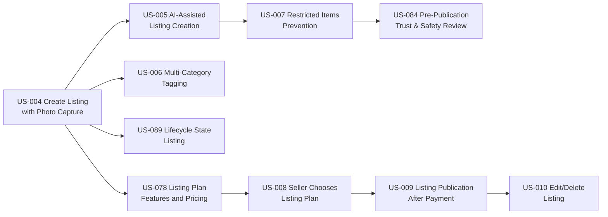

This document contains one self-contained LLD section per story, in dependency order. Each section has its own Overview, Data Model, API Contracts, Service Logic, Sequence Diagram, Validation Rules, Error Handling, and NFR/Security notes. Shared infrastructure (Listing module package layout, `ApiResponse` envelope, `AiGatewayClient`) is defined once in the US-005 section (§B) and reused by reference from later sections.

## Master Table of Contents

- [Part A - US-004: Create Listing with Photo Capture](#part-a---us-004-create-listing-with-photo-capture)
- [Part B - US-005: AI-Assisted Listing Creation](#1-story-overview)
- [Part C - US-006: Multi-Category Tagging](#part-c---us-006-multi-category-tagging)
- [Part D - US-007: Restricted Items Prevention](#part-d---us-007-restricted-items-prevention)
- [Part E - US-089: Lifecycle State - Listing](#part-e---us-089-lifecycle-state---listing)
- [Part F - US-084: Pre-Publication Trust & Safety Review](#part-f---us-084-pre-publication-trust--safety-review)
- [Part G - US-078: Listing Plan Features and Pricing](#part-g---us-078-listing-plan-features-and-pricing)
- [Part H - US-008: Seller Chooses Listing Plan](#part-h---us-008-seller-chooses-listing-plan)
- [Part I - US-009: Listing Publication After Payment](#part-i---us-009-listing-publication-after-payment)
- [Part J - US-010: Edit/Delete Listing](#part-j---us-010-editdelete-listing)

---

# Part A - US-004: Create Listing with Photo Capture

**Story Points:** 8 | **Repos:** valuex-mobile, valuex-backend
**Dependency:** US-001 (User Registration) - caller must be an authenticated, `ACTIVE` seller

## A.1 Story Overview

**As a** seller **I want to** create a listing by capturing photos of my item **so that** I can quickly list items for sale. This story is the entry point of the entire Sprint 2 flow: it creates the `listings` row in `DRAFT` status and uploads/persists `listing_images`, which every later story (AI suggestions, tagging, moderation, plan selection, publication) builds on top of.

| Actor | Role |
|---|---|
| Seller | Captures/selects photos, provides minimal initial metadata |
| Flutter Mobile App | Camera/gallery capture, client-side image validation, chunked upload |
| Listing Module (Spring Boot) | Creates draft listing and associates ready listing media |
| Media Module (Spring Boot) | Owns `ObjectStoragePort`, upload authorization, media lifecycle, variants |
| Cloudflare R2 + CDN | Initial object-store/CDN provider behind the configurable S3-compatible adapter |

### A.1.1 Edge Cases Covered

| Edge Case | Handling |
|---|---|
| Camera permission denied | Client-only; backend unaffected. Mobile shows OS permission rationale + settings deep link |
| Camera fails to open | Client falls back to gallery picker |
| >10 photos attempted | Client blocks selection past 10; backend also rejects `POST .../images` beyond 10 with `ERROR_MAX_PHOTOS_EXCEEDED` (defense in depth) |
| Poor photo quality | Client-side blur/resolution heuristic warns before upload; backend enforces hard minimum resolution |
| Non-item / random photos | Not blocked here — AI content signal is advisory (US-005) and restricted-item detection is US-007's concern |
| Network failure mid-upload | Per-image upload is independently retryable; listing stays in `DRAFT` with partial images until all succeed |

## A.2 Scope

**In scope:** `POST /api/v1/listings` (create draft), `POST /api/v1/listings/{id}/images` (upload image), `DELETE /api/v1/listings/{id}/images/{imageId}` (remove before submit), `GET /api/v1/listings/{id}` (resume draft).
**Out of scope:** AI suggestions (US-005), category tagging UI (US-006), restricted item checks (US-007), plan selection/publish (US-078/US-008/US-009).

## A.3 Data Model

Defines the base tables that all other Sprint 2 stories extend, per [HLD §4.3 Listing Domain](../HLD/03-Data-Architecture.md#43-listing-domain):

```sql
-- V{N}__create_listing_domain.sql

CREATE TYPE listing_status AS ENUM (
    'DRAFT', 'PLAN_SELECTION_PENDING', 'PLAN_PAYMENT_PENDING', 'PLAN_PAYMENT_FAILED',
    'PLAN_PAYMENT_SUCCESS', 'TRUST_SAFETY_REVIEW', 'APPROVED', 'PUBLISHED',
    'REJECTED', 'REVISION_REQUIRED', 'SOLD', 'EXPIRED',
    'DEACTIVATED_BY_SELLER', 'REMOVED_BY_ADMIN'
);
-- Superset used by US-089 lifecycle design (Part E); US-004 only ever writes DRAFT.

CREATE TABLE listings (
    id UUID PRIMARY KEY DEFAULT uuid_generate_v4(),
    seller_id UUID NOT NULL REFERENCES users(id),
    title VARCHAR(100),
    description TEXT,
    condition VARCHAR(50),
    price NUMERIC(12,2),
    status listing_status NOT NULL DEFAULT 'DRAFT',
    plan_type VARCHAR(50),
    ai_assisted BOOLEAN NOT NULL DEFAULT FALSE,
    seller_location VARCHAR(255),
    expires_at TIMESTAMP,
    created_at TIMESTAMP NOT NULL DEFAULT CURRENT_TIMESTAMP,
    updated_at TIMESTAMP NOT NULL DEFAULT CURRENT_TIMESTAMP
);

CREATE INDEX idx_listings_seller_status ON listings(seller_id, status);

CREATE TABLE listing_images (
    id UUID PRIMARY KEY DEFAULT uuid_generate_v4(),
    listing_id UUID NOT NULL REFERENCES listings(id) ON DELETE CASCADE,
    media_asset_id UUID NOT NULL REFERENCES media_assets(id),
    sort_order INTEGER NOT NULL DEFAULT 0,
    created_at TIMESTAMP NOT NULL DEFAULT CURRENT_TIMESTAMP
);

CREATE INDEX idx_listing_images_listing ON listing_images(listing_id);
CREATE UNIQUE INDEX uq_listing_images_media ON listing_images(media_asset_id);
CREATE UNIQUE INDEX uq_listing_images_order ON listing_images(listing_id, sort_order);

CREATE TABLE listing_status_history (
    id UUID PRIMARY KEY DEFAULT uuid_generate_v4(),
    listing_id UUID NOT NULL REFERENCES listings(id),
    from_status listing_status,
    to_status listing_status NOT NULL,
    changed_by UUID,
    reason VARCHAR(255),
    changed_at TIMESTAMP NOT NULL DEFAULT CURRENT_TIMESTAMP
);
```

US-004 also depends on the shared Media Module tables defined by the object-storage HLD update. If they do not already exist when US-004 is implemented, this story's migration must introduce them before `listing_images.media_asset_id` can reference them:

```sql
CREATE TABLE media_assets (
    id UUID PRIMARY KEY DEFAULT uuid_generate_v4(),
    owner_type VARCHAR(50) NOT NULL,
    owner_id UUID NOT NULL,
    media_purpose VARCHAR(50) NOT NULL,
    storage_provider VARCHAR(50) NOT NULL,
    bucket VARCHAR(255) NOT NULL,
    object_key TEXT NOT NULL,
    original_filename VARCHAR(255),
    detected_content_type VARCHAR(100),
    size_bytes BIGINT,
    width INTEGER,
    height INTEGER,
    checksum VARCHAR(255),
    perceptual_hash VARCHAR(255),
    status VARCHAR(30) NOT NULL,
    visibility VARCHAR(30) NOT NULL,
    created_by UUID,
    created_at TIMESTAMPTZ NOT NULL DEFAULT CURRENT_TIMESTAMP,
    processed_at TIMESTAMPTZ,
    retention_until TIMESTAMPTZ,
    deleted_at TIMESTAMPTZ
);

CREATE TABLE media_variants (
    id UUID PRIMARY KEY DEFAULT uuid_generate_v4(),
    media_asset_id UUID NOT NULL REFERENCES media_assets(id),
    variant_type VARCHAR(30) NOT NULL,
    object_key TEXT NOT NULL,
    content_type VARCHAR(100) NOT NULL,
    size_bytes BIGINT,
    width INTEGER,
    height INTEGER,
    created_at TIMESTAMPTZ NOT NULL DEFAULT CURRENT_TIMESTAMP
);
```

`listing_images` stores listing-specific ordering and ownership linkage only. Binary metadata (`bucket`, `object_key`, `checksum`, `perceptual_hash`, dimensions, status, variants) lives in the reusable `media_assets` / `media_variants` model owned by the Media Module in [HLD Part 3 §8](../HLD/03-Data-Architecture.md#8-object-storage-design). `perceptual_hash` is populated by media processing at upload time but only *consumed* starting with US-082 (watermark/manipulation detection, Sprint 9) — computing it up front avoids a backfill migration later.

## A.4 API Contracts

Base path `/api/v1/listings`, package `com.valuex.listing`.

| Method & Path | Purpose | Auth |
|---|---|---|
| `POST /api/v1/listings` | Create draft listing (empty shell) | `SELLER` |
| `POST /api/v1/media/uploads` | Create `PENDING_UPLOAD` media asset and return short-lived upload URL | authenticated owner |
| `POST /api/v1/media/{mediaId}/complete` | Confirm upload and start validation/variant processing | authenticated owner |
| `POST /api/v1/listings/{id}/images` | Associate a READY `LISTING_IMAGE` media asset with the listing | `SELLER`, owner |
| `DELETE /api/v1/listings/{id}/images/{imageId}` | Remove an uploaded image while in `DRAFT` | `SELLER`, owner |
| `GET /api/v1/listings/{id}` | Fetch draft to resume editing | `SELLER`, owner |

Create draft request/response:

```json
// POST /api/v1/listings -> 201
{ "success": true, "data": { "listingId": "uuid", "status": "DRAFT" } }
```

Image upload uses the shared Media API pattern from [HLD Part 7 §28](../HLD/07-API-Integrations-Release-Risk.md#28-media-apis) to keep large binaries off the Spring Boot heap: `POST /api/v1/media/uploads` returns a short-lived upload URL generated through `ObjectStoragePort`; the client uploads directly to the configured object store (Cloudflare R2 for MVP), `POST /api/v1/media/{mediaId}/complete` starts validation/variant processing, then `POST /api/v1/listings/{id}/images` associates the READY `mediaId` with the listing.

```json
{ "mediaId": "uuid-media-asset", "sortOrder": 0 }
```

## A.5 Service Logic (key rules)

```java
@Transactional
public UUID attachListingImage(UUID listingId, UUID sellerId, AttachListingImageRequest req) {
    var listing = requireOwnedDraft(listingId, sellerId); // 404 LISTING_NOT_FOUND / 400 LISTING_NOT_IN_DRAFT

    long count = listingImageRepository.countByListingId(listingId);
    if (count >= 10) throw new BusinessException("ERROR_MAX_PHOTOS_EXCEEDED", "Maximum 10 photos allowed");

    var media = mediaAssetService.requireReadyAsset(req.mediaId(), sellerId, "LISTING_IMAGE");
    if (media.width() < 480 || media.height() < 480)
        throw new BusinessException("ERROR_INVALID_PHOTO", "Photo quality too low or invalid format");
    if (media.sizeBytes() > 10 * 1024 * 1024)
        throw new BusinessException("ERROR_INVALID_PHOTO", "Photo exceeds 10MB limit");

    var image = new ListingImage();
    image.setListingId(listingId);
    image.setMediaAssetId(req.mediaId());
    image.setSortOrder((int) count);
    return listingImageRepository.save(image).getId();
}
```

`requireOwnedDraft` centralizes the ownership + status check reused by US-006, US-005, and US-010's edit path.

## A.6 Sequence Diagram

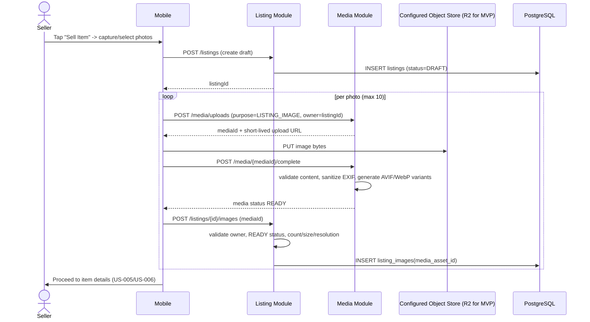

## A.7 Validation Rules & Error Codes

| Rule | Error Code | Message |
|---|---|---|
| Min 1 photo before proceeding past capture step | `ERROR_MIN_PHOTOS_REQUIRED` (client-gated; backend allows 0 while `DRAFT`) | "At least 1 photo required" |
| Max 10 photos | `ERROR_MAX_PHOTOS_EXCEEDED` | "Maximum 10 photos allowed" |
| Format JPG/PNG/HEIC only | `ERROR_INVALID_PHOTO` | "Photo quality too low or invalid format" |
| Max 10MB per photo | `ERROR_INVALID_PHOTO` | "Photo exceeds 10MB limit" |
| Min resolution 480x480 | `ERROR_INVALID_PHOTO` | "Photo quality too low or invalid format" |
| Upload transport failure | `ERROR_PHOTO_UPLOAD_FAILED` | "Failed to upload photo. Check your connection" |
| Camera permission denied (client-only) | `ERROR_CAMERA_PERMISSION_DENIED` | "Camera access required to capture photos" |

## A.8 Security & NFR Notes

- Upload URLs are generated by `ObjectStoragePort` from external provider configuration, scoped to one object key, short-lived (15 minutes), and `PUT`-only — clients never receive long-lived R2/S3-compatible credentials.
- Image registration endpoint re-validates dimensions/size server-side (never trusts client-reported EXIF alone) to prevent tampered metadata bypassing limits.
- Ownership enforced via `SecurityContext.getCurrentUserId()` on every call, consistent with [CODING_STANDARDS.md §2.6](../CODING_STANDARDS.md).
- Target: image registration P95 < 300ms; end-to-end photo-to-draft-ready P95 < 8s on 4G (dominated by client-side direct upload and media processing, not this API).

### A.8.1 Implementation Reconciliation (US-004 backend slice)

- Implemented backend package names are `com.valuex.media` and `com.valuex.listing`, with repositories under `infrastructure.persistence`; controllers use the existing `ApiResponse` envelope and `SecurityContext`.
- Migration `V9__listing_media_schema.sql` stores `listing_images.media_asset_id`; reusable `media_assets` and `media_variants` tables own provider/object metadata.
- `ObjectStoragePort` is configured through `OBJECT_STORAGE_PROVIDER` and `valuex.media.storage.*`. Cloudflare R2 is the default adapter using the AWS S3-compatible SDK; AWS S3 and Backblaze B2 adapters remain extension points and require no business-module changes when added.
- `POST /api/v1/media/{mediaId}/complete` performs authoritative object metadata lookup through `ObjectStoragePort` and marks media `READY` after metadata/resolution validation. Asynchronous derivative-worker generation, AVIF/WebP processing, and perceptual-hash computation are intentionally deferred follow-ups; the lifecycle/schema is ready for them.
- Upload authorization verifies that a `LISTING` media request targets an existing `DRAFT` listing owned by the authenticated seller. Listing attachment additionally verifies that the READY media asset belongs to that same listing.

---

# Part B - US-005: AI-Assisted Listing Creation

**Story Points:** 8 | **Repos:** valuex-backend, valuex-ai
**Dependency:** US-004 (Create Listing with Photo Capture) - must be complete; listing must exist in `DRAFT` state with at least 1 uploaded image before this flow runs

## Table of Contents (Part B)

1. [Story Overview](#1-story-overview)
2. [Scope](#2-scope)
3. [Architecture & Component Interaction](#3-architecture--component-interaction)
4. [Data Model (PostgreSQL)](#4-data-model-postgresql)
5. [Backend Design (valuex-backend)](#5-backend-design-valuex-backend)
6. [AI Service Design (valuex-ai)](#6-ai-service-design-valuex-ai)
7. [Sequence Diagrams](#7-sequence-diagrams)
8. [Validation Rules Implementation](#8-validation-rules-implementation)
9. [Error Handling & Error Codes](#9-error-handling--error-codes)
10. [Resilience Configuration](#10-resilience-configuration)
11. [Observability](#11-observability)
12. [Security & Privacy](#12-security--privacy)
13. [Testing Strategy](#13-testing-strategy)
14. [Non-Functional Requirements](#14-non-functional-requirements)
15. [Open Items / Follow-ups](#15-open-items--follow-ups)

---

# 1. Story Overview

**As a** seller
**I want** AI to suggest item details from my photos
**So that** I can create listings faster with accurate information

The system analyzes photos already uploaded for a draft listing (US-004) and returns suggested category, title, condition, price range, and description. Every suggestion is advisory — the seller may accept, edit, or reject each field independently, and manual entry is always available. Per [HLD §3.1](../HLD/04-AI-Architecture.md#31-ai-must-be-advisory-unless-business-rule-requires-blocking), AI must never block listing creation; restricted-item blocking is a separate concern owned by US-007.

## 1.1 Actors

| Actor | Role |
|---|---|
| Seller | Triggers suggestion generation, reviews/accepts/edits/rejects fields |
| Spring Boot Backend (Listing Module) | Source of truth for the listing draft; orchestrates the AI call; persists suggestions and feedback |
| AI Gateway (FastAPI) | Internal-only entry point; routes to Listing Intelligence Service |
| Listing Intelligence Service | Performs image analysis, category classification, price estimation, description/title generation |

## 1.2 Acceptance Criteria Recap

- Given uploaded item photos, when AI analyzes the images, suggest: category, title, condition, price range, description.
- Seller can accept, edit, or reject each suggestion independently, and can always enter fields manually.

## 1.3 Edge Cases Covered by This Design

| Edge Case | Handling |
|---|---|
| AI cannot identify item | Empty/low-confidence `categorySuggestions`, `WARNING_UNABLE_TO_IDENTIFY` |
| AI suggests wrong category | Seller edits before publish (no backend rejection) |
| AI suggests unrealistic price | Backend re-validates suggested range against comparable listings; `WARNING_PRICE_OUT_OF_RANGE` appended if outside 20% band |
| Photos contain multiple items | AI returns `MULTIPLE_ITEMS_DETECTED` warning |
| Item unique/rare, no comparables | Wide fallback price range + low confidence flag, no hard failure |
| AI service timeout or failure | Circuit breaker + timeout fallback → degraded response, manual entry allowed |

---

# 2. Scope

## 2.1 In Scope

- `POST /api/v1/listings/{listingId}/ai-suggestions` - trigger suggestion generation
- `GET /api/v1/listings/{listingId}/ai-suggestions` - fetch latest suggestion (resume draft)
- `PATCH /api/v1/listings/{listingId}/ai-suggestions/{suggestionId}/feedback` - record accept/edit/reject per field
- `POST /ai/v1/listings/suggest` internal AI endpoint (Listing Intelligence Service)
- Persistence of suggestions and per-field feedback for the AI feedback loop ([HLD §18.2](../HLD/04-AI-Architecture.md#182-feedback-loops))
- Fallback to manual entry on AI failure/timeout

## 2.2 Out of Scope

- Restricted item / moderation blocking - covered by **US-007**, own service call, own LLD
- Multi-category tagging UI - covered by **US-006**
- Pre-publication trust & safety review - covered by **US-084**
- Model training/fine-tuning pipeline - covered by AI Ops (HLD §18), not a Sprint 2 deliverable
- pgvector / embedding-based similarity - not used here; Listing Intelligence Service is independent of Visual Search AI. (See memory note: pgvector setup is deferred and only required before **visual search** work, i.e. US-039+, not this story.)

---

# 3. Architecture & Component Interaction

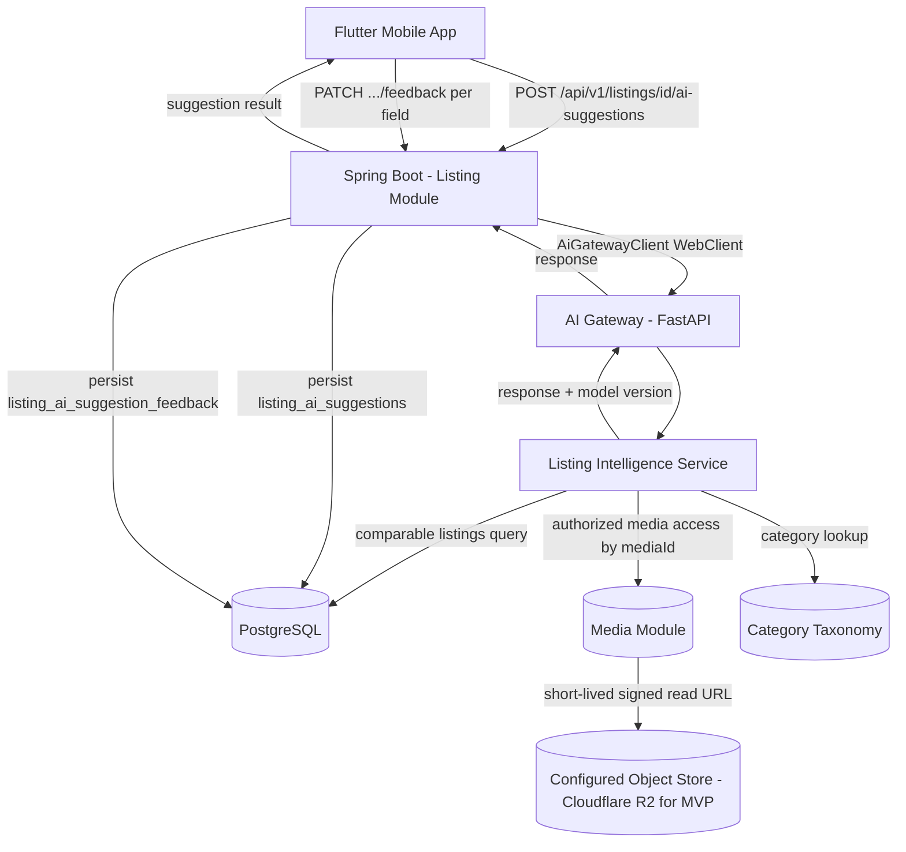

**Ownership boundary (per [HLD §3.3](../HLD/04-AI-Architecture.md#33-ai-service-isolation)):** the Listing Intelligence Service returns predictions only. It never writes to `listings`. Spring Boot remains the sole writer of listing state; suggestion acceptance is applied to the draft listing through the existing `PATCH /api/v1/listings/{id}` endpoint (US-004/US-010), not by the AI suggestion endpoints themselves.

---

# 4. Data Model (PostgreSQL)

Extends the Listing Domain defined in [HLD §4.3](../HLD/03-Data-Architecture.md#43-listing-domain). Assumes `listings` and `listing_images` already exist from US-004. Migration file name/version must be set to the next available Flyway version at implementation time (shown here as `V{N}` placeholder per [CODING_STANDARDS.md §2.7](../CODING_STANDARDS.md)).

```sql
-- V{N}__add_listing_ai_suggestions.sql

CREATE TYPE listing_ai_suggestion_status AS ENUM (
    'PENDING',
    'COMPLETED',
    'FAILED',
    'TIMEOUT'
);

CREATE TYPE listing_ai_feedback_field AS ENUM (
    'CATEGORY',
    'TITLE',
    'CONDITION',
    'DESCRIPTION',
    'PRICE'
);

CREATE TYPE listing_ai_feedback_action AS ENUM (
    'ACCEPTED',
    'EDITED',
    'REJECTED'
);

CREATE TABLE listing_ai_suggestions (
    id UUID PRIMARY KEY DEFAULT uuid_generate_v4(),
    listing_id UUID NOT NULL REFERENCES listings(id),
    status listing_ai_suggestion_status NOT NULL DEFAULT 'PENDING',
    category_suggestions JSONB,          -- [{categoryId, categoryPath, confidence}]
    title_suggestion VARCHAR(100),
    condition_suggestion VARCHAR(50),
    description_suggestion TEXT,
    price_min NUMERIC(12,2),
    price_max NUMERIC(12,2),
    price_currency VARCHAR(3) DEFAULT 'INR',
    warnings JSONB,                      -- ["WARNING_PRICE_OUT_OF_RANGE", ...]
    overall_confidence NUMERIC(5,4),
    model_name VARCHAR(100),
    model_version VARCHAR(50),
    inference_id UUID,
    latency_ms INTEGER,
    fallback_used BOOLEAN NOT NULL DEFAULT FALSE,
    created_at TIMESTAMP NOT NULL DEFAULT CURRENT_TIMESTAMP
);

CREATE INDEX idx_listing_ai_suggestions_listing ON listing_ai_suggestions(listing_id);
CREATE INDEX idx_listing_ai_suggestions_status ON listing_ai_suggestions(status);

-- One row per field the seller acted on; feeds the AI feedback loop (HLD 18.2)
CREATE TABLE listing_ai_suggestion_feedback (
    id UUID PRIMARY KEY DEFAULT uuid_generate_v4(),
    suggestion_id UUID NOT NULL REFERENCES listing_ai_suggestions(id),
    field listing_ai_feedback_field NOT NULL,
    action listing_ai_feedback_action NOT NULL,
    original_value TEXT,
    final_value TEXT,
    created_at TIMESTAMP NOT NULL DEFAULT CURRENT_TIMESTAMP
);

CREATE INDEX idx_listing_ai_feedback_suggestion ON listing_ai_suggestion_feedback(suggestion_id);

-- Nullable, backward-compatible addition per CODING_STANDARDS 2.7
ALTER TABLE listings ADD COLUMN ai_assisted BOOLEAN NOT NULL DEFAULT FALSE;
```

### 4.1 Notes

- `category_suggestions` and `warnings` are `JSONB` rather than child tables — they are write-once, read-as-a-blob per suggestion, never queried by individual array element, so relational normalization adds no value here.
- `listing_ai_suggestions` is append-only in practice (a new row per generation attempt, e.g. seller re-uploads photos and re-triggers), which preserves an audit trail without needing an UPDATE-based status machine.
- `ai_assisted` on `listings` lets analytics ([HLD §12.2](../HLD/04-AI-Architecture.md#122-quality-metrics) - "seller acceptance rate of suggestions") join back to listing outcomes without scanning the suggestions table.

---

# 5. Backend Design (valuex-backend)

Follows [CODING_STANDARDS.md §2.2](../CODING_STANDARDS.md) package layout, added under the existing `listing` module.

## 5.1 Package Additions

```text
com.valuex.listing/
├── controller/
│   └── ListingAiController.java
├── service/
│   └── ListingAiService.java
├── domain/
│   ├── ListingAiSuggestion.java
│   ├── ListingAiSuggestionFeedback.java
│   ├── ListingAiSuggestionStatus.java
│   ├── ListingAiFeedbackField.java
│   └── ListingAiFeedbackAction.java
├── repository/
│   ├── ListingAiSuggestionRepository.java
│   └── ListingAiSuggestionFeedbackRepository.java
├── dto/
│   ├── ListingAiSuggestionResponse.java
│   ├── CategorySuggestionDto.java
│   ├── PriceRangeDto.java
│   └── SuggestionFeedbackRequest.java
└── exception/
    └── (reuses common.exception.BusinessException)

com.valuex.common.infrastructure.ai/
├── AiGatewayClient.java
├── ListingSuggestRequest.java
└── ListingSuggestResponse.java

com.valuex.media/
├── controller/
│   └── MediaController.java
├── service/
│   └── MediaAssetService.java
├── domain/
│   ├── MediaAsset.java
│   ├── MediaVariant.java
│   ├── MediaPurpose.java
│   ├── MediaStatus.java
│   └── MediaVisibility.java
├── repository/
│   ├── MediaAssetRepository.java
│   └── MediaVariantRepository.java
├── port/
│   └── ObjectStoragePort.java
└── infrastructure/
    ├── CloudflareR2ObjectStorageAdapter.java   // active MVP adapter
    ├── AwsS3ObjectStorageAdapter.java          // optional/future adapter
    └── BackblazeB2ObjectStorageAdapter.java    // optional/future adapter
```

`AiGatewayClient` lives in `common.infrastructure` (not the `listing` module) because the AI Gateway is a single shared entry point ([HLD §4.1](../HLD/04-AI-Architecture.md#41-ai-gateway-api)) also used by the fraud, moderation, and visual search integrations delivered in later sprints.

`ObjectStoragePort` is the only object-store dependency visible to application services. The active adapter is selected by external configuration (`OBJECT_STORAGE_PROVIDER=r2|aws-s3|backblaze-b2`, endpoint, region, credentials, bucket prefix, CDN base URL). Switching providers requires configuration and infrastructure changes once the target adapter exists; listing, payment, moderation, and AI business code must not change.

```java
public interface ObjectStoragePort {
    UploadAuthorization createUploadAuthorization(UploadRequest request);
    StoredObjectMetadata getMetadata(StorageObjectKey objectKey);
    DownloadAuthorization createDownloadAuthorization(StorageObjectKey objectKey, Duration validity);
    void delete(StorageObjectKey objectKey);
    void copy(StorageObjectKey source, StorageObjectKey destination);
}
```

## 5.2 API Contracts

All endpoints follow the standard envelope in [CODING_STANDARDS.md §1.6](../CODING_STANDARDS.md). Base path `/api/v1/listings`.

### 5.2.1 Trigger Suggestion Generation

```http
POST /api/v1/listings/{listingId}/ai-suggestions
Authorization: Bearer <jwt>
```

Request body (optional):

```json
{
  "textHint": "iPhone used 1 year"
}
```

Success response (`AI` returned suggestions):

```json
{
  "success": true,
  "data": {
    "suggestionId": "8f2a...uuid",
    "status": "COMPLETED",
    "categorySuggestions": [
      { "categoryId": "uuid", "categoryPath": "Electronics > Mobile Phones", "confidence": 0.91 }
    ],
    "titleSuggestion": "Apple iPhone 13 128GB - Good Condition",
    "conditionSuggestion": "GOOD",
    "descriptionSuggestion": "Used Apple iPhone 13 with visible minor wear...",
    "priceRange": { "min": 32000, "max": 38000, "currency": "INR" },
    "warnings": ["WARNING_PRICE_OUT_OF_RANGE"],
    "confidence": 0.89,
    "modelName": "listing-intelligence-llm",
    "modelVersion": "1.2.0",
    "fallback": false
  },
  "metadata": { "requestId": "uuid", "timestamp": "2026-08-02T10:00:00Z" }
}
```

Degraded response (AI unavailable/timeout) — **still HTTP 200 / `success: true`** because the flow is advisory and must not block listing creation ([HLD §13.1](../HLD/04-AI-Architecture.md#131-listing-ai-failure)):

```json
{
  "success": true,
  "data": {
    "suggestionId": "8f2a...uuid",
    "status": "FAILED",
    "fallback": true,
    "message": "Auto-suggestions unavailable. Please enter details manually"
  },
  "metadata": { "requestId": "uuid", "timestamp": "2026-08-02T10:00:00Z" }
}
```

Error responses (true client/business errors, standard error envelope, `success: false`):

| HTTP | Code | Condition |
|---|---|---|
| 404 | `LISTING_NOT_FOUND` | listingId doesn't exist or doesn't belong to caller |
| 400 | `LISTING_HAS_NO_IMAGES` | listing has zero uploaded images |
| 400 | `LISTING_NOT_IN_DRAFT` | listing is not in `DRAFT` status |
| 429 | `AI_SUGGESTION_RATE_LIMITED` | seller retriggers too frequently (see §8) |

### 5.2.2 Fetch Latest Suggestion

```http
GET /api/v1/listings/{listingId}/ai-suggestions
```

Returns the most recent `listing_ai_suggestions` row for the listing (same shape as above), or `404 AI_SUGGESTION_NOT_FOUND` if none was ever generated (mobile falls back to showing "Get AI Suggestions" button rather than an error state).

### 5.2.3 Record Field Feedback

```http
PATCH /api/v1/listings/{listingId}/ai-suggestions/{suggestionId}/feedback
```

Request:

```json
{
  "feedback": [
    { "field": "TITLE", "action": "ACCEPTED", "originalValue": "Apple iPhone 13 128GB - Good Condition", "finalValue": "Apple iPhone 13 128GB - Good Condition" },
    { "field": "PRICE", "action": "EDITED", "originalValue": "32000-38000", "finalValue": "35000" },
    { "field": "CATEGORY", "action": "REJECTED", "originalValue": "Electronics > Mobile Phones", "finalValue": null }
  ]
}
```

Response: `200` with `{ "recorded": 3 }`. This endpoint only records feedback for analytics/retraining — it does **not** mutate the listing. The mobile client separately calls the existing `PATCH /api/v1/listings/{id}` (US-004) with the seller's final field values.

## 5.3 DTOs

```java
package com.valuex.listing.dto;

import java.math.BigDecimal;
import java.util.List;
import java.util.UUID;

public record ListingAiSuggestionResponse(
        UUID suggestionId,
        String status,
        List<CategorySuggestionDto> categorySuggestions,
        String titleSuggestion,
        String conditionSuggestion,
        String descriptionSuggestion,
        PriceRangeDto priceRange,
        List<String> warnings,
        Double confidence,
        String modelName,
        String modelVersion,
        boolean fallback,
        String message
) {}
```

```java
package com.valuex.listing.dto;

import java.util.UUID;

public record CategorySuggestionDto(UUID categoryId, String categoryPath, Double confidence) {}
```

```java
package com.valuex.listing.dto;

import java.math.BigDecimal;

public record PriceRangeDto(BigDecimal min, BigDecimal max, String currency) {}
```

```java
package com.valuex.listing.dto;

import jakarta.validation.Valid;
import jakarta.validation.constraints.NotEmpty;
import java.util.List;

public record SuggestionFeedbackRequest(@NotEmpty @Valid List<FeedbackItem> feedback) {

    public record FeedbackItem(
            String field,        // CATEGORY | TITLE | CONDITION | DESCRIPTION | PRICE
            String action,       // ACCEPTED | EDITED | REJECTED
            String originalValue,
            String finalValue
    ) {}
}
```

## 5.4 Entity

```java
package com.valuex.listing.domain;

import jakarta.persistence.*;
import lombok.Getter;
import lombok.Setter;
import org.hibernate.annotations.JdbcTypeCode;
import org.hibernate.type.SqlTypes;

import java.math.BigDecimal;
import java.time.Instant;
import java.util.List;
import java.util.UUID;

@Entity
@Table(name = "listing_ai_suggestions")
@Getter
@Setter
public class ListingAiSuggestion {

    @Id
    @GeneratedValue
    private UUID id;

    @Column(name = "listing_id", nullable = false)
    private UUID listingId;

    @Enumerated(EnumType.STRING)
    private ListingAiSuggestionStatus status;

    @JdbcTypeCode(SqlTypes.JSON)
    @Column(name = "category_suggestions")
    private List<CategorySuggestionJson> categorySuggestions;

    @Column(name = "title_suggestion")
    private String titleSuggestion;

    @Column(name = "condition_suggestion")
    private String conditionSuggestion;

    @Column(name = "description_suggestion")
    private String descriptionSuggestion;

    @Column(name = "price_min")
    private BigDecimal priceMin;

    @Column(name = "price_max")
    private BigDecimal priceMax;

    @Column(name = "price_currency")
    private String priceCurrency;

    @JdbcTypeCode(SqlTypes.JSON)
    private List<String> warnings;

    @Column(name = "overall_confidence")
    private BigDecimal overallConfidence;

    @Column(name = "model_name")
    private String modelName;

    @Column(name = "model_version")
    private String modelVersion;

    @Column(name = "inference_id")
    private UUID inferenceId;

    @Column(name = "latency_ms")
    private Integer latencyMs;

    @Column(name = "fallback_used", nullable = false)
    private boolean fallbackUsed;

    @Column(name = "created_at", nullable = false, updatable = false)
    private Instant createdAt;

    @Override
    public boolean equals(Object o) {
        if (this == o) return true;
        if (!(o instanceof ListingAiSuggestion that)) return false;
        return id != null && id.equals(that.id);
    }

    @Override
    public int hashCode() {
        return getClass().hashCode();
    }

    public record CategorySuggestionJson(UUID categoryId, String categoryPath, Double confidence) {}
}
```

`@Data` is intentionally not used per [CODING_STANDARDS.md §2.12](../CODING_STANDARDS.md) — `equals`/`hashCode` are pinned to `id` only. `ListingAiSuggestionFeedback` follows the same pattern (omitted for brevity — five columns: `id`, `suggestionId`, `field`, `action`, `originalValue`, `finalValue`, `createdAt`).

## 5.5 Repository

```java
package com.valuex.listing.repository;

import com.valuex.listing.domain.ListingAiSuggestion;
import org.springframework.data.jpa.repository.JpaRepository;

import java.util.Optional;
import java.util.UUID;

public interface ListingAiSuggestionRepository extends JpaRepository<ListingAiSuggestion, UUID> {
    Optional<ListingAiSuggestion> findFirstByListingIdOrderByCreatedAtDesc(UUID listingId);
    long countByListingIdAndCreatedAtAfter(UUID listingId, java.time.Instant since);
}
```

`countByListingIdAndCreatedAtAfter` backs the per-listing rate limit described in §8.4.

## 5.6 AiGatewayClient (Infrastructure)

```java
package com.valuex.common.infrastructure.ai;

import io.github.resilience4j.circuitbreaker.annotation.CircuitBreaker;
import io.github.resilience4j.timelimiter.annotation.TimeLimiter;
import lombok.RequiredArgsConstructor;
import lombok.extern.slf4j.Slf4j;
import org.springframework.stereotype.Component;
import org.springframework.web.reactive.function.client.WebClient;
import reactor.core.publisher.Mono;

import java.util.concurrent.CompletableFuture;

@Component
@RequiredArgsConstructor
@Slf4j
public class AiGatewayClient {

    private final WebClient aiGatewayWebClient; // bean configured with base URL + X-Internal-Api-Key header

    @CircuitBreaker(name = "aiGateway", fallbackMethod = "suggestListingFallback")
    @TimeLimiter(name = "aiGateway")
    public CompletableFuture<ListingSuggestResponse> suggestListing(ListingSuggestRequest request) {
        return aiGatewayWebClient.post()
                .uri("/ai/v1/listings/suggest")
                .bodyValue(request)
                .retrieve()
                .bodyToMono(ListingSuggestResponse.class)
                .toFuture();
    }

    @SuppressWarnings("unused") // invoked reflectively by Resilience4j on open circuit / timeout / any exception
    private CompletableFuture<ListingSuggestResponse> suggestListingFallback(
            ListingSuggestRequest request, Throwable throwable) {
        log.warn("AI Gateway suggestListing failed, falling back to manual entry. listingId={} cause={}",
                request.listingId(), throwable.toString());
        return CompletableFuture.completedFuture(ListingSuggestResponse.unavailable());
    }
}
```

`ListingSuggestResponse.unavailable()` is a static factory returning a sentinel with `available=false` so `ListingAiService` can build the degraded response without inspecting exception types.

## 5.7 ListingAiService

```java
package com.valuex.listing.service;

import com.valuex.common.exception.BusinessException;
import com.valuex.common.exception.NotFoundException;
import com.valuex.common.infrastructure.ai.AiGatewayClient;
import com.valuex.common.infrastructure.ai.ListingSuggestRequest;
import com.valuex.common.infrastructure.ai.ListingSuggestResponse;
import com.valuex.listing.domain.*;
import com.valuex.listing.dto.*;
import com.valuex.listing.repository.ListingAiSuggestionFeedbackRepository;
import com.valuex.listing.repository.ListingAiSuggestionRepository;
import com.valuex.listing.repository.ListingImageRepository;
import com.valuex.listing.repository.ListingRepository;
import lombok.RequiredArgsConstructor;
import org.springframework.stereotype.Service;
import org.springframework.transaction.annotation.Transactional;

import java.time.Instant;
import java.util.List;
import java.util.UUID;
import java.util.concurrent.ExecutionException;
import java.util.concurrent.TimeoutException;

@Service
@RequiredArgsConstructor
public class ListingAiService {

    private static final int MAX_TRIGGERS_PER_HOUR = 5;

    private final ListingRepository listingRepository;
    private final ListingImageRepository listingImageRepository;
    private final ListingAiSuggestionRepository suggestionRepository;
    private final ListingAiSuggestionFeedbackRepository feedbackRepository;
    private final AiGatewayClient aiGatewayClient;

    @Transactional
    public ListingAiSuggestionResponse generateSuggestions(UUID listingId, UUID sellerId, String textHint) {
        var listing = listingRepository.findByIdAndSellerId(listingId, sellerId)
                .orElseThrow(() -> new NotFoundException("LISTING_NOT_FOUND", "Listing not found"));

        if (listing.getStatus() != ListingStatus.DRAFT) {
            throw new BusinessException("LISTING_NOT_IN_DRAFT", "Listing must be in draft to request AI suggestions");
        }

        var mediaIds = listingImageRepository.findMediaAssetIdsByListingId(listingId);
        if (mediaIds.isEmpty()) {
            throw new BusinessException("LISTING_HAS_NO_IMAGES", "Upload at least one photo before requesting suggestions");
        }

        long recentTriggers = suggestionRepository.countByListingIdAndCreatedAtAfter(
                listingId, Instant.now().minusSeconds(3600));
        if (recentTriggers >= MAX_TRIGGERS_PER_HOUR) {
            throw new BusinessException("AI_SUGGESTION_RATE_LIMITED", "Too many suggestion requests. Try again later");
        }

        var request = new ListingSuggestRequest(listingId, sellerId, mediaIds, listing.getSellerLocation(), textHint);

        ListingSuggestResponse aiResponse;
        long startedAt = System.currentTimeMillis();
        try {
            aiResponse = aiGatewayClient.suggestListing(request).get();
        } catch (ExecutionException | TimeoutException | InterruptedException e) {
            if (e instanceof InterruptedException) Thread.currentThread().interrupt();
            aiResponse = ListingSuggestResponse.unavailable();
        }
        int latencyMs = (int) (System.currentTimeMillis() - startedAt);

        if (!aiResponse.available()) {
            var failedEntity = persistFailedSuggestion(listingId, latencyMs);
            return ListingAiSuggestionResponse.fallback(failedEntity.getId());
        }

        var entity = persistCompletedSuggestion(listingId, aiResponse, latencyMs);
        listing.setAiAssisted(true);
        return toResponse(entity);
    }

    public ListingAiSuggestionResponse getLatestSuggestion(UUID listingId, UUID sellerId) {
        listingRepository.findByIdAndSellerId(listingId, sellerId)
                .orElseThrow(() -> new NotFoundException("LISTING_NOT_FOUND", "Listing not found"));

        var entity = suggestionRepository.findFirstByListingIdOrderByCreatedAtDesc(listingId)
                .orElseThrow(() -> new NotFoundException("AI_SUGGESTION_NOT_FOUND", "No suggestion generated yet"));
        return toResponse(entity);
    }

    @Transactional
    public int recordFeedback(UUID listingId, UUID suggestionId, UUID sellerId,
                               List<SuggestionFeedbackRequest.FeedbackItem> items) {
        listingRepository.findByIdAndSellerId(listingId, sellerId)
                .orElseThrow(() -> new NotFoundException("LISTING_NOT_FOUND", "Listing not found"));

        var suggestion = suggestionRepository.findById(suggestionId)
                .filter(s -> s.getListingId().equals(listingId))
                .orElseThrow(() -> new NotFoundException("AI_SUGGESTION_NOT_FOUND", "Suggestion not found"));

        var entities = items.stream()
                .map(item -> toFeedbackEntity(suggestion.getId(), item))
                .toList();
        feedbackRepository.saveAll(entities);
        return entities.size();
    }

    // persistFailedSuggestion / persistCompletedSuggestion / toResponse / toFeedbackEntity: mapping helpers, omitted for brevity
}
```

### 5.7.1 Price Re-validation (Defense in Depth)

Per the acceptance criteria "Price suggestion must be within 20% of similar listings", the backend independently re-validates the AI-provided range against comparable active listings **at persistence time**, rather than trusting the AI service's own bound:

```java
private List<String> validatePriceRange(BigDecimal aiMin, BigDecimal aiMax, UUID categoryId, String condition) {
    var comparableMedian = listingRepository.findMedianPriceByCategoryAndCondition(categoryId, condition);
    if (comparableMedian == null) {
        return List.of(); // no comparables — nothing to validate against, AI service already flags this case
    }
    var lowerBound = comparableMedian.multiply(BigDecimal.valueOf(0.8));
    var upperBound = comparableMedian.multiply(BigDecimal.valueOf(1.2));
    boolean outOfRange = aiMax.compareTo(lowerBound) < 0 || aiMin.compareTo(upperBound) > 0;
    return outOfRange ? List.of("WARNING_PRICE_OUT_OF_RANGE") : List.of();
}
```

This warning is appended to whatever warnings the AI service itself returned (e.g. `MULTIPLE_ITEMS_DETECTED`) — the two are independent checks and neither suppresses the other.

## 5.8 Controller

```java
package com.valuex.listing.controller;

import com.valuex.common.dto.ApiResponse;
import com.valuex.common.security.SecurityContext;
import com.valuex.listing.dto.ListingAiSuggestionResponse;
import com.valuex.listing.dto.SuggestionFeedbackRequest;
import com.valuex.listing.service.ListingAiService;
import io.swagger.v3.oas.annotations.Operation;
import io.swagger.v3.oas.annotations.tags.Tag;
import jakarta.validation.Valid;
import lombok.RequiredArgsConstructor;
import org.springframework.http.ResponseEntity;
import org.springframework.security.access.prepost.PreAuthorize;
import org.springframework.web.bind.annotation.*;

import java.util.UUID;

@RestController
@RequestMapping("/api/v1/listings/{listingId}/ai-suggestions")
@RequiredArgsConstructor
@Tag(name = "Listing AI", description = "AI-assisted listing suggestion endpoints")
public class ListingAiController {

    private final ListingAiService listingAiService;

    @PostMapping
    @PreAuthorize("hasRole('SELLER')")
    @Operation(summary = "Generate AI suggestions for a draft listing's uploaded photos")
    public ResponseEntity<ApiResponse<ListingAiSuggestionResponse>> generate(
            @PathVariable UUID listingId,
            @RequestBody(required = false) TextHintRequest body) {
        var sellerId = SecurityContext.getCurrentUserId();
        var textHint = body != null ? body.textHint() : null;
        var result = listingAiService.generateSuggestions(listingId, sellerId, textHint);
        return ResponseEntity.ok(ApiResponse.success(result));
    }

    @GetMapping
    @PreAuthorize("hasRole('SELLER')")
    @Operation(summary = "Fetch the latest AI suggestion for a listing")
    public ResponseEntity<ApiResponse<ListingAiSuggestionResponse>> getLatest(@PathVariable UUID listingId) {
        var sellerId = SecurityContext.getCurrentUserId();
        var result = listingAiService.getLatestSuggestion(listingId, sellerId);
        return ResponseEntity.ok(ApiResponse.success(result));
    }

    @PatchMapping("/{suggestionId}/feedback")
    @PreAuthorize("hasRole('SELLER')")
    @Operation(summary = "Record accept/edit/reject feedback per suggested field")
    public ResponseEntity<ApiResponse<Object>> recordFeedback(
            @PathVariable UUID listingId,
            @PathVariable UUID suggestionId,
            @Valid @RequestBody SuggestionFeedbackRequest request) {
        var sellerId = SecurityContext.getCurrentUserId();
        int recorded = listingAiService.recordFeedback(listingId, suggestionId, sellerId, request.feedback());
        return ResponseEntity.ok(ApiResponse.success(java.util.Map.of("recorded", recorded)));
    }

    public record TextHintRequest(String textHint) {}
}
```

Note: `SecurityContext.getCurrentUserId()` is used for ownership, never a client-supplied `sellerId`, per [CODING_STANDARDS.md §2.6](../CODING_STANDARDS.md).

## 5.9 Configuration

```yaml
# application.yml additions
valuex:
    media:
        storage:
            provider: ${OBJECT_STORAGE_PROVIDER:r2} # r2 | aws-s3 | backblaze-b2
            endpoint: ${OBJECT_STORAGE_ENDPOINT:https://<account-id>.r2.cloudflarestorage.com}
            region: ${OBJECT_STORAGE_REGION:auto}
            access-key-id: ${OBJECT_STORAGE_ACCESS_KEY_ID}
            secret-access-key: ${OBJECT_STORAGE_SECRET_ACCESS_KEY}
            bucket-prefix: ${OBJECT_STORAGE_BUCKET_PREFIX:valuex-dev}
            cdn-base-url: ${MEDIA_CDN_BASE_URL:https://media-dev.valuex.com}
            upload-url-ttl: 15m
            download-url-ttl: 10m
  ai:
    gateway:
      base-url: ${AI_GATEWAY_BASE_URL:http://valuex-ai-service:8000}
      api-key: ${AI_GATEWAY_API_KEY:changeme}

resilience4j:
  circuitbreaker:
    instances:
      aiGateway:
        sliding-window-size: 20
        failure-rate-threshold: 50
        wait-duration-in-open-state: 30s
        permitted-number-of-calls-in-half-open-state: 5
  timelimiter:
    instances:
      aiGateway:
        timeout-duration: 5s
```

New Maven dependency: `io.github.resilience4j:resilience4j-spring-boot3`, `org.springframework:spring-webflux` (for the reactive `WebClient`, used here only as an HTTP client, not for reactive controllers), and an S3-compatible object-storage client dependency used only inside provider adapters. The active adapter is selected from `valuex.media.storage.provider`; business services depend only on `ObjectStoragePort`.

---

# 6. AI Service Design (valuex-ai)

Follows [CODING_STANDARDS.md §5.2](../CODING_STANDARDS.md) project structure. This story implements the `listing` router/service pair; other routers (`visual_search`, `fraud`, `moderation`, `support`) are separate stories.

## 6.1 Router

```python
# app/routers/listing.py
from fastapi import APIRouter, Depends
from app.core.security import verify_internal_api_key
from app.models.requests import ListingSuggestRequest
from app.models.responses import ListingSuggestResponse
from app.services.listing_service import generate_listing_suggestions

router = APIRouter(prefix="/ai/v1/listings", tags=["listing"])


@router.post("/suggest", response_model=ListingSuggestResponse, dependencies=[Depends(verify_internal_api_key)])
async def suggest_listing_details(request: ListingSuggestRequest) -> ListingSuggestResponse:
    return await generate_listing_suggestions(request)
```

## 6.2 Pydantic Models

```python
# app/models/requests.py (excerpt)
from pydantic import BaseModel, ConfigDict, Field
from uuid import UUID


class ListingSuggestRequest(BaseModel):
    model_config = ConfigDict(str_strip_whitespace=True)

    listing_id: UUID = Field(alias="listingId")
    seller_id: UUID = Field(alias="sellerId")
    media_ids: list[UUID] = Field(alias="mediaIds", min_length=1, max_length=10)
    seller_location: str | None = Field(default=None, alias="sellerLocation")
    text_hint: str | None = Field(default=None, alias="textHint", max_length=500)
```

```python
# app/models/responses.py (excerpt)
from pydantic import BaseModel
from uuid import UUID


class CategorySuggestion(BaseModel):
    category_id: UUID
    category_path: str
    confidence: float


class PriceRange(BaseModel):
    min: float
    max: float
    currency: str = "INR"


class ListingSuggestResponse(BaseModel):
    inference_id: UUID
    model_name: str
    model_version: str
    category_suggestions: list[CategorySuggestion]
    title_suggestion: str | None
    condition_suggestion: str | None
    description_suggestion: str | None
    price_range: PriceRange | None
    warnings: list[str]
    confidence_score: float
```

## 6.3 Service Logic

```python
# app/services/listing_service.py
import time
from uuid import uuid4

from app.core.config import settings
from app.core.logging import logger
from app.models.requests import ListingSuggestRequest
from app.models.responses import ListingSuggestResponse
from app.services import (
    image_analysis,      # vision model: item identification, condition, multi-item / unclear detection
    category_classifier,  # maps identified item -> taxonomy nodes with confidence
    price_estimator,      # queries comparable listings, computes bounded price range
    text_generator,        # produces title + description from identified attributes
)

MODEL_NAME = "listing-intelligence-llm"
MODEL_VERSION = "1.2.0"


async def generate_listing_suggestions(request: ListingSuggestRequest) -> ListingSuggestResponse:
    started_at = time.monotonic()
    inference_id = uuid4()
    warnings: list[str] = []

    media_refs = await media_client.create_read_authorizations(request.media_ids)
    analysis = await image_analysis.analyze(media_refs, timeout_seconds=settings.ai.vision_timeout_seconds)

    if analysis.item_count > 1:
        warnings.append("MULTIPLE_ITEMS_DETECTED")
    if analysis.confidence < settings.ai.min_identification_confidence:
        warnings.append("WARNING_UNABLE_TO_IDENTIFY")
    if analysis.is_unclear:
        warnings.append("WARNING_IMAGE_UNCLEAR")

    categories = await category_classifier.classify(analysis, top_k=3)

    price_range = None
    if categories:
        estimate = await price_estimator.estimate(
            category_id=categories[0].category_id,
            condition=analysis.condition,
            location=request.seller_location,
        )
        if estimate.comparable_count < settings.ai.min_comparable_listings:
            warnings.append("WARNING_LOW_PRICE_CONFIDENCE")
        price_range = estimate.price_range

    title = None
    description = None
    if analysis.confidence >= settings.ai.min_identification_confidence:
        title, description = await text_generator.generate(
            analysis=analysis,
            category=categories[0] if categories else None,
            text_hint=request.text_hint,
        )

    latency_ms = int((time.monotonic() - started_at) * 1000)
    logger.info(
        "listing_suggest_complete",
        inference_id=str(inference_id),
        listing_id=str(request.listing_id),
        model_version=MODEL_VERSION,
        confidence=analysis.confidence,
        latency_ms=latency_ms,
        warnings=warnings,
    )

    return ListingSuggestResponse(
        inference_id=inference_id,
        model_name=MODEL_NAME,
        model_version=MODEL_VERSION,
        category_suggestions=categories,
        title_suggestion=title,
        condition_suggestion=analysis.condition,
        description_suggestion=description,
        price_range=price_range,
        warnings=warnings,
        confidence_score=analysis.confidence,
    )
```

### 6.3.1 Price Estimator (Comparable-Listings Query)

```python
# app/services/price_estimator.py (excerpt)
async def estimate(category_id, condition, location) -> PriceEstimate:
    comparables = await fetch_comparable_listings(
        category_id=category_id,
        condition=condition,
        location=location,
        max_age_days=90,
        limit=50,
    )
    if len(comparables) < settings.ai.min_comparable_listings:
        # No/thin comparable set: return a wide range flagged low-confidence
        # rather than fabricating a tight, unfounded range.
        return PriceEstimate(price_range=None, comparable_count=len(comparables))

    prices = sorted(c.price for c in comparables)
    p25, p75 = percentile(prices, 25), percentile(prices, 75)
    return PriceEstimate(
        price_range=PriceRange(min=p25, max=p75, currency="INR"),
        comparable_count=len(comparables),
    )
```

`fetch_comparable_listings` reads from the PostgreSQL `listings` table (read-only role — Listing Intelligence Service never writes to backend-owned tables), joined on `listing_categories`.

## 6.4 Configuration

```python
# app/core/config.py (excerpt)
from pydantic_settings import BaseSettings


class AISettings(BaseSettings):
    vision_timeout_seconds: float = 3.0
    min_identification_confidence: float = 0.55
    min_comparable_listings: int = 5


class Settings(BaseSettings):
    ai: AISettings = AISettings()
    internal_api_key: str
    database_url: str
    media_api_base_url: str
    media_api_key: str
```

---

# 7. Sequence Diagrams

## 7.1 Happy Path

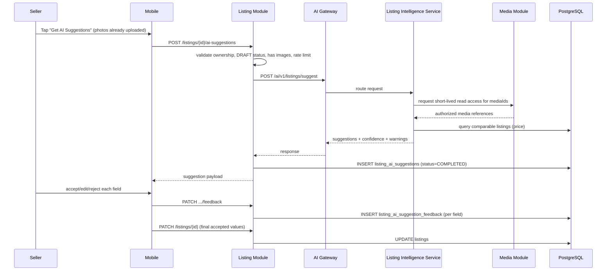

## 7.2 AI Failure / Timeout Fallback

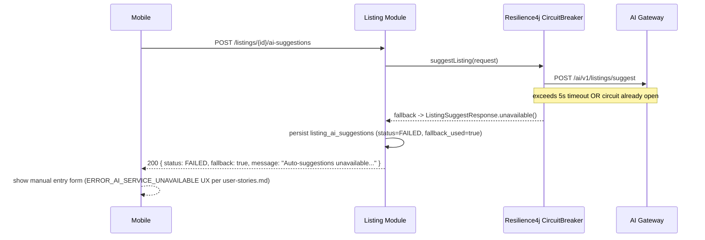

## 7.3 Low-Confidence / Unable-to-Identify

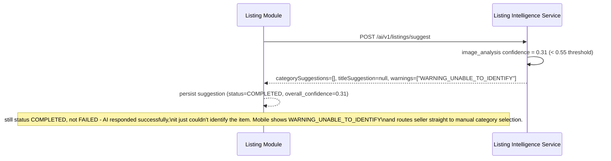

---

# 8. Validation Rules Implementation

Mapping each rule from [user-stories.md](../user-stories.md#us-005-ai-assisted-listing-creation) US-005 to its enforcement point:

| Rule | Enforced By |
|---|---|
| AI suggestions are optional; manual entry always allowed | Suggestion endpoints never mutate `listings`; seller always has direct access to `PATCH /api/v1/listings/{id}` regardless of suggestion outcome |
| Price suggestion must be within 20% of similar listings | Dual enforcement: `price_estimator` bounds itself to the comparable IQR (§6.3.1); backend re-validates independently at persistence (§5.7.1) |
| Category must be from predefined list | `category_classifier.classify()` only selects from the `categories` taxonomy table — never freeform text |
| Title max length: 100 characters | Pydantic-side generation is prompted with a 100-char constraint; DB column `title_suggestion VARCHAR(100)` enforces it as a hard backstop |
| Description max length: 2000 characters | Same pattern — `description_suggestion TEXT` has no DB limit, so a service-layer truncation guard is applied before persistence |

## 8.4 Rate Limiting (Design Decision, Not in User Story Text)

The user story doesn't specify a trigger frequency limit, but an unbounded retrigger button would let a seller hammer the AI Gateway (cost risk, [HLD §19](../HLD/04-AI-Architecture.md#19-ai-risks--mitigations) "AI cost spike"). `MAX_TRIGGERS_PER_HOUR = 5` per listing is enforced in `ListingAiService.generateSuggestions` (§5.7) via `countByListingIdAndCreatedAtAfter`. This is a soft internal control, not a user-facing plan/quota — unlike the buyer-facing photo search entitlement in [HLD §5.5](../HLD/04-AI-Architecture.md#55-photo-search-entitlement-rules), which is out of scope for this story.

---

# 9. Error Handling & Error Codes

| Error Code | HTTP | Trigger | User-Facing Message (from user-stories.md) |
|---|---|---|---|
| `LISTING_NOT_FOUND` | 404 | listing doesn't exist / not owned by caller | - |
| `LISTING_NOT_IN_DRAFT` | 400 | listing already published/deleted | - |
| `LISTING_HAS_NO_IMAGES` | 400 | no photos uploaded yet | - |
| `AI_SUGGESTION_RATE_LIMITED` | 429 | >5 triggers/hour on one listing | - |
| `AI_SUGGESTION_NOT_FOUND` | 404 | `GET`/feedback on listing with no suggestion history | - |
| (degraded, not an error) | 200 | AI Gateway timeout/circuit open | `ERROR_AI_SERVICE_UNAVAILABLE`: "Auto-suggestions unavailable. Please enter details manually" |
| (warning in payload) | 200 | low identification confidence | `WARNING_UNABLE_TO_IDENTIFY`: "Unable to identify item. Please select category manually" |
| (warning in payload) | 200 | price outside comparable band | `WARNING_PRICE_OUT_OF_RANGE`: "Suggested price may be too high/low. Please verify" |

Per [CODING_STANDARDS.md §2.10](../CODING_STANDARDS.md), all thrown exceptions are `NotFoundException`/`BusinessException`/`ValidationException`, handled centrally by `GlobalExceptionHandler` — no controller-level try/catch. The AI-unavailable and low-confidence cases are deliberately **not** exceptions: they are successful, advisory responses per [HLD §3.1](../HLD/04-AI-Architecture.md#31-ai-must-be-advisory-unless-business-rule-requires-blocking), so they're modeled as data (`fallback: true` / `warnings: [...]`), not HTTP error status codes.

---

# 10. Resilience Configuration

| Control | Value | Rationale |
|---|---|---|
| Per-call timeout | 5s | Matches [HLD §12.1](../HLD/04-AI-Architecture.md#121-metrics) target "Listing AI latency < 5 seconds" |
| Circuit breaker sliding window | 20 calls | Standard Resilience4j default, small enough to react within a few minutes at expected Sprint-2 traffic |
| Failure rate threshold | 50% | Opens circuit before a struggling AI service compounds into cascading timeouts across concurrent listing creations |
| Wait duration in open state | 30s | Matches AI Gateway pod restart / autoscale reaction time |
| Retry | None | Suggestion generation is not free (invokes vision + LLM calls); blind retries would double AI spend on a service already trending toward failure. Rely on circuit breaker + user-initiated retrigger (rate-limited, §8.4) instead |

Vision-model call inside the AI service (`image_analysis.analyze`, §6.3) has its own inner timeout (`vision_timeout_seconds`, default 3.0s) so a single slow image doesn't consume the full 5s backend budget before the AI service can even assemble a partial/degraded internal response.

---

# 11. Observability

Per [HLD §12](../HLD/04-AI-Architecture.md#12-ai-observability):

**Metrics (backend, via Micrometer/Prometheus):**
- `listing_ai_suggestion_requests_total{status}` (COMPLETED / FAILED / TIMEOUT)
- `listing_ai_suggestion_latency_ms` (histogram)
- `listing_ai_suggestion_fallback_total` (circuit breaker + timeout fallbacks)
- `listing_ai_suggestion_feedback_total{field, action}` — feeds the "seller acceptance rate" quality metric from [HLD §12.2](../HLD/04-AI-Architecture.md#122-quality-metrics)

**Logs (AI service, structured JSON per `app/core/logging.py`):** `inference_id`, `listing_id`, `model_version`, `confidence`, `latency_ms`, `warnings`, per [HLD §12.3](../HLD/04-AI-Architecture.md#123-logs). Never logs raw image bytes, signed URLs, provider credentials, or seller PII — only media IDs and derived attributes.

**Quality feedback loop:** `listing_ai_suggestion_feedback` rows are the raw input to the "seller edits to AI suggestions" feedback source listed in [HLD §18.2](../HLD/04-AI-Architecture.md#182-feedback-loops). No retraining pipeline is built in this story — this table is the durable capture point that a later AI Ops story consumes.

---

# 12. Security & Privacy

- `AiGatewayClient` calls carry `X-Internal-Api-Key`; the AI Gateway is not reachable from the public internet ([CODING_STANDARDS.md §1.5](../CODING_STANDARDS.md), [HLD §15.1](../HLD/04-AI-Architecture.md#151-access-control)).
- Images are referenced by `mediaId` only — never re-uploaded to the AI service and never exposed as permanent provider URLs; `image_analysis.analyze` receives short-lived authorized media references generated per request, not stored signed URLs ([HLD §15.2](../HLD/04-AI-Architecture.md#152-data-privacy)).
- `listing_ai_suggestions.description_suggestion` and `title_suggestion` are LLM output shown to the seller before it can reach any other user — validated for length only in this story; profanity/restricted-content filtering is owned by US-007's moderation pass, run separately before publish.
- `sellerId` on the request path is always taken from `SecurityContext`, never trusted from the request body (§5.8).

---

# 13. Testing Strategy

Per [CODING_STANDARDS.md §2.11](../CODING_STANDARDS.md) / §5 (Python).

## 13.1 Backend Unit Tests (JUnit 5 + Mockito + AssertJ)

- `shouldReturnSuggestionsWhenAiGatewaySucceeds()`
- `shouldReturnFallbackResponseWhenAiGatewayTimesOut()`
- `shouldReturnFallbackResponseWhenCircuitBreakerOpen()`
- `shouldThrowNotFoundWhenListingDoesNotBelongToSeller()`
- `shouldThrowBusinessExceptionWhenListingHasNoImages()`
- `shouldThrowBusinessExceptionWhenListingNotInDraft()`
- `shouldThrowRateLimitedWhenTriggeredMoreThanFiveTimesInHour()`
- `shouldAppendPriceOutOfRangeWarningWhenAiPriceOutsideComparableBand()`
- `shouldNotAppendPriceWarningWhenNoComparableListingsExist()`
- `shouldPersistFeedbackRowsPerField()`

## 13.2 Backend Integration Tests (`@SpringBootTest`, TestContainers PostgreSQL)

- `POST /listings/{id}/ai-suggestions` happy path → `200`, row persisted, `listings.ai_assisted = true`
- `POST /listings/{id}/ai-suggestions` with AI Gateway mock returning 5xx → `200` degraded payload, `status=FAILED`
- `GET /listings/{id}/ai-suggestions` with no prior suggestion → `404 AI_SUGGESTION_NOT_FOUND`
- `PATCH .../feedback` with invalid `field` enum value → `400 VALIDATION_ERROR`

## 13.3 AI Service Tests (pytest)

- `test_returns_unable_to_identify_warning_below_confidence_threshold`
- `test_returns_multiple_items_warning_when_item_count_greater_than_one`
- `test_returns_null_price_range_when_comparable_count_below_minimum`
- `test_response_always_includes_model_name_and_version`
- `test_internal_api_key_required` (401 without `X-Internal-Api-Key`)

## 13.4 Edge Case Coverage Matrix

| User Story Edge Case | Test |
|---|---|
| AI cannot identify item from photos | `test_returns_unable_to_identify_warning_below_confidence_threshold` |
| Photos contain multiple items | `test_returns_multiple_items_warning_when_item_count_greater_than_one` |
| AI suggests unrealistic price | `shouldAppendPriceOutOfRangeWarningWhenAiPriceOutsideComparableBand` |
| Item unique/rare, no comparables | `test_returns_null_price_range_when_comparable_count_below_minimum` |
| AI service timeout or failure | `shouldReturnFallbackResponseWhenAiGatewayTimesOut`, `...CircuitBreakerOpen` |

---

# 14. Non-Functional Requirements

| Requirement | Target | Source |
|---|---|---|
| Listing AI latency | < 5s | [HLD §12.1](../HLD/04-AI-Architecture.md#121-metrics) |
| Availability degradation | Never blocks listing creation | [HLD §3.1](../HLD/04-AI-Architecture.md#31-ai-must-be-advisory-unless-business-rule-requires-blocking) |
| Concurrent suggestion requests | Bounded by circuit breaker sliding window (20) + per-listing rate limit (5/hr) | §8.4, §10 |
| Data retention | `listing_ai_suggestions`/`_feedback` retained indefinitely (small volume, feeds retraining); no PII stored beyond `sellerId`/`listingId` foreign keys | [HLD §11.1](../HLD/04-AI-Architecture.md#111-postgresql) |

---

# 15. Open Items / Follow-ups

- **Model source for MVP** (external multimodal LLM/vision API vs. taxonomy rules) is left as an implementation choice in [HLD §4.2](../HLD/04-AI-Architecture.md#42-listing-intelligence-service) ("MVP may use... "). This LLD's `image_analysis` / `text_generator` modules are written against a provider-agnostic interface so the concrete vendor can be selected during implementation without changing the router/service contract.
- **Restricted item detection (US-007)** is a separate, blocking check layered on top of this advisory flow — not covered here. Confirm with the team whether US-007's moderation call happens synchronously within the same `POST /ai-suggestions` round trip or as an independent call triggered by image upload (US-004), since that affects whether `ListingAiService` needs to short-circuit on a moderation block.
- **pgvector** is not required for this story (Listing Intelligence Service does not use embeddings/vector search). It remains a tracked prerequisite only for visual search work (US-039+) per the existing backlog note in `Sprint-plan.md`.

---

# Part C - US-006: Multi-Category Tagging

**Story Points:** 3 | **Repos:** valuex-backend, valuex-mobile
**Dependency:** US-004 (listing must exist, at least `DRAFT`)

## C.1 Story Overview

**As a** seller **I want to** tag my item with multiple categories **so that** it appears in relevant search results. A listing has exactly one primary category (mandatory) and up to 3 additional categories; a search hit on *any* assigned category surfaces the listing (Sprint 3 concern for the search index itself — this story only owns correct persistence and validation of the tag set).

## C.2 Scope

**In scope:** `PUT /api/v1/listings/{id}/categories` (replace full category set), `GET /api/v1/categories/tree` (taxonomy for the picker), suspicious-combination flagging.
**Out of scope:** Search indexing/relevance (Sprint 3, US-011), taxonomy authoring/admin CRUD (assumed seeded data).

## C.3 Data Model

Extends [HLD §4.3 Listing Domain](../HLD/03-Data-Architecture.md#43-listing-domain) `categories` / `listing_categories`:

```sql
-- V{N}__add_listing_categories.sql
CREATE TABLE categories (
    id UUID PRIMARY KEY DEFAULT uuid_generate_v4(),
    parent_id UUID REFERENCES categories(id),
    name VARCHAR(255) NOT NULL,
    depth INTEGER NOT NULL DEFAULT 0,
    is_active BOOLEAN NOT NULL DEFAULT TRUE
);
CREATE INDEX idx_categories_parent ON categories(parent_id);

CREATE TABLE listing_categories (
    listing_id UUID NOT NULL REFERENCES listings(id) ON DELETE CASCADE,
    category_id UUID NOT NULL REFERENCES categories(id),
    is_primary BOOLEAN NOT NULL DEFAULT FALSE,
    created_at TIMESTAMP NOT NULL DEFAULT CURRENT_TIMESTAMP,
    PRIMARY KEY(listing_id, category_id)
);
-- exactly one is_primary=TRUE row per listing_id, enforced at application layer
-- (partial unique index below is a defense-in-depth backstop)
CREATE UNIQUE INDEX uq_listing_categories_primary
    ON listing_categories(listing_id) WHERE is_primary;
```

## C.4 API Contract

```http
PUT /api/v1/listings/{listingId}/categories
```

```json
{
  "primaryCategoryId": "uuid-electronics-mobiles",
  "additionalCategoryIds": ["uuid-accessories", "uuid-refurbished"]
}
```

Response: `200 { "success": true, "data": { "categories": [ {"categoryId","categoryPath","isPrimary"} ] } }`.

## C.5 Service Logic

```java
@Transactional
public void setCategories(UUID listingId, UUID sellerId, SetCategoriesRequest req) {
    var listing = requireOwnedListing(listingId, sellerId);

    var allIds = Stream.concat(Stream.of(req.primaryCategoryId()), req.additionalCategoryIds().stream()).toList();
    if (allIds.size() != new HashSet<>(allIds).size())
        throw new BusinessException("ERROR_DUPLICATE_CATEGORY", "Category already selected");
    if (req.additionalCategoryIds().size() > 3)
        throw new BusinessException("ERROR_MAX_CATEGORIES", "Maximum 4 categories allowed");

    var categories = categoryRepository.findAllById(allIds);
    if (categories.size() != allIds.size())
        throw new NotFoundException("CATEGORY_NOT_FOUND", "One or more categories do not exist");

    List<String> warnings = new ArrayList<>();
    if (!relatednessChecker.areRelated(categories))
        warnings.add("WARNING_UNRELATED_CATEGORIES");

    listingCategoryRepository.deleteByListingId(listingId); // replace-all semantics
    listingCategoryRepository.save(new ListingCategory(listingId, req.primaryCategoryId(), true));
    req.additionalCategoryIds().forEach(id ->
            listingCategoryRepository.save(new ListingCategory(listingId, id, false)));

    listingCategoryRepository.flush(); // surface uq_listing_categories_primary violation immediately if any
}
```

`relatednessChecker` is a simple rule: additional categories must share a common ancestor with the primary category within 2 levels, or belong to an explicit allow-listed cross-sell pair table (e.g. "Mobile Phones" + "Mobile Accessories"). This is intentionally simple for Sprint 2 — no ML classifier — matching the story's low complexity (3 SP).

## C.6 Sequence Diagram

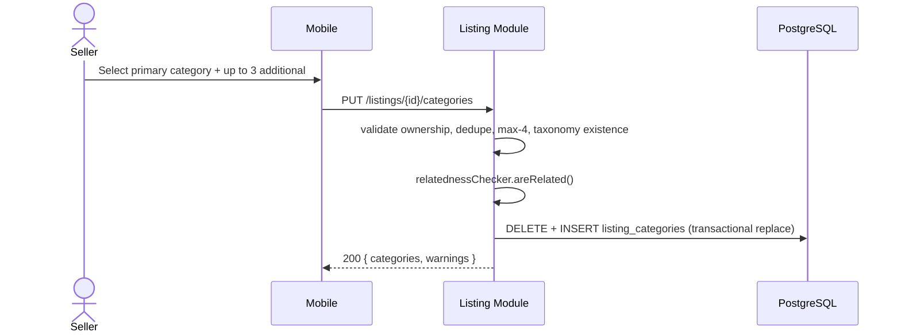

## C.7 Validation Rules & Error Codes

| Rule | Error Code | Message |
|---|---|---|
| Primary category mandatory | `ERROR_PRIMARY_CATEGORY_REQUIRED` | "Select a primary category" |
| Max 3 additional (4 total) | `ERROR_MAX_CATEGORIES` | "Maximum 4 categories allowed" |
| No duplicates | `ERROR_DUPLICATE_CATEGORY` | "Category already selected" |
| Categories from taxonomy only | `CATEGORY_NOT_FOUND` (404) | n/a (client picker only ever offers valid taxonomy nodes) |
| Suspicious/unrelated combination | `WARNING_UNRELATED_CATEGORIES` (advisory, not blocking) | "Selected categories seem unrelated. This may affect visibility" |

## C.8 NFR & Notes

- `PUT` (full replace) rather than `POST`/`PATCH` per category keeps the endpoint idempotent and avoids partial-update ordering bugs with the primary-category uniqueness constraint.
- Category tree depth up to 6+ levels (edge case from user-stories.md) is handled by the mobile picker via lazy-loaded child fetches (`GET /api/v1/categories/tree?parentId=`), not a single flat payload.
- No AI involvement in this story — `WARNING_UNRELATED_CATEGORIES` is a deterministic rule check, not a model call.

---

# Part D - US-007: Restricted Items Prevention

**Story Points:** 5 | **Repos:** valuex-backend, valuex-ai
**Dependency:** US-005 (AI-Assisted Listing Creation) — reuses the AI Gateway integration pattern and runs against the same uploaded images/text

## D.1 Story Overview

**As a** platform **I want to** prevent listing of restricted items **so that** the platform remains compliant and safe. Unlike US-005 (advisory), this check is **blocking**: per [HLD §8 Restricted Item & Content Moderation AI](../HLD/04-AI-Architecture.md#8-restricted-item--content-moderation-ai), a `Restricted` result blocks listing creation outright, `Unclear` routes to manual review, and `Severe violation` restricts the seller account (US-088 lifecycle transition to `UNDER_REVIEW`).

This check runs at photo/text submission time (before plan selection), independently of and prior to US-084's broader Trust & Safety review — US-007 is the narrow "is this item outright prohibited" gate; US-084 is the fuller fraud/reputation/price review layered on top after this passes.

## D.2 Scope

**In scope:** `POST /api/v1/listings/{id}/restricted-check` (backend orchestration), `POST /ai/v1/moderation/restricted-item-check` (AI service), account flagging on severe violation, appeal submission.
**Out of scope:** Broader trust & safety scoring (US-084), admin review console UI (Sprint 10, US-054), watermark detection (Sprint 9, US-082).

## D.3 Data Model

```sql
-- V{N}__add_listing_moderation_checks.sql
CREATE TYPE moderation_result AS ENUM ('SAFE', 'UNCLEAR', 'RESTRICTED', 'SEVERE_VIOLATION');

CREATE TABLE listing_moderation_checks (
    id UUID PRIMARY KEY DEFAULT uuid_generate_v4(),
    listing_id UUID NOT NULL REFERENCES listings(id),
    result moderation_result NOT NULL,
    matched_categories JSONB,      -- ["weapons", "counterfeit_goods"]
    matched_keywords JSONB,        -- text-scan hits, redacted in logs
    confidence NUMERIC(5,4),
    model_version VARCHAR(50),
    reviewed_by_admin_id UUID,     -- set only if UNCLEAR was manually resolved
    admin_decision VARCHAR(20),    -- APPROVED | REJECTED
    created_at TIMESTAMP NOT NULL DEFAULT CURRENT_TIMESTAMP
);
CREATE INDEX idx_listing_moderation_listing ON listing_moderation_checks(listing_id);

CREATE TABLE listing_moderation_appeals (
    id UUID PRIMARY KEY DEFAULT uuid_generate_v4(),
    moderation_check_id UUID NOT NULL REFERENCES listing_moderation_checks(id),
    seller_id UUID NOT NULL REFERENCES users(id),
    appeal_reason TEXT NOT NULL,
    status VARCHAR(20) NOT NULL DEFAULT 'PENDING', -- PENDING | UPHELD | OVERTURNED
    resolved_by_admin_id UUID,
    resolved_at TIMESTAMP,
    created_at TIMESTAMP NOT NULL DEFAULT CURRENT_TIMESTAMP
);
```

## D.4 API Contract

```http
POST /api/v1/listings/{listingId}/restricted-check
```

Response (blocking result):

```json
{
  "success": false,
  "error": { "code": "ERROR_RESTRICTED_ITEM", "message": "This item cannot be listed. See prohibited items policy" },
  "data": { "matchedCategories": ["weapons"], "result": "RESTRICTED" }
}
```

Response (unclear, queued):

```json
{
  "success": true,
  "data": { "result": "UNCLEAR", "message": "Listing flagged for review. You'll be notified within 24 hours" }
}
```

```http
POST /api/v1/listings/{listingId}/restricted-check/{checkId}/appeal
```

## D.5 Service Logic

```java
@Transactional
public ModerationCheckResult runRestrictedItemCheck(UUID listingId, UUID sellerId) {
    var listing = requireOwnedListing(listingId, sellerId);
    var mediaIds = listingImageRepository.findMediaAssetIdsByListingId(listingId);

    var aiResult = aiGatewayClient.checkRestrictedItem(new RestrictedItemCheckRequest(
            listingId, mediaIds, listing.getTitle(), listing.getDescription())).join();
    // Unlike US-005's AiGatewayClient, no advisory fallback here: if the AI
    // Gateway is unreachable, the request FAILS CLOSED (§D.9) rather than
    // silently allowing an unchecked listing through.

    var check = persistCheck(listingId, aiResult);

    switch (aiResult.result()) {
        case SAFE -> { /* no-op, seller proceeds */ }
        case UNCLEAR -> queueForManualReview(check);
        case RESTRICTED -> throw new BusinessException("ERROR_RESTRICTED_ITEM",
                "This item cannot be listed. See prohibited items policy");
        case SEVERE_VIOLATION -> {
            userModerationService.flagAccountUnderReview(sellerId, "SEVERE_RESTRICTED_ITEM_VIOLATION"); // US-088 transition
            throw new BusinessException("ERROR_ACCOUNT_SUSPENDED",
                    "Your account is suspended due to policy violations");
        }
    }
    return toResult(check);
}
```

## D.6 Sequence Diagram

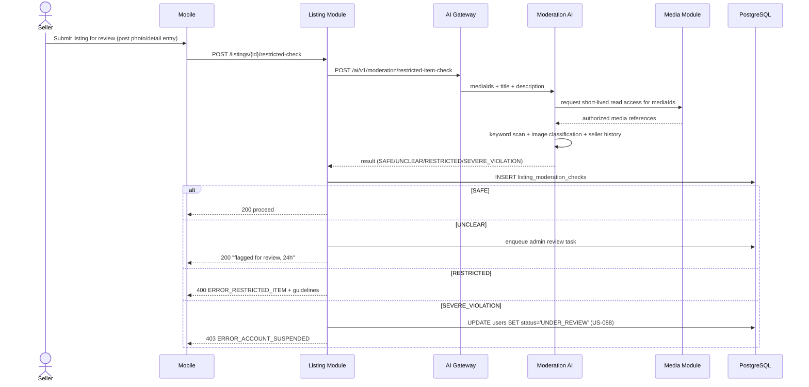

## D.7 Validation Rules & Error Codes

| Rule | Error Code | HTTP |
|---|---|---|
| Restricted category detected | `ERROR_RESTRICTED_ITEM` | 400 |
| Borderline/ambiguous → manual review | `LISTING_UNDER_REVIEW` (advisory) | 200 |
| Repeated/severe violation | `ERROR_ACCOUNT_SUSPENDED` | 403 |
| Seller appeals | `APPEAL_SUBMITTED` | 201 |
| AI Gateway unreachable | `ERROR_MODERATION_UNAVAILABLE` | 503 |

## D.8 Appeal Flow

`POST .../appeal` is only permitted when `result IN ('RESTRICTED', 'SEVERE_VIOLATION')` and no prior appeal exists for that check (`UNIQUE(moderation_check_id)` at the application layer). Appeals are queued to a senior-moderator queue (admin console delivered in Sprint 10, US-055's sibling); this story only owns appeal *submission* and status tracking, per the acceptance criteria's "Appeal submitted" message.

## D.9 Resilience: Fail-Closed, Not Fail-Open

This is the key resilience difference from US-005: **AI unavailability must not allow an unchecked listing to publish.** `AiGatewayClient.checkRestrictedItem` has no advisory fallback — a circuit-open or timeout condition surfaces as `503 ERROR_MODERATION_UNAVAILABLE`, and the listing remains blocked at the current step until the check can run. This matches [HLD §3.1](../HLD/04-AI-Architecture.md#31-ai-must-be-advisory-unless-business-rule-requires-blocking): "AI must never block listing creation" applies to *advisory* AI (US-005); restricted-item detection is explicitly the carved-out "business rule requires blocking" exception.

| Control | Value |
|---|---|
| Timeout | 8s (image classification is heavier than US-005's suggestion call) |
| Circuit breaker | Separate Resilience4j instance `moderationGateway` (does not share budget with `aiGateway`) |
| Fallback | None — fail closed, `503`, retry button shown to seller |

## D.10 Security & Compliance

- `matched_keywords` are stored but redacted (`***`) in application logs to avoid leaking exact bypass phrases into log aggregators accessible to a wider engineering audience than the moderation team.
- Account flagging (`flagAccountUnderReview`) writes to `listing_moderation_checks` and the `users` status column in the same transaction as the moderation check, ensuring an admin never sees a "severe violation" check without a corresponding account state change (audit consistency, feeds US-083 System Audit Trail in Sprint 10).

---

# Part E - US-089: Lifecycle State - Listing

**Story Points:** 5 | **Repos:** valuex-backend
**Dependency:** US-004 (listings must exist to have a lifecycle)

## E.1 Story Overview

**As a** platform **I want** to track listing lifecycle states **so that** listing status determines visibility and actions. This story formalizes the `listing_status` enum (already stubbed in Part A §A.3) into a governed state machine with validated transitions, history logging, and visibility rules consumed by every other Sprint 2+ story that reads or writes listing status.

## E.2 Full State Set

Per [user-stories.md US-089](../user-stories.md#us-089-lifecycle-state---listing):

```text
DRAFT -> PLAN_SELECTION_PENDING -> PLAN_PAYMENT_PENDING -> {PLAN_PAYMENT_FAILED | PLAN_PAYMENT_SUCCESS}
PLAN_PAYMENT_SUCCESS -> MEDIA_UPLOAD_PENDING -> AI_DETAILS_GENERATED -> PRICE_PENDING
PRICE_PENDING -> TRUST_SAFETY_REVIEW -> {APPROVED | REJECTED | REVISION_REQUIRED}
APPROVED -> PUBLISHED
PUBLISHED -> BUYER_INQUIRY_PENDING -> NEGOTIATION_IN_PROGRESS -> OFFER_ACCEPTED -> ORDER_CREATED -> SOLD
PUBLISHED -> EXPIRED | DEACTIVATED_BY_SELLER | REMOVED_BY_ADMIN
```

Note: the acceptance-criteria state list is presented linearly, but in practice Sprint 2's actual seller flow (Parts A/B/C/D/F/G/H/I) only exercises: `DRAFT → TRUST_SAFETY_REVIEW → APPROVED → PLAN_SELECTION_PENDING → PLAN_PAYMENT_PENDING → PLAN_PAYMENT_SUCCESS → PUBLISHED`, plus `REJECTED`/`REVISION_REQUIRED` branches. States from `BUYER_INQUIRY_PENDING` onward are driven by Sprint 3/4 stories and are included here only so the enum and transition table are complete and forward-compatible — this LLD does not implement their triggering logic.

## E.3 Data Model

The `listing_status` enum was already defined in Part A §A.3. This story adds the governed transition table and enforcement:

```sql
-- V{N}__add_listing_status_transitions.sql
CREATE TABLE listing_status_transitions (
    from_status listing_status,   -- NULL = initial creation
    to_status listing_status NOT NULL,
    PRIMARY KEY (from_status, to_status)
);

INSERT INTO listing_status_transitions (from_status, to_status) VALUES
    (NULL, 'DRAFT'),
    ('DRAFT', 'TRUST_SAFETY_REVIEW'),
    ('TRUST_SAFETY_REVIEW', 'APPROVED'),
    ('TRUST_SAFETY_REVIEW', 'REJECTED'),
    ('TRUST_SAFETY_REVIEW', 'REVISION_REQUIRED'),
    ('REVISION_REQUIRED', 'DRAFT'),
    ('APPROVED', 'PLAN_SELECTION_PENDING'),
    ('PLAN_SELECTION_PENDING', 'PLAN_PAYMENT_PENDING'),
    ('PLAN_PAYMENT_PENDING', 'PLAN_PAYMENT_FAILED'),
    ('PLAN_PAYMENT_PENDING', 'PLAN_PAYMENT_SUCCESS'),
    ('PLAN_PAYMENT_FAILED', 'PLAN_SELECTION_PENDING'),
    ('PLAN_PAYMENT_SUCCESS', 'PUBLISHED'),
    ('PUBLISHED', 'SOLD'),
    ('PUBLISHED', 'EXPIRED'),
    ('PUBLISHED', 'DEACTIVATED_BY_SELLER'),
    ('PUBLISHED', 'REMOVED_BY_ADMIN');
-- (Sprint 3+ transitions BUYER_INQUIRY_PENDING..ORDER_CREATED added by those sprints' migrations)
```

`listing_status_history` (defined in Part A §A.3) records every actual transition; `listing_status_transitions` is the whitelist checked before allowing one.

## E.4 Service Logic — Central Transition Guard

Every module that changes `listings.status` (Listing, Plan/Entitlement, Payment, Moderation) must go through this shared guard rather than issuing a raw `UPDATE`:

```java
@Service
@RequiredArgsConstructor
public class ListingLifecycleService {

    private final ListingRepository listingRepository;
    private final ListingStatusTransitionRepository transitionRepository;
    private final ListingStatusHistoryRepository historyRepository;
    private final ApplicationEventPublisher events;

    @Transactional
    public void transition(UUID listingId, ListingStatus toStatus, UUID changedBy, String reason) {
        var listing = listingRepository.findByIdForUpdate(listingId) // SELECT ... FOR UPDATE
                .orElseThrow(() -> new NotFoundException("LISTING_NOT_FOUND", "Listing not found"));

        var from = listing.getStatus();
        if (!transitionRepository.existsByFromStatusAndToStatus(from, toStatus)) {
            throw new BusinessException("INVALID_LISTING_STATE_TRANSITION",
                    "Cannot move listing from %s to %s".formatted(from, toStatus));
        }

        listing.setStatus(toStatus);
        listingRepository.save(listing);
        historyRepository.save(new ListingStatusHistory(listingId, from, toStatus, changedBy, reason));
        events.publishEvent(new ListingStatusChangedEvent(listingId, from, toStatus));
    }
}
```

`findByIdForUpdate` (pessimistic row lock) prevents a race between, e.g., a seller-initiated delete (US-010) and an admin rejection (US-084) landing concurrently on the same listing.

## E.5 Visibility Rules (Business Rules from Acceptance Criteria)

| Rule | Enforcement Point |
|---|---|
| Cannot publish without successful plan payment | `transition(..., PUBLISHED, ...)` only reachable from `PLAN_PAYMENT_SUCCESS` per whitelist |
| Must pass `TRUST_SAFETY_REVIEW` before `PUBLISHED` | No whitelist row skips directly from `DRAFT`/`APPROVED` around review |
| `PUBLISHED` listings visible in search | Search indexing (Sprint 3) subscribes to `ListingStatusChangedEvent`, indexes only when `toStatus == PUBLISHED`, de-indexes on any exit from `PUBLISHED` |
| `SOLD` listings archived | Search/listing read APIs filter `status NOT IN ('SOLD','EXPIRED','REMOVED_BY_ADMIN','DEACTIVATED_BY_SELLER')` by default |
| Expired listings not auto-renewed | No whitelist transition from `EXPIRED` back to `PUBLISHED`; only back to `PLAN_SELECTION_PENDING` (manual renew, modeled as a fresh plan purchase) |

## E.6 Sequence Diagram — Guarded Transition

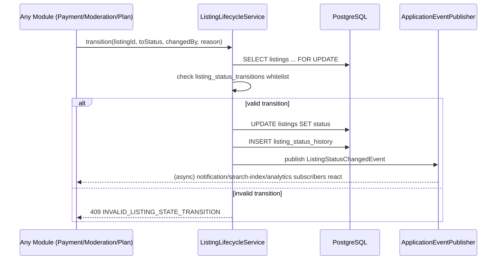

## E.7 Error Handling

| HTTP | Code | Trigger |
|---|---|---|
| 409 | `INVALID_LISTING_STATE_TRANSITION` | attempted transition not in whitelist |
| 404 | `LISTING_NOT_FOUND` | listingId doesn't exist |

## E.8 Observability & Audit

- Every row in `listing_status_history` is immutable (insert-only), feeding [US-083 System Audit Trail](../user-stories.md#us-083-system-audit-trail) (Sprint 10) without needing a separate audit hook in this story.
- Metric `listing_status_transition_total{from,to}` for funnel analysis (draft→published conversion rate).
- `ListingStatusChangedEvent` is the single integration point later sprints hook into (search indexing, notifications, analytics) — avoids each module polling `listings.status` directly.

---

# Part F - US-084: Pre-Publication Trust & Safety Review

**Story Points:** 5 | **Repos:** valuex-backend, valuex-ai
**Dependency:** US-007 (Restricted Items Prevention) — this review runs only after the narrower restricted-item gate has already passed

## F.1 Story Overview

**As a** platform **I want** all listings reviewed before publication **so that** prohibited items and fraud are prevented. Where US-007 is a binary restricted-item gate, US-084 computes a holistic **fraud score** (image analysis, text analysis, price reasonableness, seller reputation) and routes based on a threshold: score < 70 auto-approves; score ≥ 70 queues for manual admin review within a 24-hour SLA. Trusted sellers (rating > 4.5, 50+ sales) bypass to auto-approval regardless of score.

## F.2 Scope

**In scope:** `POST /api/v1/listings/{id}/trust-safety-review` (orchestration, transitions listing via `ListingLifecycleService` from Part E), fraud score computation call, admin approve/reject endpoints, appeal flow.
**Out of scope:** Admin review console UI (Sprint 10, US-054), fraud/velocity scoring shared with post-publication monitoring (Sprint 9, US-052 — this story's score is listing-specific, not account-wide).

## F.3 Data Model

```sql
-- V{N}__add_trust_safety_review.sql
CREATE TABLE listing_trust_safety_reviews (
    id UUID PRIMARY KEY DEFAULT uuid_generate_v4(),
    listing_id UUID NOT NULL REFERENCES listings(id),
    fraud_score NUMERIC(5,2) NOT NULL,       -- 0-100
    auto_decision VARCHAR(20) NOT NULL,      -- AUTO_APPROVED | QUEUED_FOR_REVIEW | TRUSTED_SELLER_BYPASS
    admin_id UUID,
    admin_decision VARCHAR(20),              -- APPROVED | REJECTED
    rejection_reason VARCHAR(500),
    score_breakdown JSONB,                   -- {imageScore, textScore, priceScore, reputationScore}
    reviewed_at TIMESTAMP,
    created_at TIMESTAMP NOT NULL DEFAULT CURRENT_TIMESTAMP
);
CREATE INDEX idx_trust_safety_review_listing ON listing_trust_safety_reviews(listing_id);
CREATE INDEX idx_trust_safety_review_pending ON listing_trust_safety_reviews(auto_decision)
    WHERE auto_decision = 'QUEUED_FOR_REVIEW' AND admin_decision IS NULL;
```

## F.4 API Contract

```http
POST /api/v1/listings/{listingId}/trust-safety-review     -- seller-triggered (or auto-triggered on submit)
GET  /api/v1/admin/listings/review                          -- admin queue (owned jointly with US-054, Sprint 10)
POST /api/v1/admin/listings/{listingId}/approve
POST /api/v1/admin/listings/{listingId}/reject
```

Reject request:

```json
{ "reason": "Price 300% above comparable listings — possible scam" }
```

## F.5 Service Logic

```java
@Transactional
public TrustSafetyReviewResult review(UUID listingId) {
    var listing = listingRepository.findById(listingId)
            .orElseThrow(() -> new NotFoundException("LISTING_NOT_FOUND", "Listing not found"));
    lifecycleService.transition(listingId, ListingStatus.TRUST_SAFETY_REVIEW, listing.getSellerId(), "review_started");

    var seller = sellerReputationClient.getReputation(listing.getSellerId());
    if (seller.rating() > 4.5 && seller.completedSales() >= 50) {
        return approve(listingId, listing.getSellerId(), "TRUSTED_SELLER_BYPASS", null);
    }

    var score = aiGatewayClient.computeFraudScore(toFraudScoreRequest(listing)).join();
    var review = persistReview(listingId, score);

    if (score.total() < 70) {
        return approve(listingId, listing.getSellerId(), "AUTO_APPROVED", score);
    }
    reviewQueueRepository.enqueue(review.getId(), slaDeadline: Instant.now().plus(Duration.ofHours(24)));
    return TrustSafetyReviewResult.queued(review.getId());
}

private TrustSafetyReviewResult approve(UUID listingId, UUID sellerId, String decision, FraudScoreResponse score) {
    lifecycleService.transition(listingId, ListingStatus.APPROVED, sellerId, decision);
    return TrustSafetyReviewResult.approved(decision, score);
}
```

Admin approve/reject reuses `lifecycleService.transition(..., APPROVED|REJECTED, adminId, reason)`, guaranteeing the same audit trail (`listing_status_history`) whether approval was automated or manual.

## F.6 Sequence Diagram

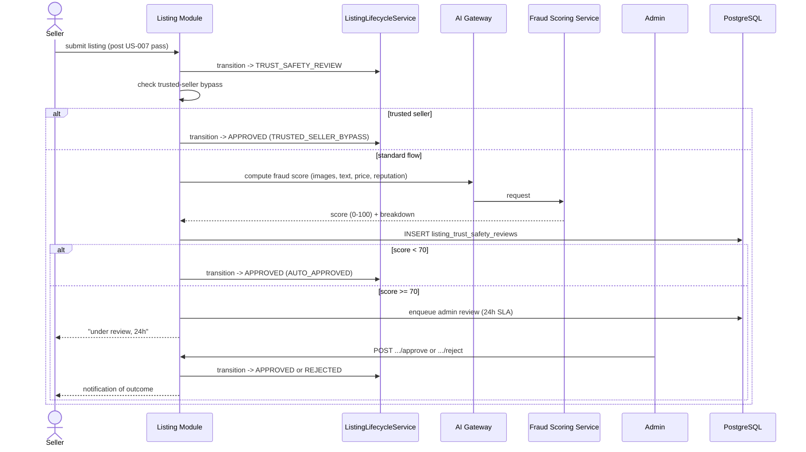

## F.7 Validation & Error Handling

| Condition | Code | HTTP |
|---|---|---|
| Listing under review | `LISTING_UNDER_REVIEW` | 200 (advisory) |
| Admin rejects | `LISTING_REJECTED` | 200 (seller notified with `rejection_reason`) |
| Seller appeals rejection | `APPEAL_SUBMITTED` | 201 |
| Review SLA breach (>24h unresolved) | internal alert only, not user-facing error | n/a |
| AI fraud scoring unavailable | fail closed → queue for manual review (never auto-approve on failure) | 200, `auto_decision=QUEUED_FOR_REVIEW`, `score_breakdown=null` |

Appeals reuse the same `listing_moderation_appeals`-style pattern as Part D, but referencing `listing_trust_safety_reviews.id`; reviewed by a senior moderator per the acceptance criteria ("Appeals reviewed by senior moderator").

## F.8 Resilience

Unlike US-007 (hard fail-closed reject), a fraud-scoring outage here **queues for manual review** rather than blocking outright — the acceptance criteria explicitly describes a threshold-routing model, and manual review is always a safe fallback since a human will still gate publication. This is a deliberate difference from Part D's stricter behavior: US-007 blocks known-prohibited items outright (no human needed to say "no"), while US-084's fraud score is inherently probabilistic and better resolved by a human than by failing the entire submission.

## F.9 Observability

- Metric `trust_safety_review_queue_depth` and `trust_safety_review_sla_breach_total` — directly supports the "Manual review SLA: 24 hours" business rule.
- Metric `trust_safety_auto_approval_rate` vs `manual_review_rate` — capacity planning input for the admin moderation team (Sprint 10 dashboard, US-100).

---

# Part G - US-078: Listing Plan Features and Pricing

**Story Points:** 3 | **Repos:** valuex-backend, valuex-mobile
**Dependency:** US-004 (listing draft must exist to select a plan for it)

## G.1 Story Overview

**As a** seller **I want to** understand differences between listing plans **so that** I can choose the right plan for my item. This story is the read-only "plan catalog + pricing breakdown" step; the actual selection + payment flow is US-008/US-009. It owns the `plans`/`listing_plans` catalog data defined in [HLD §4.5 Plan & Entitlement Module](../HLD/02-Backend-Architecture.md#45-plan--entitlement-module).

## G.2 Scope

**In scope:** `GET /api/v1/plans/seller` (catalog with pricing/features), plan validity computation, Featured-listing rotation cap (max 20).
**Out of scope:** Payment processing (US-008/US-009), plan upgrade mid-validity (US-064, later sprint), buyer-side plans (US-079, Sprint 12).

## G.3 Data Model

```sql
-- V{N}__add_seller_plans.sql
CREATE TABLE plans (
    id UUID PRIMARY KEY DEFAULT uuid_generate_v4(),
    code VARCHAR(20) UNIQUE NOT NULL,   -- BASIC | BOOSTED | PRIORITY
    name VARCHAR(50) NOT NULL,
    audience VARCHAR(10) NOT NULL,      -- SELLER | BUYER
    original_price NUMERIC(10,2) NOT NULL,
    discounted_price NUMERIC(10,2) NOT NULL,
    validity_days INTEGER NOT NULL,
    support_level VARCHAR(20) NOT NULL, -- AI_EMAIL | AI_EMAIL_CHAT | AI_EMAIL_CHAT_CALL
    features JSONB NOT NULL,            -- ["Listed on top when searched", "Featured badge", ...]
    is_active BOOLEAN NOT NULL DEFAULT TRUE
);

INSERT INTO plans (code, name, audience, original_price, discounted_price, validity_days, support_level, features) VALUES
    ('BASIC', 'Basic', 'SELLER', 99, 49, 7, 'AI_EMAIL',
        '["Listed in chronological order", "7 days validity"]'),
    ('BOOSTED', 'Boosted', 'SELLER', 399, 149, 7, 'AI_EMAIL_CHAT',
        '["Listed on top when searched", "7 days validity"]'),
    ('PRIORITY', 'Priority', 'SELLER', 699, 249, 30, 'AI_EMAIL_CHAT_CALL',
        '["Boosted placement", "Featured on landing page", "Featured badge", "1 month validity"]');
```

`listings.plan_type` (Part A) stores the selected `plans.code` once purchased (US-008); this story only reads the catalog.

## G.4 API Contract

```http
GET /api/v1/plans/seller
```

```json
{
  "success": true,
  "data": [
    { "code": "BASIC", "name": "Basic", "originalPrice": 99, "discountedPrice": 49, "validityDays": 7,
      "supportLevel": "AI_EMAIL", "features": ["Listed in chronological order", "7 days validity"] },
    { "code": "BOOSTED", "name": "Boosted", "originalPrice": 399, "discountedPrice": 149, "validityDays": 7,
      "supportLevel": "AI_EMAIL_CHAT", "features": ["Listed on top when searched", "7 days validity"] },
    { "code": "PRIORITY", "name": "Priority", "originalPrice": 699, "discountedPrice": 249, "validityDays": 30,
      "supportLevel": "AI_EMAIL_CHAT_CALL", "features": ["Boosted placement", "Featured on landing page", "Featured badge", "1 month validity"] }
  ]
}
```

## G.5 Service Logic — Featured Rotation Cap

The only non-trivial business rule in this story is "Featured items shown max 20 on landing page (rotation basis)":

```java
@Service
@RequiredArgsConstructor
public class FeaturedListingRotationService {

    private static final int MAX_FEATURED_SLOTS = 20;
    private final ListingRepository listingRepository;

    // Called by the landing-page read API (owned by Sprint 3+ discovery module);
    // this service only computes eligibility, not the landing page itself.
    public List<UUID> currentFeaturedListingIds() {
        return listingRepository.findActivePriorityListingsOrderByPublishedAtAsc(PageRequest.of(0, MAX_FEATURED_SLOTS))
                .stream().map(Listing::getId).toList();
        // Oldest-published-first rotation: a new PRIORITY listing enters the
        // pool immediately but only surfaces once an older one ages out of
        // the top-20 window or expires — simplest fair rotation without a
        // separate scheduling job for Sprint 2.
    }
}
```

## G.6 Validation Rules & Error Codes

| Rule | Enforcement | Error Code |
|---|---|---|
| Validity starts from successful payment | `listings.expires_at` set by US-009 on `PLAN_PAYMENT_SUCCESS`, not at catalog-read time | n/a (informational here) |
| Plan features non-transferable | No "transfer plan" endpoint exists | n/a |
| Max 20 featured on landing page | `FeaturedListingRotationService` | n/a (silent cap, not a user-facing error) |
| Payment required before plan activates | Enforced downstream in US-008/US-009 | `ERROR_PAYMENT_REQUIRED` |
| Plan expired | Read-path check when serving a listing whose `expires_at < now()` | `PLAN_EXPIRED` |

## G.7 NFR Notes

- `GET /api/v1/plans/seller` is cached (`@Cacheable`, Redis, 1-hour TTL) since plan catalog data changes infrequently (admin-managed, not implemented in Sprint 2) — avoids a DB round trip on every listing creation flow.
- Feature/price content is seeded via migration (§G.3), not hardcoded in the mobile client, so a future price change doesn't require an app release.

---

# Part H - US-008: Seller Chooses Listing Plan

**Story Points:** 5 | **Repos:** valuex-backend, valuex-mobile
**Dependency:** US-078 (plan catalog must exist); listing must be `APPROVED` (post Part F trust & safety review) before plan selection, per the `listing_status_transitions` whitelist (Part E §E.3)

## H.1 Story Overview

**As a** seller **I want to** choose a listing plan (Basic/Boosted/Priority) **so that** I can control visibility and reach. This story owns plan selection and payment initiation; **actual publication** on payment success is US-009's responsibility — this separation matches the lifecycle split between `PLAN_PAYMENT_PENDING`/`PLAN_PAYMENT_SUCCESS` (this story) and `PUBLISHED` (US-009).

## H.2 Scope

**In scope:** `POST /api/v1/listings/{id}/plan-selection`, Razorpay order creation for paid plans, immediate activation path for the free Basic plan, max-50-active-listings enforcement.
**Out of scope:** Payment webhook handling / publication (US-009), payment gateway integration details beyond order creation (shared infra also used by Escrow/Subscriptions per [HLD §21](../HLD/07-API-Integrations-Release-Risk.md#21-payment-gateway-integration)).

## H.3 Data Model

```sql
-- V{N}__add_listing_payments.sql
CREATE TABLE payments (
    id UUID PRIMARY KEY DEFAULT uuid_generate_v4(),
    reference_type VARCHAR(30) NOT NULL,   -- LISTING_PLAN | ORDER | SUBSCRIPTION (US-008 uses LISTING_PLAN)
    reference_id UUID NOT NULL,            -- listings.id for LISTING_PLAN
    gateway_order_id VARCHAR(255),
    amount NUMERIC(12,2) NOT NULL,
    status VARCHAR(50) NOT NULL DEFAULT 'PAYMENT_INITIATED',
    created_at TIMESTAMP NOT NULL DEFAULT CURRENT_TIMESTAMP
);
CREATE INDEX idx_payments_reference ON payments(reference_type, reference_id);

CREATE TABLE payment_attempts (
    id UUID PRIMARY KEY DEFAULT uuid_generate_v4(),
    payment_id UUID NOT NULL REFERENCES payments(id),
    gateway_transaction_id VARCHAR(255),
    status VARCHAR(50) NOT NULL,
    failure_reason VARCHAR(255),
    attempted_at TIMESTAMP NOT NULL DEFAULT CURRENT_TIMESTAMP
);
```

`payments.reference_type` is a discriminator reused by Sprint 5's `PAYMENT_ORDER` (US-021) and Sprint 12's `SUBSCRIPTION` (US-038) — this story only ever writes `LISTING_PLAN` rows, but the table is shaped so later sprints don't need a new payments table.

## H.4 API Contract

```http
POST /api/v1/listings/{listingId}/plan-selection
```

```json
{ "planCode": "BOOSTED" }
```

Free plan (`BASIC`) response — immediate:

```json
{ "success": true, "data": { "planCode": "BASIC", "paymentRequired": false, "listingStatus": "PLAN_PAYMENT_SUCCESS" } }
```

Paid plan response — redirect to gateway:

```json
{
  "success": true,
  "data": {
    "planCode": "BOOSTED", "paymentRequired": true,
    "razorpayOrderId": "order_xyz", "amount": 14900, "currency": "INR"
  }
}
```

## H.5 Service Logic

```java
@Transactional
public PlanSelectionResult selectPlan(UUID listingId, UUID sellerId, String planCode) {
    var listing = requireOwnedListing(listingId, sellerId);
    if (listing.getStatus() != ListingStatus.APPROVED)
        throw new BusinessException("ERROR_INCOMPLETE_LISTING", "Complete all required fields before selecting plan");

    long activeCount = listingRepository.countBySellerIdAndStatusIn(sellerId, ACTIVE_STATUSES);
    if (activeCount >= 50)
        throw new BusinessException("ERROR_MAX_LISTINGS_REACHED", "You've reached the maximum listing limit");

    var plan = planRepository.findByCodeAndAudience(planCode, "SELLER")
            .orElseThrow(() -> new NotFoundException("PLAN_NOT_FOUND", "Unknown plan"));

    lifecycleService.transition(listingId, ListingStatus.PLAN_SELECTION_PENDING, sellerId, "plan_selected:" + planCode);
    listing.setPlanType(plan.getCode());

    if (plan.getDiscountedPrice().signum() == 0) {
        lifecycleService.transition(listingId, ListingStatus.PLAN_PAYMENT_SUCCESS, sellerId, "free_plan_auto_success");
        return PlanSelectionResult.freeActivated(plan.getCode());
    }

    lifecycleService.transition(listingId, ListingStatus.PLAN_PAYMENT_PENDING, sellerId, "awaiting_payment");
    var order = paymentGatewayClient.createOrder(plan.getDiscountedPrice(), "INR",
            "LISTING_PLAN", listingId);
    paymentRepository.save(Payment.initiated("LISTING_PLAN", listingId, order.id(), plan.getDiscountedPrice()));
    return PlanSelectionResult.paymentRequired(plan.getCode(), order.id(), plan.getDiscountedPrice());
}
```

`ACTIVE_STATUSES` = every status except `SOLD, EXPIRED, DEACTIVATED_BY_SELLER, REMOVED_BY_ADMIN, REJECTED` — matches the "max 50 active listings" business rule's intent (drafts-in-progress count toward the cap to prevent seller spam-drafting).

## H.6 Sequence Diagram

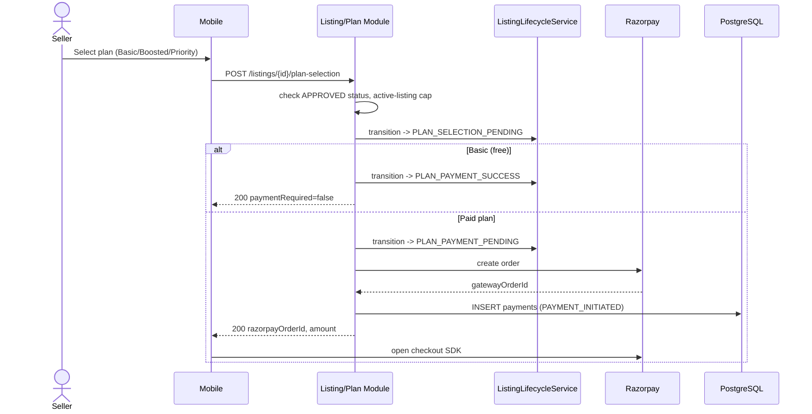

(Continued in Part I §I.5 — the Razorpay webhook / payment success callback that follows this order creation.)

## H.7 Validation Rules & Error Codes

| Rule | Error Code | Message |
|---|---|---|
| Draft must be `APPROVED` before plan selection | `ERROR_INCOMPLETE_LISTING` | "Complete all required fields before selecting plan" |
| Free plan requires no payment | n/a — handled by `signum() == 0` branch | — |
| Paid plans require successful payment before publishing | Enforced by lifecycle whitelist (Part E) — `PUBLISHED` unreachable without `PLAN_PAYMENT_SUCCESS` | — |
| Max 50 active listings per seller | `ERROR_MAX_LISTINGS_REACHED` | "You've reached the maximum listing limit" |
| Payment fails | `ERROR_PAYMENT_FAILED` | "Payment unsuccessful. Please try again" |

## H.8 Edge Cases

| Edge Case | Handling |
|---|---|
| Seller cancels payment in Razorpay UI | Client calls no completion endpoint; listing remains `PLAN_PAYMENT_PENDING`; seller can re-open checkout for the same `gatewayOrderId` or re-select plan (new order created) |
| Seller closes app before payment | Same as above — `PLAN_PAYMENT_PENDING` is a durable, resumable state; a scheduled job (US-009 side) times out orders unpaid after 30 minutes back to `PLAN_SELECTION_PENDING` |
| Payment fails at gateway | Webhook (US-009) marks `payments.status = FAILED`; lifecycle transitions to `PLAN_PAYMENT_FAILED`; seller can retry plan selection |

---

# Part I - US-009: Listing Publication After Payment

**Story Points:** 5 | **Repos:** valuex-backend
**Dependency:** US-008 (plan selection + payment order must already be created)

## I.1 Story Overview

**As a** seller **I want** my listing to be published immediately after successful payment **so that** buyers can discover it right away. This story owns the Razorpay webhook, the transactional publish operation, and the rollback/refund path if publish fails after payment succeeds — a scenario the acceptance criteria explicitly calls out ("Payment succeeds but listing publish fails").

## I.2 Scope

**In scope:** `POST /api/v1/webhooks/payment` (Razorpay webhook per [HLD §21](../HLD/07-API-Integrations-Release-Risk.md#21-payment-gateway-integration)), idempotent publish transaction, plan feature activation, refund-and-rollback on publish failure, publish confirmation notification.
**Out of scope:** Escrow (unrelated payment domain, Sprint 5), the actual Razorpay checkout SDK integration on mobile (US-008's concern).

## I.3 Data Model

Extends `payments` (Part H §H.3):

```sql
-- V{N}__add_payment_webhook_idempotency.sql
ALTER TABLE payments ADD COLUMN webhook_processed_at TIMESTAMP;
ALTER TABLE payments ADD COLUMN gateway_payment_id VARCHAR(255);
CREATE UNIQUE INDEX uq_payments_gateway_payment_id ON payments(gateway_payment_id) WHERE gateway_payment_id IS NOT NULL;
-- Guarantees a duplicate webhook delivery for the same gateway_payment_id
-- cannot be processed twice (defends ERROR_DUPLICATE_PAYMENT).
```

## I.4 API Contract

```http
POST /api/v1/webhooks/payment
X-Razorpay-Signature: <hmac>
```

```json
{ "event": "payment.captured", "payload": { "payment": { "id": "pay_abc", "order_id": "order_xyz", "amount": 14900 } } }
```

Response: always `200` (per Razorpay webhook contract — non-200 triggers gateway retries); actual business outcome is asynchronous from the webhook caller's perspective.

## I.5 Service Logic — Idempotent Publish with Rollback

```java
@Service
@RequiredArgsConstructor
public class PaymentWebhookService {

    private final PaymentRepository paymentRepository;
    private final ListingLifecycleService lifecycleService;
    private final ListingRepository listingRepository;
    private final PaymentGatewayClient paymentGatewayClient;
    private final NotificationService notificationService;

    @Transactional
    public void handlePaymentCaptured(String razorpayPaymentId, String razorpayOrderId, BigDecimal amount) {
        var payment = paymentRepository.findByGatewayOrderId(razorpayOrderId)
                .orElseThrow(() -> new BusinessException("PAYMENT_NOT_FOUND", "No matching payment order"));

        if (payment.getWebhookProcessedAt() != null) {
            return; // idempotent no-op: duplicate webhook delivery (ERROR_DUPLICATE_PAYMENT avoided silently)
        }
        payment.setGatewayPaymentId(razorpayPaymentId);
        payment.setStatus("PAYMENT_SUCCESS");
        payment.setWebhookProcessedAt(Instant.now());
        paymentRepository.save(payment);

        var listingId = payment.getReferenceId();
        try {
            lifecycleService.transition(listingId, ListingStatus.PLAN_PAYMENT_SUCCESS, null, "payment_captured");
            publishListing(listingId); // sets PUBLISHED + expires_at + plan feature flags
            notificationService.notifySeller(listingId, "LISTING_PUBLISHED");
        } catch (Exception e) {
            log.error("Listing publish failed after successful payment, listingId={}", listingId, e);
            paymentGatewayClient.refund(razorpayPaymentId, amount, "PUBLISH_FAILED_AUTO_REFUND");
            payment.setStatus("REFUNDED");
            paymentRepository.save(payment);
            lifecycleService.transition(listingId, ListingStatus.PLAN_SELECTION_PENDING, null, "rollback_publish_failure");
            notificationService.notifySeller(listingId, "PUBLISH_FAILED_REFUND_INITIATED");
        }
    }

    private void publishListing(UUID listingId) {
        var listing = listingRepository.findById(listingId).orElseThrow();
        var plan = planRepository.findByCode(listing.getPlanType()).orElseThrow();
        listing.setExpiresAt(Instant.now().plus(Duration.ofDays(plan.getValidityDays())));
        lifecycleService.transition(listingId, ListingStatus.PUBLISHED, null, "auto_publish_on_payment");
    }
}
```

Webhook signature verification (`X-Razorpay-Signature` HMAC check) happens in the controller layer before this service method is ever invoked, per [HLD §21](../HLD/07-API-Integrations-Release-Risk.md#21-payment-gateway-integration) — an unverified webhook body is rejected with `401` before touching any listing state.

## I.6 Sequence Diagram

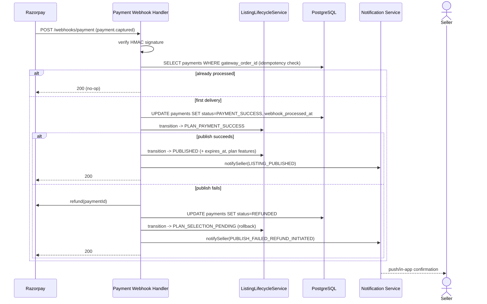

## I.7 Validation Rules & Error Codes

| Rule | Error Code | Detail |
|---|---|---|
| Payment must be confirmed before publishing | Webhook-driven only; no client-triggered publish endpoint exists | — |
| Rollback to draft-equivalent state + refund if publish fails after payment | `PaymentWebhookService.handlePaymentCaptured` catch block | `ERROR_PUBLISH_FAILED`: "Payment successful but listing failed to publish. Refund initiated" |
| Duplicate payment for same listing | `uq_payments_gateway_payment_id` + `webhookProcessedAt` idempotency guard | `ERROR_DUPLICATE_PAYMENT` (silently absorbed, not surfaced as user error) |
| Plan activation within 5 minutes of payment | Webhook processing is synchronous and typically completes in milliseconds; SLA is a monitoring target (`payment_to_publish_latency_ms` metric), not a hard timeout in code |
| Network interruption after payment | Razorpay retries webhook delivery on non-2xx/timeout; idempotency guard makes retries safe |

## I.8 Resilience & Consistency

- The publish operation and the payment status update happen in **one database transaction** with the lifecycle transition — a crash between "payment marked success" and "listing published" is impossible to observe as a partial state; either both commit or both roll back, and the `catch` block's refund path only triggers for exceptions *after* the initial commit (e.g., a downstream `plan.getValidityDays()` lookup failure), which is why refund + rollback happens in a **separate** transaction from the initial payment-success commit — the record of successful payment must survive even if publish itself fails, so a refund can be correctly issued against it.
- Refund calls to Razorpay are themselves idempotent on `razorpayPaymentId` (gateway-side guarantee); a retry of the rollback path (e.g., after an app restart mid-handling) won't double-refund.

## I.9 Observability & Security

- Metric `payment_to_publish_latency_ms` — supports the "within 5 minutes" business rule as a monitored SLA rather than an enforced timeout.
- Metric `listing_publish_failure_total` with alerting — a non-zero rate here means seller-facing refunds are happening, which is both a UX and a finance concern worth paging on.
- Webhook endpoint is otherwise unauthenticated (no seller JWT — it's a server-to-server callback) and relies entirely on HMAC signature verification; rate-limited at the API Gateway to blunt replay/flood attempts even though replays are already idempotent.

---

# Part J - US-010: Edit/Delete Listing

**Story Points:** 5 | **Repos:** valuex-backend, valuex-mobile
**Dependency:** US-009 (only published listings are meaningfully editable/deletable in the ways this story's acceptance criteria describe, though the same endpoints also serve editing a `DRAFT`/`REVISION_REQUIRED` listing per Part A/F)

## J.1 Story Overview

**As a** seller **I want to** edit or delete my listings **so that** I can keep information accurate and remove sold items. Edits to a `PUBLISHED` listing are either **minor** (applied immediately) or **major** (price change >20% or category change — require re-moderation, looping back through Part F's Trust & Safety review). Deletion is blocked whenever the listing has active orders, pending payment, or open disputes.

## J.2 Scope

**In scope:** `PATCH /api/v1/listings/{id}` (edit, reused by every earlier story's "final values" step), `DELETE /api/v1/listings/{id}` (soft delete), edit-history logging, active-viewer notification hook.
**Out of scope:** Order/dispute domain logic itself (Sprints 5/7/8) — this story only *queries* their existence via a port interface to decide whether deletion is allowed.

## J.3 Data Model

```sql
-- V{N}__add_listing_edit_history.sql
CREATE TABLE listing_edit_history (
    id UUID PRIMARY KEY DEFAULT uuid_generate_v4(),
    listing_id UUID NOT NULL REFERENCES listings(id),
    edited_by UUID NOT NULL,
    changed_fields JSONB NOT NULL,   -- {"price": {"from": 30000, "to": 42000}, ...}
    requires_remoderation BOOLEAN NOT NULL DEFAULT FALSE,
    edited_at TIMESTAMP NOT NULL DEFAULT CURRENT_TIMESTAMP
);

ALTER TABLE listings ADD COLUMN deleted_at TIMESTAMP;
ALTER TABLE listings ADD COLUMN deleted_by UUID;
-- Soft delete: row retained 90 days (acceptance criteria), purge job is a
-- separate ops concern, not implemented in this story.
```

## J.4 API Contract

```http
PATCH /api/v1/listings/{listingId}
```

```json
{ "title": "Apple iPhone 13 128GB", "price": 34000, "description": "..." }
```

```http
DELETE /api/v1/listings/{listingId}
```

Blocked response:

```json
{ "success": false, "error": { "code": "ERROR_CANNOT_DELETE_ACTIVE_ORDER", "message": "Cannot delete listing with active orders" } }
```

## J.5 Service Logic

```java
@Transactional
public EditListingResult edit(UUID listingId, UUID sellerId, EditListingRequest req) {
    var listing = requireOwnedListing(listingId, sellerId);

    var changedFields = diffChangedFields(listing, req);
    boolean majorEdit = isCategoryChange(changedFields)
            || isPriceChangeOverThreshold(listing.getPrice(), req.price(), 0.20);

    applyFields(listing, req);
    listingRepository.save(listing);
    editHistoryRepository.save(new ListingEditHistory(listingId, sellerId, changedFields, majorEdit));

    List<String> warnings = new ArrayList<>();
    if (activeViewerTracker.hasActiveViewers(listingId)) {
        warnings.add("WARNING_BUYERS_WILL_BE_NOTIFIED");
        notificationService.notifyActiveViewers(listingId, "LISTING_UPDATED");
    }

    if (majorEdit && listing.getStatus() == ListingStatus.PUBLISHED) {
        lifecycleService.transition(listingId, ListingStatus.TRUST_SAFETY_REVIEW, sellerId, "major_edit_remoderation");
        // Re-enters Part F's review flow; listing is temporarily de-listed from search until re-approved.
    }
    return new EditListingResult(listing.getId(), majorEdit, warnings);
}

@Transactional
public void delete(UUID listingId, UUID sellerId) {
    var listing = requireOwnedListing(listingId, sellerId);

    if (orderQueryPort.hasActiveOrders(listingId))
        throw new BusinessException("ERROR_CANNOT_DELETE_ACTIVE_ORDER", "Cannot delete listing with active orders");
    if (orderQueryPort.hasPendingPayment(listingId))
        throw new BusinessException("ERROR_CANNOT_DELETE_ACTIVE_ORDER", "Cannot delete listing with active orders");
    if (disputeQueryPort.hasOpenDispute(listingId))
        throw new BusinessException("ERROR_CANNOT_DELETE_ACTIVE_ORDER", "Cannot delete listing with active orders");

    listing.setDeletedAt(Instant.now());
    listing.setDeletedBy(sellerId);
    lifecycleService.transition(listingId, ListingStatus.DEACTIVATED_BY_SELLER, sellerId, "seller_deleted");
    listingRepository.save(listing);
}
```

`orderQueryPort` / `disputeQueryPort` are interfaces implemented by the Order and Dispute modules once those sprints land (Sprint 5/8) — in Sprint 2 they resolve to trivial "always false" adapters since no orders/disputes exist yet, but the port boundary is defined now so US-010 doesn't need rework later ([HLD §5](../HLD/02-Backend-Architecture.md#5-spring-boot-package-structure) module boundaries).

## J.6 Sequence Diagram — Major Edit Triggering Re-Moderation

```mermaid
sequenceDiagram
    actor Seller
    participant Mobile
    participant Backend as Listing Module
    participant Lifecycle as ListingLifecycleService
    participant DB as PostgreSQL
    participant Viewers as Active Viewers

    Seller->>Mobile: Edit price from 30000 -> 42000 (+40%)
    Mobile->>Backend: PATCH /listings/{id}
    Backend->>Backend: diff fields, detect >20% price change -> majorEdit=true
    Backend->>DB: UPDATE listings + INSERT listing_edit_history
    Backend->>Viewers: notify (WARNING_BUYERS_WILL_BE_NOTIFIED)
    Backend->>Lifecycle: transition PUBLISHED -> TRUST_SAFETY_REVIEW
    Note over Lifecycle: Re-enters Part F flow; listing de-listed from search until re-approved
    Backend-->>Mobile: 200 { majorEdit: true, warnings: [...] }
```

## J.7 Validation Rules & Error Codes

| Rule | Error Code | Message |
|---|---|---|
| Cannot delete with active orders/pending payment/open disputes | `ERROR_CANNOT_DELETE_ACTIVE_ORDER` | "Cannot delete listing with active orders" |
| Price change >20% requires re-moderation | not a hard error — routes to `TRUST_SAFETY_REVIEW` | `WARNING_PRICE_CHANGE_TOO_HIGH`-style informational banner: "Price change >20% requires admin approval" |
| Edit history maintained for audit | `listing_edit_history` insert on every `PATCH` | — |
| Deleted listings retained 90 days | Soft delete via `deleted_at`; hard purge is a separate scheduled ops job, out of scope | — |
| Active viewers notified of changes | `activeViewerTracker` + `notificationService.notifyActiveViewers` | `WARNING_BUYERS_WILL_BE_NOTIFIED` |

## J.8 Edge Cases

| Edge Case | Handling |
|---|---|
| Edit during active negotiation | Out of scope for Sprint 2 (negotiations don't exist until Sprint 4, US-017); `orderQueryPort`-style port reserved for a future `negotiationQueryPort` |
| Delete while buyer is viewing | `activeViewerTracker.hasActiveViewers` check fires the notification warning; deletion itself is not blocked by viewership alone (only by orders/payments/disputes) |
| Seller changes item drastically (different item) | Treated as a major edit if category changes; title/description-only changes without a category or >20% price change are minor and don't trigger re-moderation — acceptable per acceptance criteria, which only names category/price as major-edit triggers |
| Edit violates new platform policies | Re-moderation path (Part F) catches this on the next major edit; policy violations on a minor-only edit are not proactively re-scanned in this story (would require scanning every `PATCH`, out of scope for 5 SP) |

## J.9 NFR & Security

- `requireOwnedListing` (shared helper, first defined in Part A §A.5) is reused here — no new ownership-check code path, reducing IDOR risk surface.
- `listing_edit_history.changed_fields` stores only field-level diffs (not full before/after snapshots) to keep the audit table lightweight while still satisfying "edit history maintained for audit."
- Soft-delete (`deleted_at`) rather than hard `DELETE` ensures `listing_status_history` and `listing_edit_history` foreign keys remain valid and the 90-day retention requirement is trivially satisfiable by a scheduled purge job outside this story's scope.


