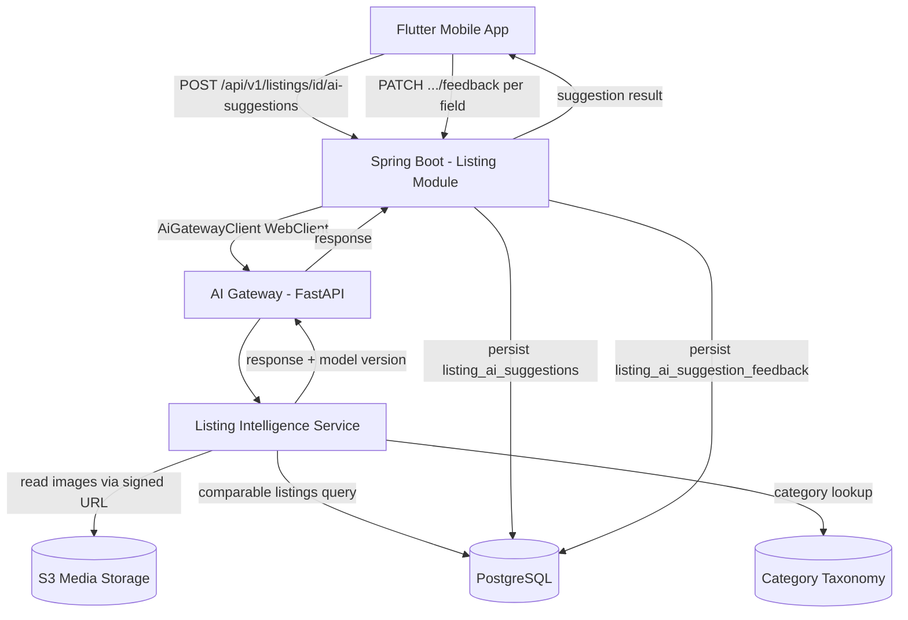
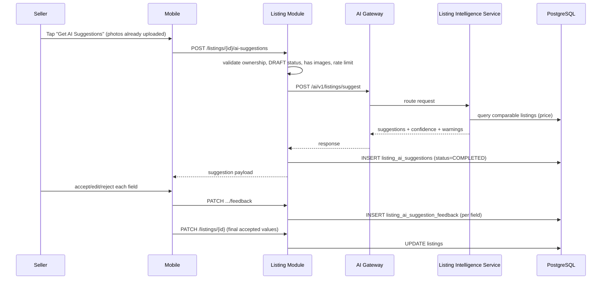
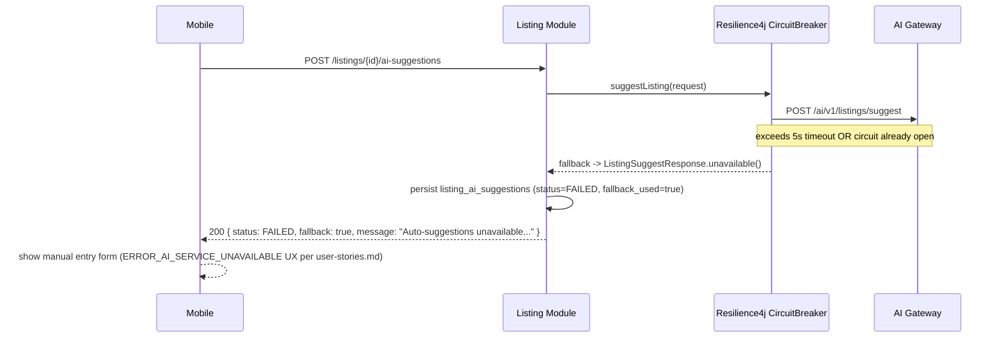
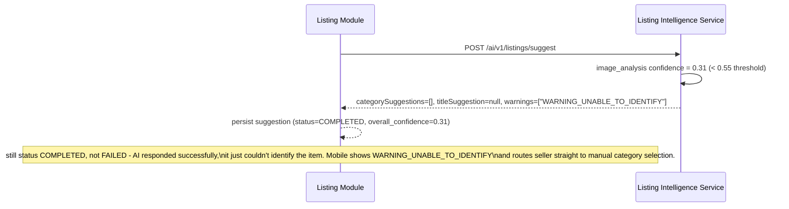

# Low Level Design - US-005: AI-Assisted Listing Creation

**Document Version:** 1.0
**Product:** ValueX
**Sprint:** Sprint 2 - Seller Listing Creation
**Story:** US-005 - AI-Assisted Listing Creation
**Story Points:** 8
**Repos:** valuex-backend, valuex-ai
**Dependency:** US-004 (Create Listing with Photo Capture) - must be complete; listing must exist in `DRAFT` state with at least 1 uploaded image before this flow runs

**Reference Documents:**
- [user-stories.md](../user-stories.md) - US-005 (lines 174-211)
- [HLD Part 2 - Backend Architecture](../HLD/02-Backend-Architecture.md) - §4.3 Listing Module
- [HLD Part 3 - Data Architecture](../HLD/03-Data-Architecture.md) - §4.3 Listing Domain
- [HLD Part 4 - AI Architecture](../HLD/04-AI-Architecture.md) - §4.2 Listing Intelligence Service, §10.1, §13.1
- [CODING_STANDARDS.md](../CODING_STANDARDS.md)

---

## Table of Contents

1. [Story Overview](#1-story-overview)
2. [Scope](#2-scope)
3. [Architecture & Component Interaction](#3-architecture--component-interaction)
4. [Data Model (PostgreSQL)](#4-data-model-postgresql)
5. [Backend Design (valuex-backend)](#5-backend-design-valuex-backend)
6. [AI Service Design (valuex-ai)](#6-ai-service-design-valuex-ai)
7. [Sequence Diagrams](#7-sequence-diagrams)
8. [Validation Rules Implementation](#8-validation-rules-implementation)
9. [Error Handling & Error Codes](#9-error-handling--error-codes)
10. [Resilience Configuration](#10-resilience-configuration)
11. [Observability](#11-observability)
12. [Security & Privacy](#12-security--privacy)
13. [Testing Strategy](#13-testing-strategy)
14. [Non-Functional Requirements](#14-non-functional-requirements)
15. [Open Items / Follow-ups](#15-open-items--follow-ups)

---

# 1. Story Overview

**As a** seller
**I want** AI to suggest item details from my photos
**So that** I can create listings faster with accurate information

The system analyzes photos already uploaded for a draft listing (US-004) and returns suggested category, title, condition, price range, and description. Every suggestion is advisory — the seller may accept, edit, or reject each field independently, and manual entry is always available. Per [HLD §3.1](../HLD/04-AI-Architecture.md#31-ai-must-be-advisory-unless-business-rule-requires-blocking), AI must never block listing creation; restricted-item blocking is a separate concern owned by US-007.

## 1.1 Actors

| Actor | Role |
|---|---|
| Seller | Triggers suggestion generation, reviews/accepts/edits/rejects fields |
| Spring Boot Backend (Listing Module) | Source of truth for the listing draft; orchestrates the AI call; persists suggestions and feedback |
| AI Gateway (FastAPI) | Internal-only entry point; routes to Listing Intelligence Service |
| Listing Intelligence Service | Performs image analysis, category classification, price estimation, description/title generation |

## 1.2 Acceptance Criteria Recap

- Given uploaded item photos, when AI analyzes the images, suggest: category, title, condition, price range, description.
- Seller can accept, edit, or reject each suggestion independently, and can always enter fields manually.

## 1.3 Edge Cases Covered by This Design

| Edge Case | Handling |
|---|---|
| AI cannot identify item | Empty/low-confidence `categorySuggestions`, `WARNING_UNABLE_TO_IDENTIFY` |
| AI suggests wrong category | Seller edits before publish (no backend rejection) |
| AI suggests unrealistic price | Backend re-validates suggested range against comparable listings; `WARNING_PRICE_OUT_OF_RANGE` appended if outside 20% band |
| Photos contain multiple items | AI returns `MULTIPLE_ITEMS_DETECTED` warning |
| Item unique/rare, no comparables | Wide fallback price range + low confidence flag, no hard failure |
| AI service timeout or failure | Circuit breaker + timeout fallback → degraded response, manual entry allowed |

---

# 2. Scope

## 2.1 In Scope

- `POST /api/v1/listings/{listingId}/ai-suggestions` - trigger suggestion generation
- `GET /api/v1/listings/{listingId}/ai-suggestions` - fetch latest suggestion (resume draft)
- `PATCH /api/v1/listings/{listingId}/ai-suggestions/{suggestionId}/feedback` - record accept/edit/reject per field
- `POST /ai/v1/listings/suggest` internal AI endpoint (Listing Intelligence Service)
- Persistence of suggestions and per-field feedback for the AI feedback loop ([HLD §18.2](../HLD/04-AI-Architecture.md#182-feedback-loops))
- Fallback to manual entry on AI failure/timeout

## 2.2 Out of Scope

- Restricted item / moderation blocking - covered by **US-007**, own service call, own LLD
- Multi-category tagging UI - covered by **US-006**
- Pre-publication trust & safety review - covered by **US-084**
- Model training/fine-tuning pipeline - covered by AI Ops (HLD §18), not a Sprint 2 deliverable
- pgvector / embedding-based similarity - not used here; Listing Intelligence Service is independent of Visual Search AI. (See memory note: pgvector setup is deferred and only required before **visual search** work, i.e. US-039+, not this story.)

---

# 3. Architecture & Component Interaction



**Ownership boundary (per [HLD §3.3](../HLD/04-AI-Architecture.md#33-ai-service-isolation)):** the Listing Intelligence Service returns predictions only. It never writes to `listings`. Spring Boot remains the sole writer of listing state; suggestion acceptance is applied to the draft listing through the existing `PATCH /api/v1/listings/{id}` endpoint (US-004/US-010), not by the AI suggestion endpoints themselves.

---

# 4. Data Model (PostgreSQL)

Extends the Listing Domain defined in [HLD §4.3](../HLD/03-Data-Architecture.md#43-listing-domain). Assumes `listings` and `listing_images` already exist from US-004. Migration file name/version must be set to the next available Flyway version at implementation time (shown here as `V{N}` placeholder per [CODING_STANDARDS.md §2.7](../CODING_STANDARDS.md)).

```sql
-- V{N}__add_listing_ai_suggestions.sql

CREATE TYPE listing_ai_suggestion_status AS ENUM (
    'PENDING',
    'COMPLETED',
    'FAILED',
    'TIMEOUT'
);

CREATE TYPE listing_ai_feedback_field AS ENUM (
    'CATEGORY',
    'TITLE',
    'CONDITION',
    'DESCRIPTION',
    'PRICE'
);

CREATE TYPE listing_ai_feedback_action AS ENUM (
    'ACCEPTED',
    'EDITED',
    'REJECTED'
);

CREATE TABLE listing_ai_suggestions (
    id UUID PRIMARY KEY DEFAULT uuid_generate_v4(),
    listing_id UUID NOT NULL REFERENCES listings(id),
    status listing_ai_suggestion_status NOT NULL DEFAULT 'PENDING',
    category_suggestions JSONB,          -- [{categoryId, categoryPath, confidence}]
    title_suggestion VARCHAR(100),
    condition_suggestion VARCHAR(50),
    description_suggestion TEXT,
    price_min NUMERIC(12,2),
    price_max NUMERIC(12,2),
    price_currency VARCHAR(3) DEFAULT 'INR',
    warnings JSONB,                      -- ["WARNING_PRICE_OUT_OF_RANGE", ...]
    overall_confidence NUMERIC(5,4),
    model_name VARCHAR(100),
    model_version VARCHAR(50),
    inference_id UUID,
    latency_ms INTEGER,
    fallback_used BOOLEAN NOT NULL DEFAULT FALSE,
    created_at TIMESTAMP NOT NULL DEFAULT CURRENT_TIMESTAMP
);

CREATE INDEX idx_listing_ai_suggestions_listing ON listing_ai_suggestions(listing_id);
CREATE INDEX idx_listing_ai_suggestions_status ON listing_ai_suggestions(status);

-- One row per field the seller acted on; feeds the AI feedback loop (HLD 18.2)
CREATE TABLE listing_ai_suggestion_feedback (
    id UUID PRIMARY KEY DEFAULT uuid_generate_v4(),
    suggestion_id UUID NOT NULL REFERENCES listing_ai_suggestions(id),
    field listing_ai_feedback_field NOT NULL,
    action listing_ai_feedback_action NOT NULL,
    original_value TEXT,
    final_value TEXT,
    created_at TIMESTAMP NOT NULL DEFAULT CURRENT_TIMESTAMP
);

CREATE INDEX idx_listing_ai_feedback_suggestion ON listing_ai_suggestion_feedback(suggestion_id);

-- Nullable, backward-compatible addition per CODING_STANDARDS 2.7
ALTER TABLE listings ADD COLUMN ai_assisted BOOLEAN NOT NULL DEFAULT FALSE;
```

### 4.1 Notes

- `category_suggestions` and `warnings` are `JSONB` rather than child tables — they are write-once, read-as-a-blob per suggestion, never queried by individual array element, so relational normalization adds no value here.
- `listing_ai_suggestions` is append-only in practice (a new row per generation attempt, e.g. seller re-uploads photos and re-triggers), which preserves an audit trail without needing an UPDATE-based status machine.
- `ai_assisted` on `listings` lets analytics ([HLD §12.2](../HLD/04-AI-Architecture.md#122-quality-metrics) - "seller acceptance rate of suggestions") join back to listing outcomes without scanning the suggestions table.

---

# 5. Backend Design (valuex-backend)

Follows [CODING_STANDARDS.md §2.2](../CODING_STANDARDS.md) package layout, added under the existing `listing` module.

## 5.1 Package Additions

```text
com.valuex.listing/
├── controller/
│   └── ListingAiController.java
├── service/
│   └── ListingAiService.java
├── domain/
│   ├── ListingAiSuggestion.java
│   ├── ListingAiSuggestionFeedback.java
│   ├── ListingAiSuggestionStatus.java
│   ├── ListingAiFeedbackField.java
│   └── ListingAiFeedbackAction.java
├── repository/
│   ├── ListingAiSuggestionRepository.java
│   └── ListingAiSuggestionFeedbackRepository.java
├── dto/
│   ├── ListingAiSuggestionResponse.java
│   ├── CategorySuggestionDto.java
│   ├── PriceRangeDto.java
│   └── SuggestionFeedbackRequest.java
└── exception/
    └── (reuses common.exception.BusinessException)

com.valuex.common.infrastructure.ai/
├── AiGatewayClient.java
├── ListingSuggestRequest.java
└── ListingSuggestResponse.java
```

`AiGatewayClient` lives in `common.infrastructure` (not the `listing` module) because the AI Gateway is a single shared entry point ([HLD §4.1](../HLD/04-AI-Architecture.md#41-ai-gateway-api)) also used by the fraud, moderation, and visual search integrations delivered in later sprints.

## 5.2 API Contracts

All endpoints follow the standard envelope in [CODING_STANDARDS.md §1.6](../CODING_STANDARDS.md). Base path `/api/v1/listings`.

### 5.2.1 Trigger Suggestion Generation

```http
POST /api/v1/listings/{listingId}/ai-suggestions
Authorization: Bearer <jwt>
```

Request body (optional):

```json
{
  "textHint": "iPhone used 1 year"
}
```

Success response (`AI` returned suggestions):

```json
{
  "success": true,
  "data": {
    "suggestionId": "8f2a...uuid",
    "status": "COMPLETED",
    "categorySuggestions": [
      { "categoryId": "uuid", "categoryPath": "Electronics > Mobile Phones", "confidence": 0.91 }
    ],
    "titleSuggestion": "Apple iPhone 13 128GB - Good Condition",
    "conditionSuggestion": "GOOD",
    "descriptionSuggestion": "Used Apple iPhone 13 with visible minor wear...",
    "priceRange": { "min": 32000, "max": 38000, "currency": "INR" },
    "warnings": ["WARNING_PRICE_OUT_OF_RANGE"],
    "confidence": 0.89,
    "modelName": "listing-intelligence-llm",
    "modelVersion": "1.2.0",
    "fallback": false
  },
  "metadata": { "requestId": "uuid", "timestamp": "2026-08-02T10:00:00Z" }
}
```

Degraded response (AI unavailable/timeout) — **still HTTP 200 / `success: true`** because the flow is advisory and must not block listing creation ([HLD §13.1](../HLD/04-AI-Architecture.md#131-listing-ai-failure)):

```json
{
  "success": true,
  "data": {
    "suggestionId": "8f2a...uuid",
    "status": "FAILED",
    "fallback": true,
    "message": "Auto-suggestions unavailable. Please enter details manually"
  },
  "metadata": { "requestId": "uuid", "timestamp": "2026-08-02T10:00:00Z" }
}
```

Error responses (true client/business errors, standard error envelope, `success: false`):

| HTTP | Code | Condition |
|---|---|---|
| 404 | `LISTING_NOT_FOUND` | listingId doesn't exist or doesn't belong to caller |
| 400 | `LISTING_HAS_NO_IMAGES` | listing has zero uploaded images |
| 400 | `LISTING_NOT_IN_DRAFT` | listing is not in `DRAFT` status |
| 429 | `AI_SUGGESTION_RATE_LIMITED` | seller retriggers too frequently (see §8) |

### 5.2.2 Fetch Latest Suggestion

```http
GET /api/v1/listings/{listingId}/ai-suggestions
```

Returns the most recent `listing_ai_suggestions` row for the listing (same shape as above), or `404 AI_SUGGESTION_NOT_FOUND` if none was ever generated (mobile falls back to showing "Get AI Suggestions" button rather than an error state).

### 5.2.3 Record Field Feedback

```http
PATCH /api/v1/listings/{listingId}/ai-suggestions/{suggestionId}/feedback
```

Request:

```json
{
  "feedback": [
    { "field": "TITLE", "action": "ACCEPTED", "originalValue": "Apple iPhone 13 128GB - Good Condition", "finalValue": "Apple iPhone 13 128GB - Good Condition" },
    { "field": "PRICE", "action": "EDITED", "originalValue": "32000-38000", "finalValue": "35000" },
    { "field": "CATEGORY", "action": "REJECTED", "originalValue": "Electronics > Mobile Phones", "finalValue": null }
  ]
}
```

Response: `200` with `{ "recorded": 3 }`. This endpoint only records feedback for analytics/retraining — it does **not** mutate the listing. The mobile client separately calls the existing `PATCH /api/v1/listings/{id}` (US-004) with the seller's final field values.

## 5.3 DTOs

```java
package com.valuex.listing.dto;

import java.math.BigDecimal;
import java.util.List;
import java.util.UUID;

public record ListingAiSuggestionResponse(
        UUID suggestionId,
        String status,
        List<CategorySuggestionDto> categorySuggestions,
        String titleSuggestion,
        String conditionSuggestion,
        String descriptionSuggestion,
        PriceRangeDto priceRange,
        List<String> warnings,
        Double confidence,
        String modelName,
        String modelVersion,
        boolean fallback,
        String message
) {}
```

```java
package com.valuex.listing.dto;

import java.util.UUID;

public record CategorySuggestionDto(UUID categoryId, String categoryPath, Double confidence) {}
```

```java
package com.valuex.listing.dto;

import java.math.BigDecimal;

public record PriceRangeDto(BigDecimal min, BigDecimal max, String currency) {}
```

```java
package com.valuex.listing.dto;

import jakarta.validation.Valid;
import jakarta.validation.constraints.NotEmpty;
import java.util.List;

public record SuggestionFeedbackRequest(@NotEmpty @Valid List<FeedbackItem> feedback) {

    public record FeedbackItem(
            String field,        // CATEGORY | TITLE | CONDITION | DESCRIPTION | PRICE
            String action,       // ACCEPTED | EDITED | REJECTED
            String originalValue,
            String finalValue
    ) {}
}
```

## 5.4 Entity

```java
package com.valuex.listing.domain;

import jakarta.persistence.*;
import lombok.Getter;
import lombok.Setter;
import org.hibernate.annotations.JdbcTypeCode;
import org.hibernate.type.SqlTypes;

import java.math.BigDecimal;
import java.time.Instant;
import java.util.List;
import java.util.UUID;

@Entity
@Table(name = "listing_ai_suggestions")
@Getter
@Setter
public class ListingAiSuggestion {

    @Id
    @GeneratedValue
    private UUID id;

    @Column(name = "listing_id", nullable = false)
    private UUID listingId;

    @Enumerated(EnumType.STRING)
    private ListingAiSuggestionStatus status;

    @JdbcTypeCode(SqlTypes.JSON)
    @Column(name = "category_suggestions")
    private List<CategorySuggestionJson> categorySuggestions;

    @Column(name = "title_suggestion")
    private String titleSuggestion;

    @Column(name = "condition_suggestion")
    private String conditionSuggestion;

    @Column(name = "description_suggestion")
    private String descriptionSuggestion;

    @Column(name = "price_min")
    private BigDecimal priceMin;

    @Column(name = "price_max")
    private BigDecimal priceMax;

    @Column(name = "price_currency")
    private String priceCurrency;

    @JdbcTypeCode(SqlTypes.JSON)
    private List<String> warnings;

    @Column(name = "overall_confidence")
    private BigDecimal overallConfidence;

    @Column(name = "model_name")
    private String modelName;

    @Column(name = "model_version")
    private String modelVersion;

    @Column(name = "inference_id")
    private UUID inferenceId;

    @Column(name = "latency_ms")
    private Integer latencyMs;

    @Column(name = "fallback_used", nullable = false)
    private boolean fallbackUsed;

    @Column(name = "created_at", nullable = false, updatable = false)
    private Instant createdAt;

    @Override
    public boolean equals(Object o) {
        if (this == o) return true;
        if (!(o instanceof ListingAiSuggestion that)) return false;
        return id != null && id.equals(that.id);
    }

    @Override
    public int hashCode() {
        return getClass().hashCode();
    }

    public record CategorySuggestionJson(UUID categoryId, String categoryPath, Double confidence) {}
}
```

`@Data` is intentionally not used per [CODING_STANDARDS.md §2.12](../CODING_STANDARDS.md) — `equals`/`hashCode` are pinned to `id` only. `ListingAiSuggestionFeedback` follows the same pattern (omitted for brevity — five columns: `id`, `suggestionId`, `field`, `action`, `originalValue`, `finalValue`, `createdAt`).

## 5.5 Repository

```java
package com.valuex.listing.repository;

import com.valuex.listing.domain.ListingAiSuggestion;
import org.springframework.data.jpa.repository.JpaRepository;

import java.util.Optional;
import java.util.UUID;

public interface ListingAiSuggestionRepository extends JpaRepository<ListingAiSuggestion, UUID> {
    Optional<ListingAiSuggestion> findFirstByListingIdOrderByCreatedAtDesc(UUID listingId);
    long countByListingIdAndCreatedAtAfter(UUID listingId, java.time.Instant since);
}
```

`countByListingIdAndCreatedAtAfter` backs the per-listing rate limit described in §8.4.

## 5.6 AiGatewayClient (Infrastructure)

```java
package com.valuex.common.infrastructure.ai;

import io.github.resilience4j.circuitbreaker.annotation.CircuitBreaker;
import io.github.resilience4j.timelimiter.annotation.TimeLimiter;
import lombok.RequiredArgsConstructor;
import lombok.extern.slf4j.Slf4j;
import org.springframework.stereotype.Component;
import org.springframework.web.reactive.function.client.WebClient;
import reactor.core.publisher.Mono;

import java.util.concurrent.CompletableFuture;

@Component
@RequiredArgsConstructor
@Slf4j
public class AiGatewayClient {

    private final WebClient aiGatewayWebClient; // bean configured with base URL + X-Internal-Api-Key header

    @CircuitBreaker(name = "aiGateway", fallbackMethod = "suggestListingFallback")
    @TimeLimiter(name = "aiGateway")
    public CompletableFuture<ListingSuggestResponse> suggestListing(ListingSuggestRequest request) {
        return aiGatewayWebClient.post()
                .uri("/ai/v1/listings/suggest")
                .bodyValue(request)
                .retrieve()
                .bodyToMono(ListingSuggestResponse.class)
                .toFuture();
    }

    @SuppressWarnings("unused") // invoked reflectively by Resilience4j on open circuit / timeout / any exception
    private CompletableFuture<ListingSuggestResponse> suggestListingFallback(
            ListingSuggestRequest request, Throwable throwable) {
        log.warn("AI Gateway suggestListing failed, falling back to manual entry. listingId={} cause={}",
                request.listingId(), throwable.toString());
        return CompletableFuture.completedFuture(ListingSuggestResponse.unavailable());
    }
}
```

`ListingSuggestResponse.unavailable()` is a static factory returning a sentinel with `available=false` so `ListingAiService` can build the degraded response without inspecting exception types.

## 5.7 ListingAiService

```java
package com.valuex.listing.service;

import com.valuex.common.exception.BusinessException;
import com.valuex.common.exception.NotFoundException;
import com.valuex.common.infrastructure.ai.AiGatewayClient;
import com.valuex.common.infrastructure.ai.ListingSuggestRequest;
import com.valuex.common.infrastructure.ai.ListingSuggestResponse;
import com.valuex.listing.domain.*;
import com.valuex.listing.dto.*;
import com.valuex.listing.repository.ListingAiSuggestionFeedbackRepository;
import com.valuex.listing.repository.ListingAiSuggestionRepository;
import com.valuex.listing.repository.ListingImageRepository;
import com.valuex.listing.repository.ListingRepository;
import lombok.RequiredArgsConstructor;
import org.springframework.stereotype.Service;
import org.springframework.transaction.annotation.Transactional;

import java.time.Instant;
import java.util.List;
import java.util.UUID;
import java.util.concurrent.ExecutionException;
import java.util.concurrent.TimeoutException;

@Service
@RequiredArgsConstructor
public class ListingAiService {

    private static final int MAX_TRIGGERS_PER_HOUR = 5;

    private final ListingRepository listingRepository;
    private final ListingImageRepository listingImageRepository;
    private final ListingAiSuggestionRepository suggestionRepository;
    private final ListingAiSuggestionFeedbackRepository feedbackRepository;
    private final AiGatewayClient aiGatewayClient;

    @Transactional
    public ListingAiSuggestionResponse generateSuggestions(UUID listingId, UUID sellerId, String textHint) {
        var listing = listingRepository.findByIdAndSellerId(listingId, sellerId)
                .orElseThrow(() -> new NotFoundException("LISTING_NOT_FOUND", "Listing not found"));

        if (listing.getStatus() != ListingStatus.DRAFT) {
            throw new BusinessException("LISTING_NOT_IN_DRAFT", "Listing must be in draft to request AI suggestions");
        }

        var imageUrls = listingImageRepository.findImageUrlsByListingId(listingId);
        if (imageUrls.isEmpty()) {
            throw new BusinessException("LISTING_HAS_NO_IMAGES", "Upload at least one photo before requesting suggestions");
        }

        long recentTriggers = suggestionRepository.countByListingIdAndCreatedAtAfter(
                listingId, Instant.now().minusSeconds(3600));
        if (recentTriggers >= MAX_TRIGGERS_PER_HOUR) {
            throw new BusinessException("AI_SUGGESTION_RATE_LIMITED", "Too many suggestion requests. Try again later");
        }

        var request = new ListingSuggestRequest(listingId, sellerId, imageUrls, listing.getSellerLocation(), textHint);

        ListingSuggestResponse aiResponse;
        long startedAt = System.currentTimeMillis();
        try {
            aiResponse = aiGatewayClient.suggestListing(request).get();
        } catch (ExecutionException | TimeoutException | InterruptedException e) {
            if (e instanceof InterruptedException) Thread.currentThread().interrupt();
            aiResponse = ListingSuggestResponse.unavailable();
        }
        int latencyMs = (int) (System.currentTimeMillis() - startedAt);

        if (!aiResponse.available()) {
            var failedEntity = persistFailedSuggestion(listingId, latencyMs);
            return ListingAiSuggestionResponse.fallback(failedEntity.getId());
        }

        var entity = persistCompletedSuggestion(listingId, aiResponse, latencyMs);
        listing.setAiAssisted(true);
        return toResponse(entity);
    }

    public ListingAiSuggestionResponse getLatestSuggestion(UUID listingId, UUID sellerId) {
        listingRepository.findByIdAndSellerId(listingId, sellerId)
                .orElseThrow(() -> new NotFoundException("LISTING_NOT_FOUND", "Listing not found"));

        var entity = suggestionRepository.findFirstByListingIdOrderByCreatedAtDesc(listingId)
                .orElseThrow(() -> new NotFoundException("AI_SUGGESTION_NOT_FOUND", "No suggestion generated yet"));
        return toResponse(entity);
    }

    @Transactional
    public int recordFeedback(UUID listingId, UUID suggestionId, UUID sellerId,
                               List<SuggestionFeedbackRequest.FeedbackItem> items) {
        listingRepository.findByIdAndSellerId(listingId, sellerId)
                .orElseThrow(() -> new NotFoundException("LISTING_NOT_FOUND", "Listing not found"));

        var suggestion = suggestionRepository.findById(suggestionId)
                .filter(s -> s.getListingId().equals(listingId))
                .orElseThrow(() -> new NotFoundException("AI_SUGGESTION_NOT_FOUND", "Suggestion not found"));

        var entities = items.stream()
                .map(item -> toFeedbackEntity(suggestion.getId(), item))
                .toList();
        feedbackRepository.saveAll(entities);
        return entities.size();
    }

    // persistFailedSuggestion / persistCompletedSuggestion / toResponse / toFeedbackEntity: mapping helpers, omitted for brevity
}
```

### 5.7.1 Price Re-validation (Defense in Depth)

Per the acceptance criteria "Price suggestion must be within 20% of similar listings", the backend independently re-validates the AI-provided range against comparable active listings **at persistence time**, rather than trusting the AI service's own bound:

```java
private List<String> validatePriceRange(BigDecimal aiMin, BigDecimal aiMax, UUID categoryId, String condition) {
    var comparableMedian = listingRepository.findMedianPriceByCategoryAndCondition(categoryId, condition);
    if (comparableMedian == null) {
        return List.of(); // no comparables — nothing to validate against, AI service already flags this case
    }
    var lowerBound = comparableMedian.multiply(BigDecimal.valueOf(0.8));
    var upperBound = comparableMedian.multiply(BigDecimal.valueOf(1.2));
    boolean outOfRange = aiMax.compareTo(lowerBound) < 0 || aiMin.compareTo(upperBound) > 0;
    return outOfRange ? List.of("WARNING_PRICE_OUT_OF_RANGE") : List.of();
}
```

This warning is appended to whatever warnings the AI service itself returned (e.g. `MULTIPLE_ITEMS_DETECTED`) — the two are independent checks and neither suppresses the other.

## 5.8 Controller

```java
package com.valuex.listing.controller;

import com.valuex.common.dto.ApiResponse;
import com.valuex.common.security.SecurityContext;
import com.valuex.listing.dto.ListingAiSuggestionResponse;
import com.valuex.listing.dto.SuggestionFeedbackRequest;
import com.valuex.listing.service.ListingAiService;
import io.swagger.v3.oas.annotations.Operation;
import io.swagger.v3.oas.annotations.tags.Tag;
import jakarta.validation.Valid;
import lombok.RequiredArgsConstructor;
import org.springframework.http.ResponseEntity;
import org.springframework.security.access.prepost.PreAuthorize;
import org.springframework.web.bind.annotation.*;

import java.util.UUID;

@RestController
@RequestMapping("/api/v1/listings/{listingId}/ai-suggestions")
@RequiredArgsConstructor
@Tag(name = "Listing AI", description = "AI-assisted listing suggestion endpoints")
public class ListingAiController {

    private final ListingAiService listingAiService;

    @PostMapping
    @PreAuthorize("hasRole('SELLER')")
    @Operation(summary = "Generate AI suggestions for a draft listing's uploaded photos")
    public ResponseEntity<ApiResponse<ListingAiSuggestionResponse>> generate(
            @PathVariable UUID listingId,
            @RequestBody(required = false) TextHintRequest body) {
        var sellerId = SecurityContext.getCurrentUserId();
        var textHint = body != null ? body.textHint() : null;
        var result = listingAiService.generateSuggestions(listingId, sellerId, textHint);
        return ResponseEntity.ok(ApiResponse.success(result));
    }

    @GetMapping
    @PreAuthorize("hasRole('SELLER')")
    @Operation(summary = "Fetch the latest AI suggestion for a listing")
    public ResponseEntity<ApiResponse<ListingAiSuggestionResponse>> getLatest(@PathVariable UUID listingId) {
        var sellerId = SecurityContext.getCurrentUserId();
        var result = listingAiService.getLatestSuggestion(listingId, sellerId);
        return ResponseEntity.ok(ApiResponse.success(result));
    }

    @PatchMapping("/{suggestionId}/feedback")
    @PreAuthorize("hasRole('SELLER')")
    @Operation(summary = "Record accept/edit/reject feedback per suggested field")
    public ResponseEntity<ApiResponse<Object>> recordFeedback(
            @PathVariable UUID listingId,
            @PathVariable UUID suggestionId,
            @Valid @RequestBody SuggestionFeedbackRequest request) {
        var sellerId = SecurityContext.getCurrentUserId();
        int recorded = listingAiService.recordFeedback(listingId, suggestionId, sellerId, request.feedback());
        return ResponseEntity.ok(ApiResponse.success(java.util.Map.of("recorded", recorded)));
    }

    public record TextHintRequest(String textHint) {}
}
```

Note: `SecurityContext.getCurrentUserId()` is used for ownership, never a client-supplied `sellerId`, per [CODING_STANDARDS.md §2.6](../CODING_STANDARDS.md).

## 5.9 Configuration

```yaml
# application.yml additions
valuex:
  ai:
    gateway:
      base-url: ${AI_GATEWAY_BASE_URL:http://valuex-ai-service:8000}
      api-key: ${AI_GATEWAY_API_KEY:changeme}

resilience4j:
  circuitbreaker:
    instances:
      aiGateway:
        sliding-window-size: 20
        failure-rate-threshold: 50
        wait-duration-in-open-state: 30s
        permitted-number-of-calls-in-half-open-state: 5
  timelimiter:
    instances:
      aiGateway:
        timeout-duration: 5s
```

New Maven dependency: `io.github.resilience4j:resilience4j-spring-boot3` and `org.springframework:spring-webflux` (for the reactive `WebClient`, used here only as an HTTP client, not for reactive controllers).

---

# 6. AI Service Design (valuex-ai)

Follows [CODING_STANDARDS.md §5.2](../CODING_STANDARDS.md) project structure. This story implements the `listing` router/service pair; other routers (`visual_search`, `fraud`, `moderation`, `support`) are separate stories.

## 6.1 Router

```python
# app/routers/listing.py
from fastapi import APIRouter, Depends
from app.core.security import verify_internal_api_key
from app.models.requests import ListingSuggestRequest
from app.models.responses import ListingSuggestResponse
from app.services.listing_service import generate_listing_suggestions

router = APIRouter(prefix="/ai/v1/listings", tags=["listing"])


@router.post("/suggest", response_model=ListingSuggestResponse, dependencies=[Depends(verify_internal_api_key)])
async def suggest_listing_details(request: ListingSuggestRequest) -> ListingSuggestResponse:
    return await generate_listing_suggestions(request)
```

## 6.2 Pydantic Models

```python
# app/models/requests.py (excerpt)
from pydantic import BaseModel, ConfigDict, Field
from uuid import UUID


class ListingSuggestRequest(BaseModel):
    model_config = ConfigDict(str_strip_whitespace=True)

    listing_id: UUID = Field(alias="listingId")
    seller_id: UUID = Field(alias="sellerId")
    image_urls: list[str] = Field(alias="imageUrls", min_length=1, max_length=10)
    seller_location: str | None = Field(default=None, alias="sellerLocation")
    text_hint: str | None = Field(default=None, alias="textHint", max_length=500)
```

```python
# app/models/responses.py (excerpt)
from pydantic import BaseModel
from uuid import UUID


class CategorySuggestion(BaseModel):
    category_id: UUID
    category_path: str
    confidence: float


class PriceRange(BaseModel):
    min: float
    max: float
    currency: str = "INR"


class ListingSuggestResponse(BaseModel):
    inference_id: UUID
    model_name: str
    model_version: str
    category_suggestions: list[CategorySuggestion]
    title_suggestion: str | None
    condition_suggestion: str | None
    description_suggestion: str | None
    price_range: PriceRange | None
    warnings: list[str]
    confidence_score: float
```

## 6.3 Service Logic

```python
# app/services/listing_service.py
import time
from uuid import uuid4

from app.core.config import settings
from app.core.logging import logger
from app.models.requests import ListingSuggestRequest
from app.models.responses import ListingSuggestResponse
from app.services import (
    image_analysis,      # vision model: item identification, condition, multi-item / unclear detection
    category_classifier,  # maps identified item -> taxonomy nodes with confidence
    price_estimator,      # queries comparable listings, computes bounded price range
    text_generator,        # produces title + description from identified attributes
)

MODEL_NAME = "listing-intelligence-llm"
MODEL_VERSION = "1.2.0"


async def generate_listing_suggestions(request: ListingSuggestRequest) -> ListingSuggestResponse:
    started_at = time.monotonic()
    inference_id = uuid4()
    warnings: list[str] = []

    analysis = await image_analysis.analyze(request.image_urls, timeout_seconds=settings.ai.vision_timeout_seconds)

    if analysis.item_count > 1:
        warnings.append("MULTIPLE_ITEMS_DETECTED")
    if analysis.confidence < settings.ai.min_identification_confidence:
        warnings.append("WARNING_UNABLE_TO_IDENTIFY")
    if analysis.is_unclear:
        warnings.append("WARNING_IMAGE_UNCLEAR")

    categories = await category_classifier.classify(analysis, top_k=3)

    price_range = None
    if categories:
        estimate = await price_estimator.estimate(
            category_id=categories[0].category_id,
            condition=analysis.condition,
            location=request.seller_location,
        )
        if estimate.comparable_count < settings.ai.min_comparable_listings:
            warnings.append("WARNING_LOW_PRICE_CONFIDENCE")
        price_range = estimate.price_range

    title = None
    description = None
    if analysis.confidence >= settings.ai.min_identification_confidence:
        title, description = await text_generator.generate(
            analysis=analysis,
            category=categories[0] if categories else None,
            text_hint=request.text_hint,
        )

    latency_ms = int((time.monotonic() - started_at) * 1000)
    logger.info(
        "listing_suggest_complete",
        inference_id=str(inference_id),
        listing_id=str(request.listing_id),
        model_version=MODEL_VERSION,
        confidence=analysis.confidence,
        latency_ms=latency_ms,
        warnings=warnings,
    )

    return ListingSuggestResponse(
        inference_id=inference_id,
        model_name=MODEL_NAME,
        model_version=MODEL_VERSION,
        category_suggestions=categories,
        title_suggestion=title,
        condition_suggestion=analysis.condition,
        description_suggestion=description,
        price_range=price_range,
        warnings=warnings,
        confidence_score=analysis.confidence,
    )
```

### 6.3.1 Price Estimator (Comparable-Listings Query)

```python
# app/services/price_estimator.py (excerpt)
async def estimate(category_id, condition, location) -> PriceEstimate:
    comparables = await fetch_comparable_listings(
        category_id=category_id,
        condition=condition,
        location=location,
        max_age_days=90,
        limit=50,
    )
    if len(comparables) < settings.ai.min_comparable_listings:
        # No/thin comparable set: return a wide range flagged low-confidence
        # rather than fabricating a tight, unfounded range.
        return PriceEstimate(price_range=None, comparable_count=len(comparables))

    prices = sorted(c.price for c in comparables)
    p25, p75 = percentile(prices, 25), percentile(prices, 75)
    return PriceEstimate(
        price_range=PriceRange(min=p25, max=p75, currency="INR"),
        comparable_count=len(comparables),
    )
```

`fetch_comparable_listings` reads from the PostgreSQL `listings` table (read-only role — Listing Intelligence Service never writes to backend-owned tables), joined on `listing_categories`.

## 6.4 Configuration

```python
# app/core/config.py (excerpt)
from pydantic_settings import BaseSettings


class AISettings(BaseSettings):
    vision_timeout_seconds: float = 3.0
    min_identification_confidence: float = 0.55
    min_comparable_listings: int = 5


class Settings(BaseSettings):
    ai: AISettings = AISettings()
    internal_api_key: str
    database_url: str
```

---

# 7. Sequence Diagrams

## 7.1 Happy Path



## 7.2 AI Failure / Timeout Fallback



## 7.3 Low-Confidence / Unable-to-Identify



---

# 8. Validation Rules Implementation

Mapping each rule from [user-stories.md](../user-stories.md#us-005-ai-assisted-listing-creation) US-005 to its enforcement point:

| Rule | Enforced By |
|---|---|
| AI suggestions are optional; manual entry always allowed | Suggestion endpoints never mutate `listings`; seller always has direct access to `PATCH /api/v1/listings/{id}` regardless of suggestion outcome |
| Price suggestion must be within 20% of similar listings | Dual enforcement: `price_estimator` bounds itself to the comparable IQR (§6.3.1); backend re-validates independently at persistence (§5.7.1) |
| Category must be from predefined list | `category_classifier.classify()` only selects from the `categories` taxonomy table — never freeform text |
| Title max length: 100 characters | Pydantic-side generation is prompted with a 100-char constraint; DB column `title_suggestion VARCHAR(100)` enforces it as a hard backstop |
| Description max length: 2000 characters | Same pattern — `description_suggestion TEXT` has no DB limit, so a service-layer truncation guard is applied before persistence |

## 8.4 Rate Limiting (Design Decision, Not in User Story Text)

The user story doesn't specify a trigger frequency limit, but an unbounded retrigger button would let a seller hammer the AI Gateway (cost risk, [HLD §19](../HLD/04-AI-Architecture.md#19-ai-risks--mitigations) "AI cost spike"). `MAX_TRIGGERS_PER_HOUR = 5` per listing is enforced in `ListingAiService.generateSuggestions` (§5.7) via `countByListingIdAndCreatedAtAfter`. This is a soft internal control, not a user-facing plan/quota — unlike the buyer-facing photo search entitlement in [HLD §5.5](../HLD/04-AI-Architecture.md#55-photo-search-entitlement-rules), which is out of scope for this story.

---

# 9. Error Handling & Error Codes

| Error Code | HTTP | Trigger | User-Facing Message (from user-stories.md) |
|---|---|---|---|
| `LISTING_NOT_FOUND` | 404 | listing doesn't exist / not owned by caller | - |
| `LISTING_NOT_IN_DRAFT` | 400 | listing already published/deleted | - |
| `LISTING_HAS_NO_IMAGES` | 400 | no photos uploaded yet | - |
| `AI_SUGGESTION_RATE_LIMITED` | 429 | >5 triggers/hour on one listing | - |
| `AI_SUGGESTION_NOT_FOUND` | 404 | `GET`/feedback on listing with no suggestion history | - |
| (degraded, not an error) | 200 | AI Gateway timeout/circuit open | `ERROR_AI_SERVICE_UNAVAILABLE`: "Auto-suggestions unavailable. Please enter details manually" |
| (warning in payload) | 200 | low identification confidence | `WARNING_UNABLE_TO_IDENTIFY`: "Unable to identify item. Please select category manually" |
| (warning in payload) | 200 | price outside comparable band | `WARNING_PRICE_OUT_OF_RANGE`: "Suggested price may be too high/low. Please verify" |

Per [CODING_STANDARDS.md §2.10](../CODING_STANDARDS.md), all thrown exceptions are `NotFoundException`/`BusinessException`/`ValidationException`, handled centrally by `GlobalExceptionHandler` — no controller-level try/catch. The AI-unavailable and low-confidence cases are deliberately **not** exceptions: they are successful, advisory responses per [HLD §3.1](../HLD/04-AI-Architecture.md#31-ai-must-be-advisory-unless-business-rule-requires-blocking), so they're modeled as data (`fallback: true` / `warnings: [...]`), not HTTP error status codes.

---

# 10. Resilience Configuration

| Control | Value | Rationale |
|---|---|---|
| Per-call timeout | 5s | Matches [HLD §12.1](../HLD/04-AI-Architecture.md#121-metrics) target "Listing AI latency < 5 seconds" |
| Circuit breaker sliding window | 20 calls | Standard Resilience4j default, small enough to react within a few minutes at expected Sprint-2 traffic |
| Failure rate threshold | 50% | Opens circuit before a struggling AI service compounds into cascading timeouts across concurrent listing creations |
| Wait duration in open state | 30s | Matches AI Gateway pod restart / autoscale reaction time |
| Retry | None | Suggestion generation is not free (invokes vision + LLM calls); blind retries would double AI spend on a service already trending toward failure. Rely on circuit breaker + user-initiated retrigger (rate-limited, §8.4) instead |

Vision-model call inside the AI service (`image_analysis.analyze`, §6.3) has its own inner timeout (`vision_timeout_seconds`, default 3.0s) so a single slow image doesn't consume the full 5s backend budget before the AI service can even assemble a partial/degraded internal response.

---

# 11. Observability

Per [HLD §12](../HLD/04-AI-Architecture.md#12-ai-observability):

**Metrics (backend, via Micrometer/Prometheus):**
- `listing_ai_suggestion_requests_total{status}` (COMPLETED / FAILED / TIMEOUT)
- `listing_ai_suggestion_latency_ms` (histogram)
- `listing_ai_suggestion_fallback_total` (circuit breaker + timeout fallbacks)
- `listing_ai_suggestion_feedback_total{field, action}` — feeds the "seller acceptance rate" quality metric from [HLD §12.2](../HLD/04-AI-Architecture.md#122-quality-metrics)

**Logs (AI service, structured JSON per `app/core/logging.py`):** `inference_id`, `listing_id`, `model_version`, `confidence`, `latency_ms`, `warnings`, per [HLD §12.3](../HLD/04-AI-Architecture.md#123-logs). Never logs raw image bytes or seller PII — only S3 URLs and derived attributes.

**Quality feedback loop:** `listing_ai_suggestion_feedback` rows are the raw input to the "seller edits to AI suggestions" feedback source listed in [HLD §18.2](../HLD/04-AI-Architecture.md#182-feedback-loops). No retraining pipeline is built in this story — this table is the durable capture point that a later AI Ops story consumes.

---

# 12. Security & Privacy

- `AiGatewayClient` calls carry `X-Internal-Api-Key`; the AI Gateway is not reachable from the public internet ([CODING_STANDARDS.md §1.5](../CODING_STANDARDS.md), [HLD §15.1](../HLD/04-AI-Architecture.md#151-access-control)).
- Images are referenced by S3 key/signed URL only — never re-uploaded to the AI service; `image_analysis.analyze` fetches via a short-lived signed GET URL generated per request, not a stored permanent URL ([HLD §15.2](../HLD/04-AI-Architecture.md#152-data-privacy)).
- `listing_ai_suggestions.description_suggestion` and `title_suggestion` are LLM output shown to the seller before it can reach any other user — validated for length only in this story; profanity/restricted-content filtering is owned by US-007's moderation pass, run separately before publish.
- `sellerId` on the request path is always taken from `SecurityContext`, never trusted from the request body (§5.8).

---

# 13. Testing Strategy

Per [CODING_STANDARDS.md §2.11](../CODING_STANDARDS.md) / §5 (Python).

## 13.1 Backend Unit Tests (JUnit 5 + Mockito + AssertJ)

- `shouldReturnSuggestionsWhenAiGatewaySucceeds()`
- `shouldReturnFallbackResponseWhenAiGatewayTimesOut()`
- `shouldReturnFallbackResponseWhenCircuitBreakerOpen()`
- `shouldThrowNotFoundWhenListingDoesNotBelongToSeller()`
- `shouldThrowBusinessExceptionWhenListingHasNoImages()`
- `shouldThrowBusinessExceptionWhenListingNotInDraft()`
- `shouldThrowRateLimitedWhenTriggeredMoreThanFiveTimesInHour()`
- `shouldAppendPriceOutOfRangeWarningWhenAiPriceOutsideComparableBand()`
- `shouldNotAppendPriceWarningWhenNoComparableListingsExist()`
- `shouldPersistFeedbackRowsPerField()`

## 13.2 Backend Integration Tests (`@SpringBootTest`, TestContainers PostgreSQL)

- `POST /listings/{id}/ai-suggestions` happy path → `200`, row persisted, `listings.ai_assisted = true`
- `POST /listings/{id}/ai-suggestions` with AI Gateway mock returning 5xx → `200` degraded payload, `status=FAILED`
- `GET /listings/{id}/ai-suggestions` with no prior suggestion → `404 AI_SUGGESTION_NOT_FOUND`
- `PATCH .../feedback` with invalid `field` enum value → `400 VALIDATION_ERROR`

## 13.3 AI Service Tests (pytest)

- `test_returns_unable_to_identify_warning_below_confidence_threshold`
- `test_returns_multiple_items_warning_when_item_count_greater_than_one`
- `test_returns_null_price_range_when_comparable_count_below_minimum`
- `test_response_always_includes_model_name_and_version`
- `test_internal_api_key_required` (401 without `X-Internal-Api-Key`)

## 13.4 Edge Case Coverage Matrix

| User Story Edge Case | Test |
|---|---|
| AI cannot identify item from photos | `test_returns_unable_to_identify_warning_below_confidence_threshold` |
| Photos contain multiple items | `test_returns_multiple_items_warning_when_item_count_greater_than_one` |
| AI suggests unrealistic price | `shouldAppendPriceOutOfRangeWarningWhenAiPriceOutsideComparableBand` |
| Item unique/rare, no comparables | `test_returns_null_price_range_when_comparable_count_below_minimum` |
| AI service timeout or failure | `shouldReturnFallbackResponseWhenAiGatewayTimesOut`, `...CircuitBreakerOpen` |

---

# 14. Non-Functional Requirements

| Requirement | Target | Source |
|---|---|---|
| Listing AI latency | < 5s | [HLD §12.1](../HLD/04-AI-Architecture.md#121-metrics) |
| Availability degradation | Never blocks listing creation | [HLD §3.1](../HLD/04-AI-Architecture.md#31-ai-must-be-advisory-unless-business-rule-requires-blocking) |
| Concurrent suggestion requests | Bounded by circuit breaker sliding window (20) + per-listing rate limit (5/hr) | §8.4, §10 |
| Data retention | `listing_ai_suggestions`/`_feedback` retained indefinitely (small volume, feeds retraining); no PII stored beyond `sellerId`/`listingId` foreign keys | [HLD §11.1](../HLD/04-AI-Architecture.md#111-postgresql) |

---

# 15. Open Items / Follow-ups

- **Model source for MVP** (external multimodal LLM/vision API vs. taxonomy rules) is left as an implementation choice in [HLD §4.2](../HLD/04-AI-Architecture.md#42-listing-intelligence-service) ("MVP may use... "). This LLD's `image_analysis` / `text_generator` modules are written against a provider-agnostic interface so the concrete vendor can be selected during implementation without changing the router/service contract.
- **Restricted item detection (US-007)** is a separate, blocking check layered on top of this advisory flow — not covered here. Confirm with the team whether US-007's moderation call happens synchronously within the same `POST /ai-suggestions` round trip or as an independent call triggered by image upload (US-004), since that affects whether `ListingAiService` needs to short-circuit on a moderation block.
- **pgvector** is not required for this story (Listing Intelligence Service does not use embeddings/vector search). It remains a tracked prerequisite only for visual search work (US-039+) per the existing backlog note in `Sprint-plan.md`.
